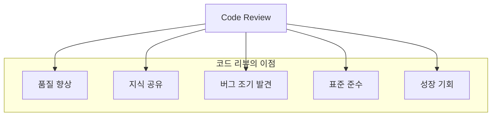
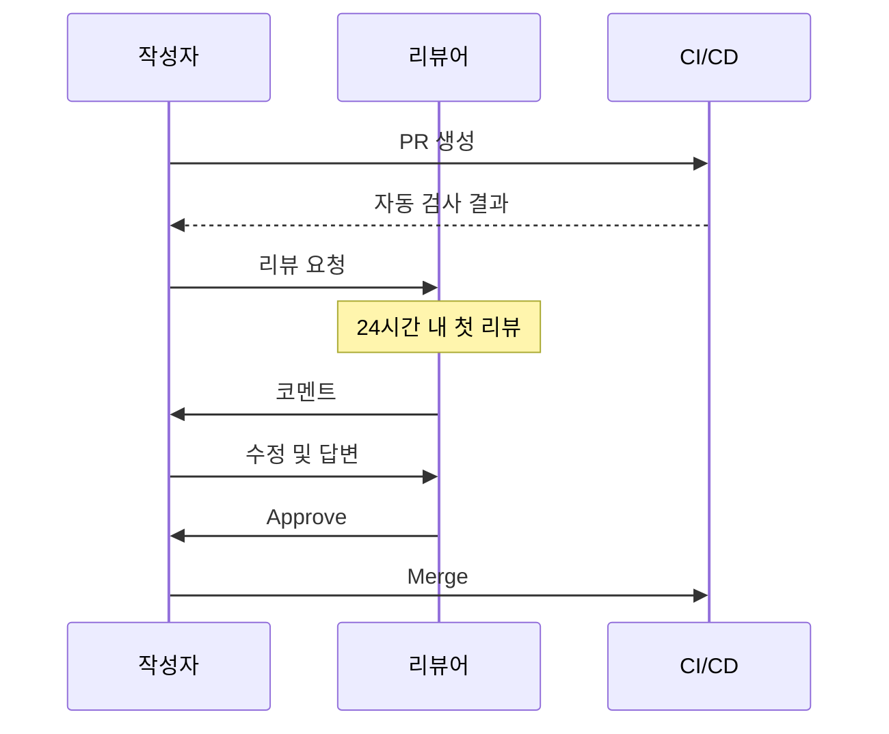

# Code Review Guide

> 이 문서는 TalkStudio 프로젝트의 코드 리뷰 가이드라인입니다.
> 효과적이고 건설적인 코드 리뷰를 위한 체크리스트와 모범 사례를 제공합니다.

---

## 변경 이력 (Changelog)

| 버전 | 날짜 | 작성자 | 변경 내용 |
|------|------|--------|----------|
| 1.0.0 | 2025-12-08 | @haseongpark | 최초 작성 |

---

## 관련 문서

- [CONTRIBUTING.md](./CONTRIBUTING.md) - 기여 가이드
- [VERSIONING_GUIDE.md](./VERSIONING_GUIDE.md) - 버전 관리 가이드
- [docs/guides/CLEAN_CODE_GUIDE.md](./docs/guides/CLEAN_CODE_GUIDE.md) - 클린 코드 가이드

---

## 1. 코드 리뷰의 목적

### 1.1 왜 코드 리뷰를 하는가?



### 1.2 코드 리뷰의 핵심 가치

| 가치 | 설명 |
|------|------|
| **품질 보증** | 버그, 보안 취약점, 성능 이슈 조기 발견 |
| **지식 전파** | 코드베이스 이해도 향상, 기술 공유 |
| **일관성 유지** | 코딩 스타일, 아키텍처 패턴 통일 |
| **협업 강화** | 팀 커뮤니케이션, 상호 학습 |

---

## 2. 리뷰어 역할

### 2.1 리뷰어의 책임

```
┌─────────────────────────────────────────────────────────┐
│                    리뷰어의 책임                          │
├─────────────────────────────────────────────────────────┤
│ ✓ 코드의 정확성과 품질 검증                               │
│ ✓ 건설적이고 구체적인 피드백 제공                         │
│ ✓ 적시에 리뷰 완료 (24시간 이내 권장)                     │
│ ✓ 작성자의 의도 이해 후 피드백                           │
│ ✓ 모범 사례와 대안 제시                                  │
└─────────────────────────────────────────────────────────┘
```

### 2.2 리뷰어 할당

| 우선순위 | 조건 | 리뷰어 |
|---------|------|--------|
| 1순위 | 해당 영역 담당자 | CODEOWNERS에 정의된 담당자 |
| 2순위 | 관련 경험자 | 유사 기능 개발 경험자 |
| 3순위 | 가용 인원 | 현재 여유 있는 팀원 |

---

## 3. 코드 리뷰 체크리스트

### 3.1 기능 (Functionality)

```markdown
## 기능 체크리스트

- [ ] 요구사항을 충족하는가?
- [ ] 엣지 케이스를 처리하는가?
- [ ] 에러 상황을 적절히 처리하는가?
- [ ] 사용자 경험이 고려되었는가?
- [ ] 기존 기능에 영향을 주지 않는가?
```

**리뷰 예시:**

```javascript
// PR 코드
function deleteMessage(id) {
  const messages = useChatStore.getState().messages;
  const newMessages = messages.filter(m => m.id !== id);
  useChatStore.setState({ messages: newMessages });
}

// 리뷰 코멘트:
// ⚠️ 존재하지 않는 ID로 삭제 시도할 경우를 처리해야 합니다.
// 제안:
function deleteMessage(id) {
  const messages = useChatStore.getState().messages;
  const messageExists = messages.some(m => m.id === id);

  if (!messageExists) {
    console.warn(`Message with id ${id} not found`);
    return false;
  }

  const newMessages = messages.filter(m => m.id !== id);
  useChatStore.setState({ messages: newMessages });
  return true;
}
```

### 3.2 코드 품질 (Code Quality)

```markdown
## 코드 품질 체크리스트

- [ ] 함수/변수명이 의도를 명확히 전달하는가?
- [ ] 함수가 단일 책임을 가지는가?
- [ ] 중복 코드가 없는가?
- [ ] 복잡도가 적절한가 (중첩 3단계 이하)?
- [ ] 매직 넘버/문자열이 상수로 추출되었는가?
```

**리뷰 예시:**

```javascript
// ❌ 리뷰 대상 코드
function process(d) {
  if (d.t === 1) {
    return d.v * 1.1;
  } else if (d.t === 2) {
    return d.v * 1.2;
  }
  return d.v;
}

// ✅ 개선 제안
const TAX_RATES = {
  STANDARD: 1.1,
  PREMIUM: 1.2,
  DEFAULT: 1.0,
};

const PRODUCT_TYPES = {
  STANDARD: 1,
  PREMIUM: 2,
};

function calculatePriceWithTax(product) {
  const taxRate = {
    [PRODUCT_TYPES.STANDARD]: TAX_RATES.STANDARD,
    [PRODUCT_TYPES.PREMIUM]: TAX_RATES.PREMIUM,
  }[product.type] || TAX_RATES.DEFAULT;

  return product.value * taxRate;
}
```

### 3.3 React 컴포넌트 (React Components)

```markdown
## React 컴포넌트 체크리스트

- [ ] 컴포넌트가 단일 책임을 가지는가?
- [ ] Props가 적절히 타입 정의되었는가?
- [ ] 불필요한 리렌더링이 없는가?
- [ ] 메모이제이션이 필요한 곳에 적용되었는가?
- [ ] 이벤트 핸들러가 적절히 정의되었는가?
- [ ] 부수 효과가 useEffect로 관리되는가?
```

**리뷰 예시:**

```jsx
// ❌ 리뷰 대상 코드
function MessageList() {
  const store = useChatStore();  // 전체 스토어 구독

  return (
    <div>
      {store.messages.map(msg => (
        <div key={msg.id} onClick={() => store.removeMessage(msg.id)}>
          {msg.text}
        </div>
      ))}
    </div>
  );
}

// ✅ 개선 제안
function MessageList() {
  // 필요한 상태만 구독
  const messages = useChatStore(state => state.messages);
  const removeMessage = useChatStore(state => state.removeMessage);

  // 이벤트 핸들러 메모이제이션
  const handleRemove = useCallback((id) => {
    removeMessage(id);
  }, [removeMessage]);

  return (
    <div>
      {messages.map(msg => (
        <MessageItem
          key={msg.id}
          message={msg}
          onRemove={handleRemove}
        />
      ))}
    </div>
  );
}

// 별도 컴포넌트로 분리하여 개별 리렌더링 최적화
const MessageItem = memo(function MessageItem({ message, onRemove }) {
  return (
    <div onClick={() => onRemove(message.id)}>
      {message.text}
    </div>
  );
});
```

### 3.4 상태 관리 (State Management)

```markdown
## Zustand 상태 관리 체크리스트

- [ ] 셀렉터를 사용하여 필요한 상태만 구독하는가?
- [ ] 액션이 순수 함수인가?
- [ ] 상태 구조가 정규화되어 있는가?
- [ ] 불변성이 유지되는가?
- [ ] 파생 상태는 계산으로 처리하는가?
```

**리뷰 예시:**

```javascript
// ❌ 리뷰 대상 코드
const useChatStore = create((set) => ({
  messages: [],
  messageCount: 0,  // 파생 상태를 별도로 저장

  addMessage: (msg) => set((state) => ({
    messages: [...state.messages, msg],
    messageCount: state.messageCount + 1,  // 동기화 필요
  })),
}));

// ✅ 개선 제안
const useChatStore = create((set, get) => ({
  messages: [],

  // 파생 상태는 계산으로 처리
  getMessageCount: () => get().messages.length,

  addMessage: (msg) => set((state) => ({
    messages: [...state.messages, msg],
  })),
}));

// 컴포넌트에서 사용
const messageCount = useChatStore(state => state.messages.length);
```

### 3.5 스타일링 (Styling)

```markdown
## Tailwind CSS 체크리스트

- [ ] 클래스가 논리적으로 그룹화되어 있는가?
- [ ] 반복되는 스타일이 컴포넌트로 추출되었는가?
- [ ] 반응형 디자인이 고려되었는가?
- [ ] 접근성 (a11y) 클래스가 적용되었는가?
- [ ] 다크 모드가 고려되었는가 (필요시)?
```

**리뷰 예시:**

```jsx
// ❌ 리뷰 대상 코드
<button className="bg-blue-500 text-white font-bold py-2 px-4 rounded hover:bg-blue-700 focus:outline-none focus:shadow-outline">
  클릭
</button>

// ✅ 개선 제안 (재사용 가능한 컴포넌트)
function Button({ children, variant = 'primary', ...props }) {
  const baseStyles = 'font-bold py-2 px-4 rounded transition-colors focus:outline-none focus:ring-2';

  const variants = {
    primary: 'bg-blue-500 text-white hover:bg-blue-700 focus:ring-blue-300',
    secondary: 'bg-gray-500 text-white hover:bg-gray-700 focus:ring-gray-300',
  };

  return (
    <button
      className={`${baseStyles} ${variants[variant]}`}
      {...props}
    >
      {children}
    </button>
  );
}
```

### 3.6 테스트 (Testing)

```markdown
## 테스트 체크리스트

- [ ] 테스트가 행동을 검증하는가 (구현 세부사항 X)?
- [ ] 테스트 이름이 명확한가?
- [ ] AAA 패턴을 따르는가 (Arrange-Act-Assert)?
- [ ] 엣지 케이스가 테스트되는가?
- [ ] 모킹이 적절히 사용되는가?
- [ ] 테스트가 독립적인가?
```

**리뷰 예시:**

```javascript
// ❌ 리뷰 대상 코드
test('message', () => {
  const { getByText } = render(<MessageEditor />);
  expect(getByText).toBeTruthy();
});

// ✅ 개선 제안
describe('MessageEditor', () => {
  beforeEach(() => {
    // 각 테스트 전 스토어 초기화
    useChatStore.setState({ messages: [] });
  });

  it('should add message to store when form is submitted with valid input', async () => {
    // Arrange
    render(<MessageEditor />);
    const input = screen.getByPlaceholderText('메시지를 입력하세요');
    const submitButton = screen.getByRole('button', { name: '전송' });

    // Act
    await userEvent.type(input, 'Hello, World!');
    await userEvent.click(submitButton);

    // Assert
    const messages = useChatStore.getState().messages;
    expect(messages).toHaveLength(1);
    expect(messages[0].text).toBe('Hello, World!');
  });

  it('should not add message when input is empty', async () => {
    // Arrange
    render(<MessageEditor />);
    const submitButton = screen.getByRole('button', { name: '전송' });

    // Act
    await userEvent.click(submitButton);

    // Assert
    const messages = useChatStore.getState().messages;
    expect(messages).toHaveLength(0);
  });
});
```

### 3.7 보안 (Security)

```markdown
## 보안 체크리스트

- [ ] 사용자 입력이 검증되는가?
- [ ] XSS 취약점이 없는가?
- [ ] 민감 정보가 노출되지 않는가?
- [ ] 의존성에 알려진 취약점이 없는가?
- [ ] HTTPS가 적용되는가?
```

**리뷰 예시:**

```jsx
// ❌ 보안 취약점: XSS
function Message({ text }) {
  return <div dangerouslySetInnerHTML={{ __html: text }} />;
}

// ✅ 안전한 코드
function Message({ text }) {
  return <div>{text}</div>;  // React가 자동으로 이스케이프
}

// HTML이 필요한 경우 sanitize 라이브러리 사용
import DOMPurify from 'dompurify';

function Message({ htmlContent }) {
  const sanitizedHtml = DOMPurify.sanitize(htmlContent);
  return <div dangerouslySetInnerHTML={{ __html: sanitizedHtml }} />;
}
```

### 3.8 성능 (Performance)

```markdown
## 성능 체크리스트

- [ ] 불필요한 리렌더링이 없는가?
- [ ] 대용량 데이터에 대한 최적화가 있는가?
- [ ] 이미지/에셋이 최적화되었는가?
- [ ] 메모리 누수 가능성이 없는가?
- [ ] 번들 사이즈 영향이 고려되었는가?
```

**리뷰 예시:**

```javascript
// ❌ 성능 이슈: 컴포넌트 내부에서 함수 재생성
function ChatPreview() {
  const messages = useChatStore(state => state.messages);

  // 매 렌더링마다 새 함수 생성
  const formatTime = (time) => {
    return new Date(time).toLocaleTimeString();
  };

  return (
    <div>
      {messages.map(msg => (
        <div key={msg.id}>
          {msg.text} - {formatTime(msg.time)}
        </div>
      ))}
    </div>
  );
}

// ✅ 개선: 유틸리티로 분리 또는 useMemo 사용
// utils/formatTime.js
export function formatTime(time) {
  return new Date(time).toLocaleTimeString();
}

// ChatPreview.jsx
import { formatTime } from '../utils/formatTime';

function ChatPreview() {
  const messages = useChatStore(state => state.messages);

  return (
    <div>
      {messages.map(msg => (
        <div key={msg.id}>
          {msg.text} - {formatTime(msg.time)}
        </div>
      ))}
    </div>
  );
}
```

---

## 4. 리뷰 코멘트 작성법

### 4.1 코멘트 유형

| 접두어 | 의미 | 대응 |
|--------|------|------|
| `[필수]` | 반드시 수정 필요 | Merge 전 수정 |
| `[제안]` | 개선 권장 | 선택적 수정 |
| `[질문]` | 이해를 위한 질문 | 답변 필요 |
| `[칭찬]` | 좋은 코드 인정 | 참고 |
| `[참고]` | 정보 공유 | 참고 |

### 4.2 좋은 코멘트 예시

```markdown
# ✅ 좋은 코멘트

## [필수] 에러 처리 추가 필요
현재 API 호출 실패 시 처리가 없습니다.

제안:
```javascript
try {
  const result = await fetchData();
  // ...
} catch (error) {
  console.error('데이터 로드 실패:', error);
  setError('데이터를 불러오는데 실패했습니다.');
}
```

---

## [제안] 컴포넌트 분리 고려
이 컴포넌트가 150줄을 넘어가고 있습니다.
`MessageInput`과 `MessageList`로 분리하면 관리가 더 쉬울 것 같습니다.

---

## [질문] 이 로직의 의도가 궁금합니다
여기서 `filter`를 두 번 사용하는 이유가 있을까요?
한 번의 순회로 처리할 수 있을 것 같아서요.

---

## [칭찬] 좋은 추상화입니다!
테마별 스타일을 깔끔하게 분리해주셨네요.
확장성이 좋아 보입니다.
```

### 4.3 나쁜 코멘트 예시

```markdown
# ❌ 나쁜 코멘트

"이거 이상해요" (구체적이지 않음)

"왜 이렇게 했어요?" (비난처럼 들림)

"이건 틀렸어요" (대안 없음)

"별로네요" (비건설적)
```

### 4.4 건설적인 피드백 공식

```
상황 설명 + 문제점 + 제안 + (선택) 이유

예시:
"현재 이 함수는 50줄입니다. (상황)
가독성과 테스트가 어려울 수 있습니다. (문제점)
검증, 변환, 저장 단계로 분리하면 어떨까요? (제안)
각 단계를 독립적으로 테스트할 수 있게 됩니다. (이유)"
```

---

## 5. 리뷰 프로세스

### 5.1 리뷰 타임라인



### 5.2 SLA (Service Level Agreement)

| 항목 | 목표 시간 |
|------|----------|
| 첫 번째 리뷰 | 24시간 이내 |
| 후속 리뷰 | 12시간 이내 |
| 긴급 PR | 4시간 이내 |

### 5.3 리뷰 단계

```
1. 개요 파악 (5분)
   - PR 설명 읽기
   - 변경 범위 파악
   - 관련 이슈 확인

2. 코드 검토 (10-30분)
   - 체크리스트 기반 검토
   - 코멘트 작성

3. 테스트 확인 (5분)
   - 테스트 커버리지
   - 테스트 품질

4. 최종 결정
   - Approve / Request Changes / Comment
```

---

## 6. 리뷰 결과 처리

### 6.1 Approve (승인)

```markdown
승인 조건:
- 모든 [필수] 항목 해결
- CI 검사 통과
- 충돌 없음
```

### 6.2 Request Changes (변경 요청)

```markdown
변경 요청 사유:
- 기능 버그
- 보안 취약점
- 심각한 성능 이슈
- 테스트 누락 (신규 기능)
```

### 6.3 Comment (코멘트만)

```markdown
코멘트만 남기는 경우:
- 경미한 제안사항
- 질문만 있을 때
- 논의가 필요할 때
```

---

## 7. 셀프 리뷰 가이드

PR 제출 전 작성자가 직접 확인하는 체크리스트:

```markdown
## 셀프 리뷰 체크리스트

### 기본
- [ ] PR 설명이 명확한가?
- [ ] 커밋 메시지가 컨벤션을 따르는가?
- [ ] 불필요한 파일이 포함되지 않았는가?

### 코드
- [ ] console.log가 제거되었는가?
- [ ] 주석 처리된 코드가 없는가?
- [ ] TODO가 정리되었는가?
- [ ] 에러 처리가 적절한가?

### 테스트
- [ ] 새 코드에 테스트가 있는가?
- [ ] 기존 테스트가 통과하는가?
- [ ] 수동 테스트를 완료했는가?

### 문서
- [ ] README 업데이트가 필요한가?
- [ ] API 문서 업데이트가 필요한가?
```

---

## 8. 분쟁 해결

### 8.1 의견 충돌 시

```
1. 서면으로 각자 의견 정리
2. 기술적 근거 제시
3. 제3자 의견 요청
4. 팀 미팅에서 논의
5. 결정 후 ADR에 기록
```

### 8.2 결정 권한

| 상황 | 결정 권한 |
|------|----------|
| 스타일/컨벤션 | 기존 코드베이스 따름 |
| 아키텍처 | 테크 리드 또는 팀 합의 |
| 기능 요구사항 | 프로덕트 오너 |

---

## 9. 도구 활용

### 9.1 자동화 도구

| 도구 | 용도 |
|------|------|
| ESLint | 코드 스타일, 잠재적 버그 |
| Prettier | 코드 포매팅 |
| GitHub Actions | CI/CD 자동화 |
| Codecov | 테스트 커버리지 |

### 9.2 GitHub 기능 활용

```markdown
- Suggested Changes: 직접 코드 수정 제안
- Resolve Conversation: 해결된 논의 정리
- Request Review: 추가 리뷰어 요청
- Draft PR: 진행 중인 작업 공유
```

---

## 10. 지속적 개선

### 10.1 회고

정기적으로 리뷰 프로세스를 회고합니다:

- 리뷰 소요 시간
- 반복되는 이슈
- 개선 가능한 점

### 10.2 가이드 업데이트

새로운 패턴이나 규칙이 필요하면 이 문서를 업데이트합니다.

---

> **Remember**: 코드 리뷰는 코드를 비판하는 것이지, 사람을 비판하는 것이 아닙니다.
> 건설적이고 존중하는 태도로 임해주세요.
