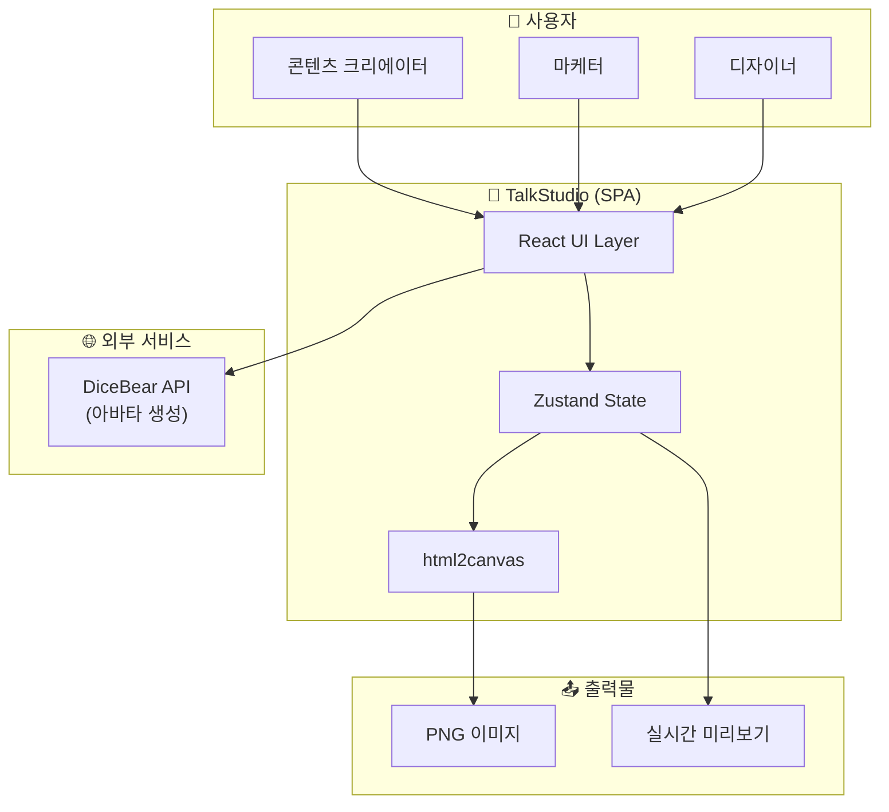
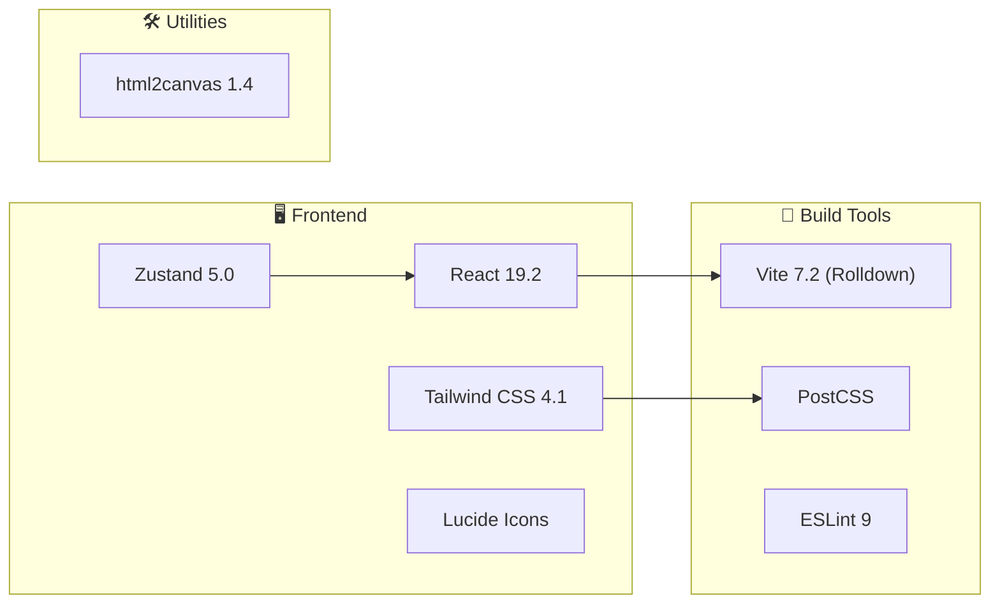
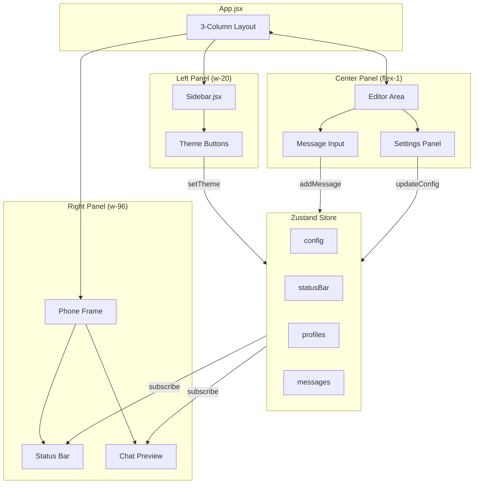
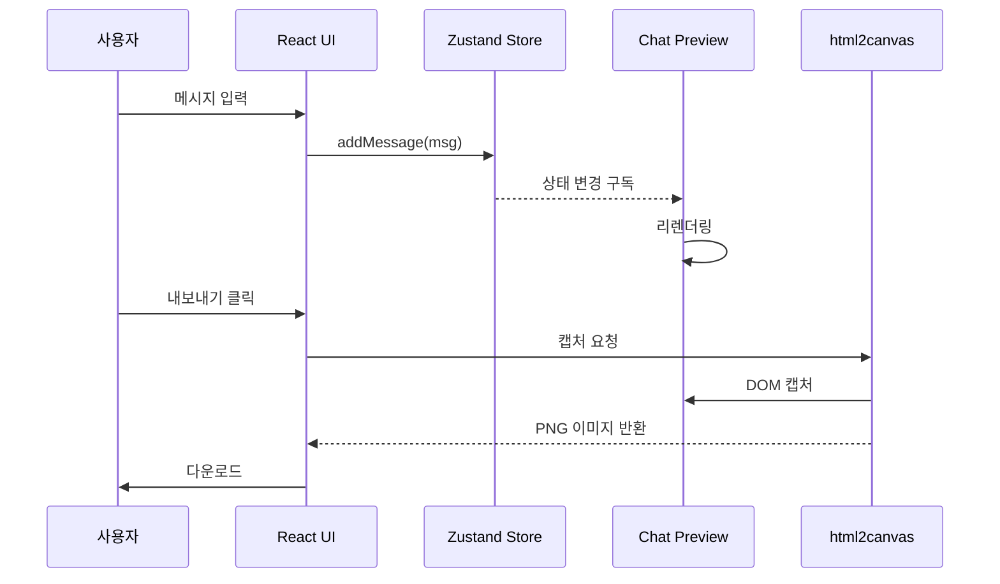

# TalkStudio - Project Context

> **Single Source of Truth** - 이 문서는 TalkStudio 프로젝트의 전체 맥락을 정의합니다.
> AI 에이전트와 인간 개발자 모두 이 문서를 프로젝트 이해의 출발점으로 삼습니다.

---

## 변경 이력 (Changelog)

| 버전 | 날짜 | 작성자 | 변경 내용 |
|------|------|--------|----------|
| 1.0.0 | 2025-12-08 | @haseongpark | 최초 작성 |

---

## 관련 문서

- [README.md](./README.md) - 빠른 시작 가이드
- [ENVIRONMENT.md](./ENVIRONMENT.md) - 환경 설정 가이드
- [docs/specs/PRD.md](./docs/specs/PRD.md) - 제품 요구사항 정의서
- [docs/specs/ARCHITECTURE.md](./docs/specs/ARCHITECTURE.md) - 시스템 아키텍처

---

## 1. 프로젝트 개요

### 1.1 프로젝트명
**TalkStudio** (톡스튜디오)

### 1.2 한 줄 설명
다양한 메시징 플랫폼(카카오톡, 텔레그램, 인스타그램, 디스코드) 스타일의 대화 스크린샷을 생성하는 웹 기반 시뮬레이터

### 1.3 프로젝트 비전
콘텐츠 크리에이터, 마케터, 디자이너가 **실제 메시징 앱 없이도** 자연스러운 대화 스크린샷을 빠르게 제작할 수 있는 도구를 제공한다.

### 1.4 핵심 가치 제안 (Value Proposition)
| 기존 방식 | TalkStudio |
|----------|-----------|
| 실제 앱에서 대화 후 스크린샷 | 가상 대화를 즉시 생성 |
| 개인정보 노출 위험 | 완전히 가상의 데이터 사용 |
| 플랫폼별 별도 작업 필요 | 단일 도구로 4개 플랫폼 지원 |
| 편집 불가능 | 언제든 수정/재생성 가능 |

---

## 2. 시스템 컨텍스트

### 2.1 시스템 경계 다이어그램



### 2.2 핵심 기능 (Core Features)

| ID | 기능명 | 설명 | 우선순위 |
|----|--------|------|----------|
| F-001 | 테마 전환 | 4개 메시징 플랫폼 테마 간 전환 | P0 (필수) |
| F-002 | 메시지 편집 | 메시지 추가, 수정, 삭제, 순서 변경 | P0 (필수) |
| F-003 | 프로필 설정 | 프로필 이미지, 이름 커스터마이징 | P0 (필수) |
| F-004 | 실시간 미리보기 | 폰 프레임 내 대화 실시간 렌더링 | P0 (필수) |
| F-005 | 이미지 내보내기 | PNG 형식으로 대화 스크린샷 저장 | P0 (필수) |
| F-006 | 상태바 커스터마이징 | 시간, 배터리, WiFi 상태 조절 | P1 (중요) |
| F-007 | 대화 템플릿 | 미리 정의된 대화 템플릿 제공 | P2 (선택) |
| F-008 | 대화 저장/불러오기 | 로컬 스토리지 기반 저장 | P2 (선택) |

### 2.3 지원 플랫폼 테마

| 플랫폼 | 브랜드 컬러 | 말풍선 스타일 | 특징 |
|--------|-------------|--------------|------|
| 카카오톡 | `#FEE500` | 둥근 사각형, 그라데이션 없음 | 프로필 왼쪽, 시간 오른쪽 |
| 텔레그램 | `#2AABEE` | 말풍선 꼬리 있음 | 읽음 체크 표시 |
| 인스타그램 | Gradient (Yellow→Purple) | 둥근 말풍선 | 반응 이모지 지원 |
| 디스코드 | `#5865F2` | 연속 메시지 그룹핑 | 유저네임 색상 |

---

## 3. 기술 스택

### 3.1 기술 스택 요약



### 3.2 기술 스택 상세

| 카테고리 | 기술 | 버전 | 선택 이유 |
|----------|------|------|----------|
| **UI Framework** | React | 19.2.0 | 컴포넌트 기반 UI, 풍부한 생태계 |
| **Build Tool** | Vite (Rolldown) | 7.2.5 | 빠른 HMR, 최신 번들러 |
| **State Management** | Zustand | 5.0.9 | 경량, 간단한 API, React 19 호환 |
| **Styling** | Tailwind CSS | 4.1.17 | 유틸리티 퍼스트, 빠른 스타일링 |
| **Icons** | Lucide React | 0.556.0 | 경량, 일관된 디자인 |
| **Screenshot** | html2canvas | 1.4.1 | DOM to Canvas 변환 |
| **Linting** | ESLint | 9.39.1 | 코드 품질 보장 |

### 3.3 프로젝트 구조

```
📦 TalkStudio/
├── 📄 index.html                 # HTML 엔트리포인트
├── 📄 package.json               # 의존성 정의
├── 📄 vite.config.js             # Vite 설정
├── 📄 tailwind.config.js         # Tailwind 설정
├── 📄 eslint.config.js           # ESLint 설정
│
├── 📁 public/                    # 정적 에셋
│   └── 📄 vite.svg
│
├── 📁 src/                       # 소스 코드
│   ├── 📄 main.jsx               # React 엔트리포인트
│   ├── 📄 App.jsx                # 루트 컴포넌트
│   ├── 📄 index.css              # 글로벌 스타일
│   │
│   ├── 📁 components/            # UI 컴포넌트
│   │   └── 📁 layout/
│   │       └── 📄 Sidebar.jsx    # 테마 선택 사이드바
│   │
│   └── 📁 store/                 # 상태 관리
│       └── 📄 useChatStore.js    # Zustand 스토어
│
├── 📁 docs/                      # 문서 (생성 예정)
├── 📁 tests/                     # 테스트 (생성 예정)
└── 📁 scripts/                   # 유틸리티 스크립트 (생성 예정)
```

---

## 4. 아키텍처 개요

### 4.1 컴포넌트 아키텍처



### 4.2 상태 관리 구조

```javascript
// useChatStore.js - 상태 스키마
{
  // 설정
  config: {
    theme: 'kakao' | 'telegram' | 'instagram' | 'discord',
    capturedImage: string | null
  },

  // 상태바 (폰 UI)
  statusBar: {
    time: string,      // 예: "12:30"
    battery: number,   // 예: 85
    wifi: boolean      // 예: true
  },

  // 프로필
  profiles: {
    me: { name: string, avatar: string },
    other: { name: string, avatar: string }
  },

  // 메시지 목록
  messages: [
    {
      id: string,
      sender: 'me' | 'other',
      type: 'text' | 'image' | 'emoji',
      text: string,
      time: string
    }
  ],

  // 액션
  setTheme: (theme) => void,
  addMessage: (message) => void,
  removeMessage: (id) => void,
  updateConfig: (key, value) => void
}
```

### 4.3 데이터 흐름



---

## 5. 개발 환경

### 5.1 필수 요구사항

| 항목 | 최소 버전 | 권장 버전 |
|------|----------|----------|
| Node.js | 18.0.0 | 20.x LTS |
| npm | 9.0.0 | 10.x |
| 브라우저 | Chrome 100+ | Chrome 최신 |

### 5.2 로컬 개발 시작

```bash
# 1. 저장소 클론
git clone https://github.com/[username]/TalkStudio.git
cd TalkStudio

# 2. 의존성 설치
npm install

# 3. 개발 서버 시작
npm run dev
# → http://localhost:5173 에서 확인

# 4. 프로덕션 빌드
npm run build

# 5. 린트 검사
npm run lint
```

### 5.3 npm 스크립트

| 스크립트 | 명령어 | 설명 |
|---------|--------|------|
| dev | `npm run dev` | Vite 개발 서버 시작 (HMR 활성화) |
| build | `npm run build` | 프로덕션 번들 생성 |
| preview | `npm run preview` | 프로덕션 빌드 미리보기 |
| lint | `npm run lint` | ESLint 코드 검사 |

---

## 6. 코딩 컨벤션

### 6.1 파일/폴더 네이밍

| 유형 | 규칙 | 예시 |
|------|------|------|
| 컴포넌트 파일 | PascalCase | `Sidebar.jsx`, `ChatPreview.jsx` |
| 유틸리티 파일 | camelCase | `formatTime.js`, `useDebounce.js` |
| 스토어 파일 | camelCase + 접두어 | `useChatStore.js` |
| 상수 파일 | SCREAMING_SNAKE | `THEME_COLORS.js` |
| 폴더명 | kebab-case 또는 lowercase | `components/`, `chat-preview/` |

### 6.2 컴포넌트 구조

```jsx
// ✅ 권장 컴포넌트 구조
import { useState } from 'react';
import { useChatStore } from '../../store/useChatStore';

/**
 * 컴포넌트 설명
 * @param {Object} props - 컴포넌트 props
 * @param {string} props.title - 제목
 */
export function ComponentName({ title }) {
  // 1. 훅 호출
  const [state, setState] = useState(null);
  const theme = useChatStore((s) => s.config.theme);

  // 2. 이벤트 핸들러
  const handleClick = () => {
    setState('clicked');
  };

  // 3. 렌더링
  return (
    <div className="component-class">
      <h1>{title}</h1>
      <button onClick={handleClick}>Click</button>
    </div>
  );
}
```

### 6.3 상태 관리 규칙

```javascript
// ✅ Zustand 셀렉터 사용 (리렌더링 최적화)
const theme = useChatStore((state) => state.config.theme);

// ❌ 전체 스토어 구독 금지
const store = useChatStore(); // 모든 상태 변경 시 리렌더링
```

---

## 7. 품질 기준

### 7.1 코드 품질 메트릭

| 항목 | 기준 |
|------|------|
| 함수 길이 | 20줄 이하 |
| 컴포넌트 길이 | 150줄 이하 |
| 파일 길이 | 300줄 이하 |
| 중첩 깊이 | 3단계 이하 |
| Props 개수 | 5개 이하 |

### 7.2 테스트 목표 (구현 예정)

| 테스트 유형 | 목표 커버리지 | 도구 |
|------------|-------------|------|
| Unit Test | 80% | Vitest |
| Component Test | 70% | React Testing Library |
| E2E Test | Critical Path 100% | Playwright |

### 7.3 브라우저 지원

| 브라우저 | 최소 버전 |
|---------|----------|
| Chrome | 100+ |
| Firefox | 100+ |
| Safari | 15+ |
| Edge | 100+ |

---

## 8. 용어 정의 (Glossary)

| 용어 | 정의 |
|------|------|
| **테마 (Theme)** | 메시징 플랫폼의 시각적 스타일 (카카오톡, 텔레그램 등) |
| **프로필 (Profile)** | 대화 참여자의 이름과 아바타 이미지 |
| **메시지 (Message)** | 대화창에 표시되는 개별 메시지 단위 |
| **폰 프레임 (Phone Frame)** | 스마트폰 모양의 미리보기 컨테이너 |
| **상태바 (Status Bar)** | 폰 상단의 시간, 배터리, WiFi 표시 영역 |
| **말풍선 (Bubble)** | 메시지를 감싸는 UI 요소 |
| **캡처 (Capture)** | 대화 미리보기를 이미지로 내보내는 기능 |

---

## 9. 제약 조건 및 가정

### 9.1 제약 조건 (Constraints)

| ID | 제약 | 이유 |
|----|------|------|
| C-001 | 프론트엔드 전용 (서버 없음) | 비용 절감, 배포 단순화 |
| C-002 | 로컬 스토리지만 사용 | 개인정보 보호, 서버 불필요 |
| C-003 | 영어 코드 / 한글 UI | 국제화 가능성, 한국 사용자 타겟 |
| C-004 | 저작권 주의 | 플랫폼 로고/아이콘 직접 사용 금지 |

### 9.2 가정 (Assumptions)

| ID | 가정 | 검증 필요 |
|----|------|----------|
| A-001 | 사용자는 모던 브라우저를 사용함 | 브라우저 점유율 확인 |
| A-002 | 데스크톱 사용이 주 사용 환경 | 사용자 조사 필요 |
| A-003 | 고해상도 이미지 출력이 중요함 | 사용자 피드백 수집 |

---

## 10. 향후 로드맵

### Phase 1: MVP (현재)
- [x] 기본 UI 레이아웃
- [x] 테마 전환 기능
- [x] 상태 관리 구조
- [ ] 메시지 에디터
- [ ] 테마별 채팅 렌더링
- [ ] 이미지 내보내기

### Phase 2: 기능 확장
- [ ] 이미지 메시지 지원
- [ ] 이모지/스티커 지원
- [ ] 대화 저장/불러오기
- [ ] 다국어 지원 (i18n)

### Phase 3: 고급 기능
- [ ] 대화 템플릿
- [ ] 실시간 협업 (선택)
- [ ] PWA 지원

---

## 11. 연락처

| 역할 | 담당자 | 연락처 |
|------|--------|--------|
| 프로젝트 오너 | @haseongpark | GitHub |

---

## 12. 참고 자료

- [React 19 공식 문서](https://react.dev/)
- [Zustand 공식 문서](https://zustand-demo.pmnd.rs/)
- [Tailwind CSS 공식 문서](https://tailwindcss.com/)
- [Vite 공식 문서](https://vitejs.dev/)
- [html2canvas 공식 문서](https://html2canvas.hertzen.com/)

---

> **Note for AI Agents**: 이 문서는 TalkStudio 프로젝트의 Single Source of Truth입니다.
> 코드 생성 시 이 문서의 기술 스택, 아키텍처, 코딩 컨벤션을 반드시 준수하십시오.
> 불확실한 사항은 `[TBD]` 표기 후 확인을 요청하십시오.
