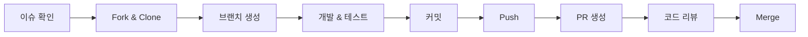
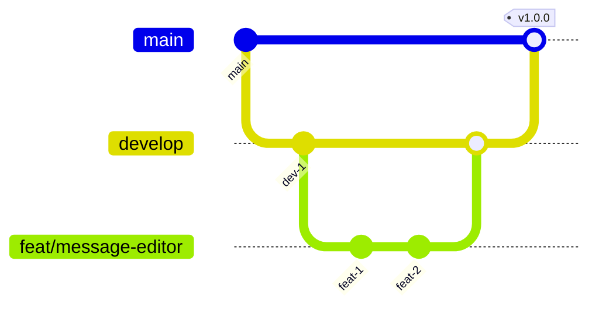

# Contributing Guide

> TalkStudio 프로젝트에 기여해 주셔서 감사합니다!
> 이 문서는 효과적인 협업을 위한 가이드라인을 제공합니다.

---

## 변경 이력 (Changelog)

| 버전 | 날짜 | 작성자 | 변경 내용 |
|------|------|--------|----------|
| 1.0.0 | 2025-12-08 | @haseongpark | 최초 작성 |

---

## 관련 문서

- [CONTEXT.md](./CONTEXT.md) - 프로젝트 전체 맥락
- [CODE_REVIEW_GUIDE.md](./CODE_REVIEW_GUIDE.md) - 코드 리뷰 가이드
- [VERSIONING_GUIDE.md](./VERSIONING_GUIDE.md) - 버전 관리 가이드
- [plan.md](./plan.md) - TDD 개발 플랜

---

## 1. 기여 방법 개요



---

## 2. 시작하기 전에

### 2.1 행동 강령 (Code of Conduct)

모든 기여자는 다음 원칙을 준수합니다:

- **존중**: 다른 기여자를 존중하고 건설적인 피드백을 제공합니다
- **포용**: 모든 배경의 사람들을 환영합니다
- **협력**: 공동의 목표를 위해 함께 일합니다
- **투명성**: 의사결정 과정을 공개적으로 진행합니다

### 2.2 기여 유형

| 유형 | 설명 | 시작 방법 |
|------|------|----------|
| 버그 리포트 | 문제점 발견 및 보고 | GitHub Issue 생성 |
| 기능 제안 | 새로운 기능 아이디어 | Feature Request Issue 생성 |
| 코드 기여 | 버그 수정, 기능 구현 | Pull Request 제출 |
| 문서 개선 | 문서 오류 수정, 보완 | Pull Request 제출 |
| 번역 | 다국어 지원 | Pull Request 제출 |

---

## 3. 개발 환경 설정

### 3.1 필수 요구사항

```bash
# Node.js 18+ 필수
node --version  # v18.0.0 이상

# npm 9+ 필수
npm --version   # v9.0.0 이상
```

### 3.2 프로젝트 설정

```bash
# 1. 저장소 Fork (GitHub 웹에서)

# 2. Fork한 저장소 클론
git clone https://github.com/[YOUR_USERNAME]/TalkStudio.git
cd TalkStudio

# 3. Upstream 원격 저장소 추가
git remote add upstream https://github.com/[ORIGINAL_OWNER]/TalkStudio.git

# 4. 의존성 설치
npm install

# 5. 개발 서버 실행
npm run dev
```

### 3.3 원격 저장소 구조

```
origin    → 본인의 Fork (push 대상)
upstream  → 원본 저장소 (pull 대상)
```

---

## 4. 브랜치 전략

### 4.1 브랜치 구조



### 4.2 브랜치 네이밍 규칙

| 접두어 | 용도 | 예시 |
|--------|------|------|
| `feat/` | 새 기능 개발 | `feat/message-editor` |
| `fix/` | 버그 수정 | `fix/theme-switch-error` |
| `refactor/` | 코드 리팩토링 | `refactor/chat-store` |
| `docs/` | 문서 작업 | `docs/api-spec` |
| `test/` | 테스트 추가/수정 | `test/unit-coverage` |
| `chore/` | 빌드/설정 변경 | `chore/eslint-config` |
| `hotfix/` | 긴급 수정 | `hotfix/critical-bug` |

### 4.3 브랜치 생성 예시

```bash
# 최신 main 브랜치에서 시작
git checkout main
git pull upstream main

# 새 기능 브랜치 생성
git checkout -b feat/message-editor

# 작업 완료 후 push
git push origin feat/message-editor
```

---

## 5. 커밋 컨벤션

### 5.1 커밋 메시지 형식

```
<type>(<scope>): <subject>

[optional body]

[optional footer]
```

### 5.2 Type 종류

| Type | 설명 | 예시 |
|------|------|------|
| `feat` | 새 기능 추가 | `feat(editor): add message input field` |
| `fix` | 버그 수정 | `fix(preview): resolve rendering issue` |
| `refactor` | 리팩토링 (기능 변경 없음) | `refactor(store): simplify state logic` |
| `docs` | 문서 변경 | `docs(readme): update installation guide` |
| `test` | 테스트 추가/수정 | `test(store): add unit tests for actions` |
| `chore` | 빌드/설정 변경 | `chore(deps): upgrade react to 19.2` |
| `style` | 코드 포맷팅 (로직 변경 없음) | `style(app): fix indentation` |
| `perf` | 성능 개선 | `perf(preview): optimize re-renders` |

### 5.3 Scope 종류

| Scope | 설명 |
|-------|------|
| `editor` | 메시지 에디터 관련 |
| `preview` | 채팅 프리뷰 관련 |
| `store` | Zustand 상태 관리 |
| `theme` | 테마 관련 |
| `export` | 이미지 내보내기 |
| `ui` | 일반 UI 컴포넌트 |
| `deps` | 의존성 관련 |
| `config` | 설정 파일 |

### 5.4 커밋 메시지 예시

```bash
# 좋은 예시 ✅
git commit -m "feat(editor): add sender selection toggle"
git commit -m "fix(theme): resolve kakao bubble color mismatch"
git commit -m "refactor(store): extract message validation logic"
git commit -m "test(store): add tests for addMessage action"

# 나쁜 예시 ❌
git commit -m "update"
git commit -m "fix bug"
git commit -m "WIP"
git commit -m "asdf"
```

### 5.5 커밋 분리 원칙

```bash
# ✅ 좋은 예: 구조 변경과 기능 변경 분리
git commit -m "refactor(editor): extract InputField component"
git commit -m "feat(editor): add character count display"

# ❌ 나쁜 예: 여러 변경을 하나에 섞음
git commit -m "refactor and add feature"
```

---

## 6. Pull Request 가이드

### 6.1 PR 생성 전 체크리스트

```markdown
- [ ] 코드가 린트 검사를 통과함 (`npm run lint`)
- [ ] 모든 테스트가 통과함 (`npm run test`)
- [ ] 새 기능에 대한 테스트를 작성함
- [ ] 문서를 업데이트함 (필요한 경우)
- [ ] 커밋 메시지가 컨벤션을 따름
- [ ] 브랜치가 최신 main과 동기화됨
```

### 6.2 PR 템플릿

PR 생성 시 다음 형식을 사용하세요:

```markdown
## Summary
<!-- 변경 사항을 1-3줄로 요약 -->

## Changes
<!-- 상세 변경 내용을 bullet point로 나열 -->
-
-
-

## Related Issues
<!-- 관련 이슈 번호 (예: Closes #123) -->

## Screenshots (if applicable)
<!-- UI 변경이 있는 경우 스크린샷 첨부 -->

## Test Plan
<!-- 테스트 방법 설명 -->
- [ ] Unit tests added/updated
- [ ] Manual testing completed

## Checklist
- [ ] Code follows project conventions
- [ ] Self-review completed
- [ ] Documentation updated
```

### 6.3 PR 제목 형식

```
<type>(<scope>): <description>

예시:
feat(editor): implement message input with validation
fix(theme): correct telegram bubble styling
docs(readme): add troubleshooting section
```

### 6.4 PR 크기 가이드라인

| 크기 | 변경 라인 수 | 권장 |
|------|-------------|------|
| XS | 1-10 | ✅ 이상적 |
| S | 11-50 | ✅ 좋음 |
| M | 51-200 | ⚠️ 가능하면 분할 |
| L | 201-500 | ⚠️ 분할 권장 |
| XL | 500+ | ❌ 반드시 분할 |

---

## 7. 코드 스타일 가이드

### 7.1 JavaScript/JSX

```javascript
// ✅ 컴포넌트: PascalCase, 함수형
export function MessageEditor({ onSubmit }) {
  const [message, setMessage] = useState('');

  const handleSubmit = (e) => {
    e.preventDefault();
    if (message.trim()) {
      onSubmit(message);
      setMessage('');
    }
  };

  return (
    <form onSubmit={handleSubmit}>
      <input
        type="text"
        value={message}
        onChange={(e) => setMessage(e.target.value)}
        placeholder="메시지를 입력하세요"
      />
      <button type="submit">전송</button>
    </form>
  );
}

// ✅ 훅: camelCase, use 접두어
export function useDebounce(value, delay) {
  const [debouncedValue, setDebouncedValue] = useState(value);

  useEffect(() => {
    const timer = setTimeout(() => setDebouncedValue(value), delay);
    return () => clearTimeout(timer);
  }, [value, delay]);

  return debouncedValue;
}

// ✅ 상수: SCREAMING_SNAKE_CASE
export const THEME_COLORS = {
  KAKAO: '#FEE500',
  TELEGRAM: '#2AABEE',
  INSTAGRAM: 'linear-gradient(...)',
  DISCORD: '#5865F2',
};
```

### 7.2 CSS (Tailwind)

```jsx
// ✅ 좋은 예: 논리적 그룹핑
<div className="
  flex items-center justify-between
  p-4 mb-2
  bg-white rounded-lg shadow-sm
  hover:shadow-md transition-shadow
">

// ❌ 나쁜 예: 무작위 순서
<div className="shadow-sm mb-2 flex bg-white p-4 rounded-lg hover:shadow-md items-center justify-between transition-shadow">
```

### 7.3 파일 구조

```
src/
├── components/
│   ├── common/           # 공통 UI 컴포넌트
│   │   ├── Button.jsx
│   │   └── Input.jsx
│   ├── editor/           # 에디터 관련
│   │   ├── MessageEditor.jsx
│   │   └── MessageList.jsx
│   ├── preview/          # 프리뷰 관련
│   │   ├── ChatPreview.jsx
│   │   └── MessageBubble.jsx
│   └── layout/           # 레이아웃
│       └── Sidebar.jsx
├── hooks/                # 커스텀 훅
├── store/                # Zustand 스토어
├── utils/                # 유틸리티 함수
├── themes/               # 테마 설정
└── constants/            # 상수 정의
```

---

## 8. 테스트 가이드

### 8.1 테스트 네이밍

```javascript
// ✅ 좋은 예: 행동 기반 네이밍
describe('MessageEditor', () => {
  it('should add message when form is submitted with valid input', () => {});
  it('should not add message when input is empty', () => {});
  it('should clear input field after successful submission', () => {});
});

// ❌ 나쁜 예: 모호한 네이밍
describe('MessageEditor', () => {
  it('works', () => {});
  it('test 1', () => {});
});
```

### 8.2 테스트 구조 (AAA 패턴)

```javascript
it('should add message to store when submitted', () => {
  // Arrange (준비)
  const initialMessages = useChatStore.getState().messages;
  render(<MessageEditor />);

  // Act (실행)
  const input = screen.getByPlaceholderText('메시지를 입력하세요');
  fireEvent.change(input, { target: { value: 'Hello!' } });
  fireEvent.click(screen.getByRole('button', { name: '전송' }));

  // Assert (검증)
  const newMessages = useChatStore.getState().messages;
  expect(newMessages.length).toBe(initialMessages.length + 1);
  expect(newMessages[newMessages.length - 1].text).toBe('Hello!');
});
```

### 8.3 테스트 실행

```bash
# 전체 테스트 실행
npm run test

# 감시 모드
npm run test:watch

# 커버리지 리포트
npm run test:coverage

# 특정 파일만 테스트
npm run test -- MessageEditor
```

---

## 9. 이슈 작성 가이드

### 9.1 버그 리포트

```markdown
## Bug Description
<!-- 버그에 대한 명확한 설명 -->

## Steps to Reproduce
1. Go to '...'
2. Click on '...'
3. Scroll down to '...'
4. See error

## Expected Behavior
<!-- 예상했던 동작 -->

## Actual Behavior
<!-- 실제 동작 -->

## Screenshots
<!-- 스크린샷이 있다면 첨부 -->

## Environment
- OS: [e.g., macOS 14.0]
- Browser: [e.g., Chrome 120]
- Node.js: [e.g., 20.10.0]

## Additional Context
<!-- 추가 정보 -->
```

### 9.2 기능 요청

```markdown
## Feature Description
<!-- 기능에 대한 명확한 설명 -->

## Problem Statement
<!-- 이 기능이 해결하는 문제 -->

## Proposed Solution
<!-- 제안하는 해결책 -->

## Alternatives Considered
<!-- 고려한 대안들 -->

## Additional Context
<!-- 추가 정보, 스크린샷, 목업 등 -->
```

---

## 10. 리뷰 프로세스

### 10.1 리뷰 기준

| 항목 | 확인 내용 |
|------|----------|
| 기능 | 요구사항을 충족하는가? |
| 코드 품질 | 컨벤션을 따르는가? |
| 테스트 | 적절한 테스트가 있는가? |
| 성능 | 성능 이슈는 없는가? |
| 보안 | 보안 취약점은 없는가? |

### 10.2 리뷰 응답

리뷰 코멘트에 대해:

- **동의**: 수정 후 "Fixed" 또는 "Done" 코멘트
- **논의 필요**: 근거를 들어 의견 제시
- **질문**: 추가 설명 요청

### 10.3 Merge 조건

- [ ] 최소 1명의 Approve
- [ ] 모든 CI 검사 통과
- [ ] 충돌 해결 완료
- [ ] 모든 리뷰 코멘트 해결

---

## 11. 릴리즈 프로세스

### 11.1 버전 관리

[Semantic Versioning](https://semver.org/) 사용:

```
MAJOR.MINOR.PATCH

예시:
1.0.0 → 1.0.1 (패치: 버그 수정)
1.0.1 → 1.1.0 (마이너: 새 기능, 하위 호환)
1.1.0 → 2.0.0 (메이저: 브레이킹 체인지)
```

### 11.2 릴리즈 체크리스트

```markdown
- [ ] 모든 테스트 통과
- [ ] CHANGELOG.md 업데이트
- [ ] package.json 버전 업데이트
- [ ] 릴리즈 노트 작성
- [ ] 태그 생성 및 푸시
```

---

## 12. 도움이 필요할 때

### 12.1 질문하기

- **GitHub Discussions**: 일반적인 질문
- **GitHub Issues**: 버그 리포트, 기능 요청
- **PR 코멘트**: 코드 관련 질문

### 12.2 유용한 리소스

- [React 공식 문서](https://react.dev/)
- [Zustand 공식 문서](https://zustand-demo.pmnd.rs/)
- [Tailwind CSS 공식 문서](https://tailwindcss.com/)
- [Vite 공식 문서](https://vitejs.dev/)

---

## 13. 감사의 말

TalkStudio에 기여해 주시는 모든 분들께 감사드립니다!

기여자 목록은 [CONTRIBUTORS.md](./CONTRIBUTORS.md)에서 확인할 수 있습니다.

---

> **Note**: 이 가이드에 대한 개선 제안도 환영합니다!
