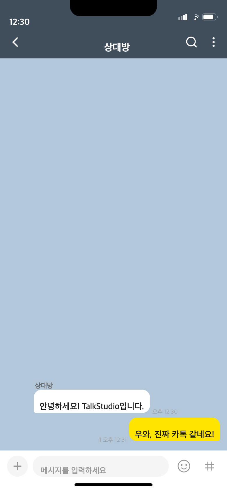
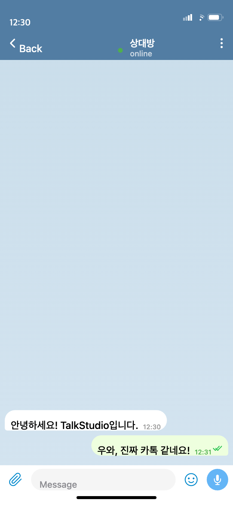
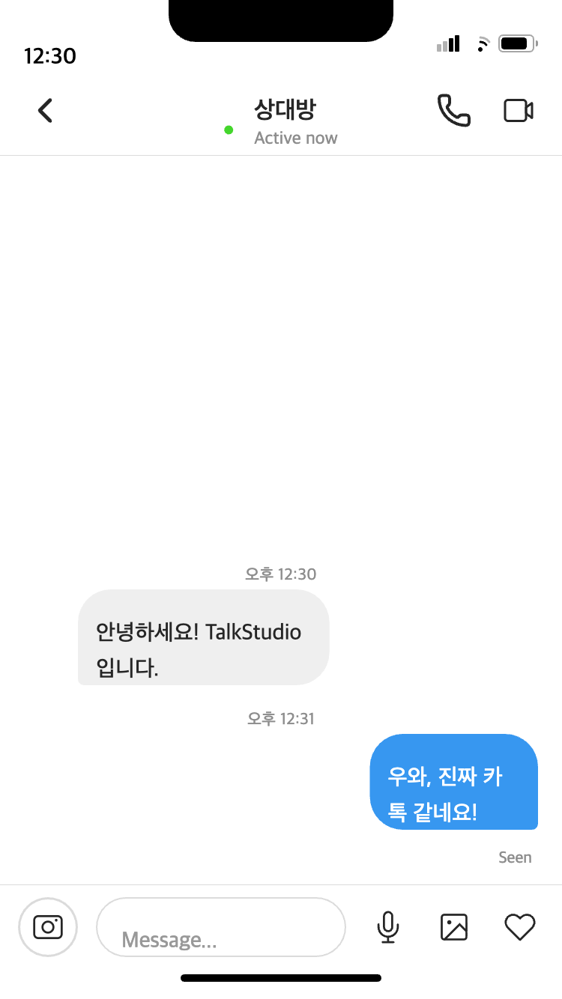

<div align="center">

# TalkStudio

### 가짜 티 나는 대화 스크린샷은 이제 그만.

**유튜브 썸네일, 인스타 스토리, 블로그 포스팅**에 넣을 대화 스크린샷,
이제 진짜처럼 만들어보세요.

[](https://github.com/Prometheus-P/TalkStudio/releases)
[](./LICENSE)

[데모 보기](#미리보기) · [시작하기](#빠른-시작) · [릴리스 노트](https://github.com/Prometheus-P/TalkStudio/releases)

</div>

---

## 이런 분들을 위해 만들었어요

| 대상 | 활용 사례 |
|:----:|----------|
| 📱 **콘텐츠 크리에이터** | 썸네일에 실감나는 대화 캡쳐가 필요할 때 |
| 🎬 **쇼츠/릴스 제작자** | 세로형 대화 스크린샷이 필요할 때 |
| ✍️ **블로거/작가** | 스토리텔링에 대화 이미지를 활용할 때 |
| 🎨 **디자이너** | 목업에 리얼한 채팅 UI가 필요할 때 |

---

## 미리보기

| KakaoTalk | Discord | Telegram | Instagram |
|:---------:|:-------:|:--------:|:---------:|
|  |  |  |  |

---

## 주요 기능

<table>
<tr>
<td width="50%">

### 💬 메신저 테마
| 플랫폼 | 특징 |
|:------:|------|
| **카카오톡** | 읽음 표시, 실제 레이아웃 |
| **Discord** | @멘션, 타임스탬프 |
| **Telegram** | 온라인 상태, 체크마크 |
| **Instagram** | Seen 표시, 시간 배치 |

</td>
<td width="50%">

### 🍎 iOS 재현
| 기능 | 설명 |
|:----:|------|
| **상태바** | 시간, 배터리, WiFi |
| **폰트** | SF Pro 시스템 폰트 |
| **프레임** | iPhone 노치 디자인 |
| **해상도** | Retina 2x 지원 |

</td>
</tr>
<tr>
<td width="50%">

### ✏️ 에디터
| 기능 | 설명 |
|:----:|------|
| **실시간 미리보기** | 즉시 반영 |
| **다중 발화자** | 최대 10명 |
| **드래그 정렬** | 순서 변경 |
| **메시지 타입** | 텍스트, 이미지 |

</td>
<td width="50%">

### 📤 내보내기
| 기능 | 설명 |
|:----:|------|
| **PNG 저장** | 고품질 이미지 |
| **쇼츠 모드** | 1080x1920 세로형 |
| **프로젝트 저장** | 자동/수동 저장 |
| **클립보드 복사** | 바로 붙여넣기 |

</td>
</tr>
</table>

---

## 빠른 시작

```bash
# 저장소 클론
git clone https://github.com/Prometheus-P/TalkStudio.git
cd TalkStudio

# 의존성 설치
npm install

# 개발 서버 실행
npm run dev
```

브라우저에서 **http://localhost:5173** 접속

---

## 사용 방법

```
1️⃣  좌측 사이드바에서 플랫폼 선택 (카카오톡, Discord, Telegram, Instagram)
2️⃣  에디터에서 발화자 선택 후 메시지 입력
3️⃣  우측 iPhone 프레임에서 실시간 미리보기 확인
4️⃣  "PNG 저장" 버튼으로 이미지 내보내기
```

---

## 기술 스택

<table>
<tr>
<td align="center"><strong>Frontend</strong></td>
<td>React 19 + Vite 7 (Rolldown)</td>
</tr>
<tr>
<td align="center"><strong>상태 관리</strong></td>
<td>Zustand 5</td>
</tr>
<tr>
<td align="center"><strong>스타일링</strong></td>
<td>Tailwind CSS 4</td>
</tr>
<tr>
<td align="center"><strong>이미지 생성</strong></td>
<td>html-to-image</td>
</tr>
<tr>
<td align="center"><strong>AI 대화 생성</strong></td>
<td>Upstage Solar API</td>
</tr>
</table>

---

## 스크립트

| 명령어 | 설명 |
|--------|------|
| `npm run dev` | 개발 서버 실행 |
| `npm run build` | 프로덕션 빌드 |
| `npm run preview` | 빌드 결과물 미리보기 |
| `npm run lint` | ESLint 검사 |
| `npm run test` | Vitest 테스트 실행 |

---

## 프로젝트 구조

```
TalkStudio/
├── src/
│   ├── components/
│   │   ├── editor/         # 에디터 (메시지 입력, 프로필 설정)
│   │   ├── preview/        # 미리보기 (iPhone 프레임, 메시지 버블)
│   │   └── layout/         # 레이아웃 (사이드바)
│   ├── store/              # Zustand 상태 관리
│   ├── themes/             # 플랫폼별 테마 프리셋
│   └── App.jsx             # 루트 컴포넌트
├── scripts/                # AI 대화 생성 & 캡처 스크립트
└── specs/                  # 기능 스펙 문서
```

---

## 아키텍처 다이어그램

FigJam으로 작성된 프로젝트 아키텍처 문서입니다.

| 다이어그램 | 설명 | 링크 |
|-----------|------|:----:|
| **전체 시스템 플로우** | End-to-End 플로우 (User → Frontend → Backend → Storage) | [보기](https://www.figma.com/online-whiteboard/create-diagram/8cbf2964-7ab8-4cb1-adc8-fd27f89f9856) |
| **앱 아키텍처** | 3-Column UI 레이아웃, Zustand 상태 관리, 데이터 흐름 | [보기](https://www.figma.com/online-whiteboard/create-diagram/201dd821-bae7-4244-89bb-db4dc3a60c26) |
| **사용자 플로우** | 테마 선택 → 메시지 작성 → 미리보기 → 캡처 과정 | [보기](https://www.figma.com/online-whiteboard/create-diagram/7a4c5566-7848-43e5-9bde-107d24435ad2) |
| **상태 관리** | Zustand Store 상태 전이 다이어그램 | [보기](https://www.figma.com/online-whiteboard/create-diagram/eb38a477-ba22-4bdb-91e5-e619b9a1821f) |
| **컴포넌트 구조** | React 컴포넌트 계층 구조 (Sidebar, Editor, Preview) | [보기](https://www.figma.com/online-whiteboard/create-diagram/22ecf2d9-0e00-4878-8e46-23ac626a5dfb) |
| **백엔드 아키텍처** | Clean Architecture (Router → Service → Repository) | [보기](https://www.figma.com/online-whiteboard/create-diagram/b06c9856-4326-4b26-93f9-7bce56900434) |

---

## 보안

보안 취약점 발견 시 [SECURITY.md](./SECURITY.md)를 참고해주세요.

---

## 라이선스

Copyright (c) 2024-2025 TalkStudio. All Rights Reserved.

이 소프트웨어는 TalkStudio의 독점 소유입니다. 자세한 내용은 [LICENSE](./LICENSE) 파일을 참조하세요.

---

<div align="center">

Made with ❤️ by [Prometheus-P](https://github.com/Prometheus-P)

**⭐ Star를 눌러 프로젝트를 응원해주세요!**

</div>
