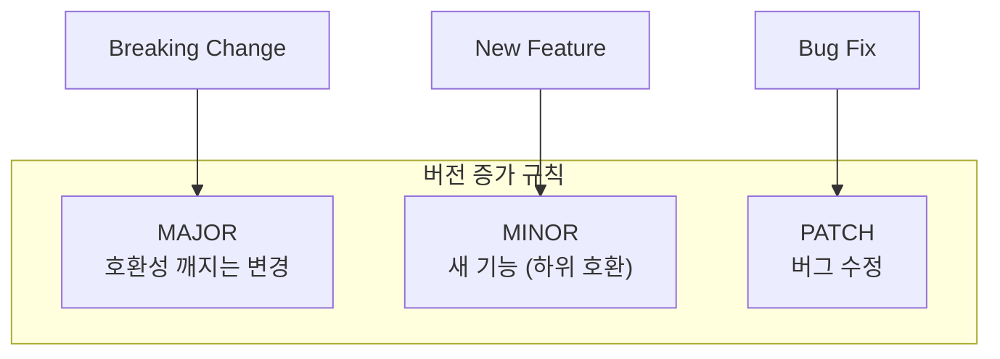
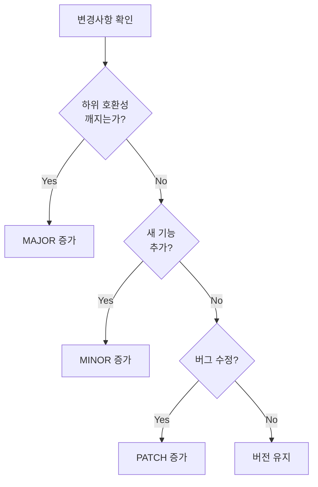
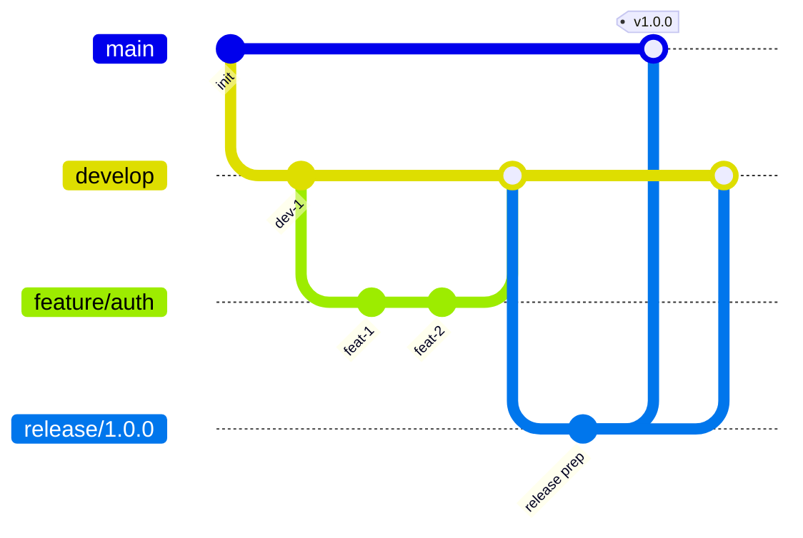

# Versioning Guide

> 이 문서는 TalkStudio 프로젝트의 버전 관리 및 Git 워크플로우 가이드입니다.

---

## 변경 이력 (Changelog)

| 버전 | 날짜 | 작성자 | 변경 내용 |
|------|------|--------|----------|
| 1.0.0 | 2025-12-08 | @haseongpark | 최초 작성 |

---

## 관련 문서

- [CONTRIBUTING.md](./CONTRIBUTING.md) - 기여 가이드
- [CODE_REVIEW_GUIDE.md](./CODE_REVIEW_GUIDE.md) - 코드 리뷰 가이드
- [docs/operations/RELEASE_MANAGEMENT.md](./docs/operations/RELEASE_MANAGEMENT.md) - 릴리즈 관리

---

## 1. Semantic Versioning (SemVer)

### 1.1 버전 형식

```
MAJOR.MINOR.PATCH[-PRERELEASE][+BUILD]

예시:
1.0.0
2.1.3
1.0.0-alpha.1
1.0.0-beta.2+build.123
```

### 1.2 버전 증가 규칙



| 변경 유형 | MAJOR | MINOR | PATCH | 예시 |
|----------|-------|-------|-------|------|
| Breaking API 변경 | +1 | 0 | 0 | 1.x.x → 2.0.0 |
| 새 기능 추가 | - | +1 | 0 | 1.1.x → 1.2.0 |
| 버그 수정 | - | - | +1 | 1.1.1 → 1.1.2 |
| 문서 수정만 | - | - | - | 버전 변경 없음 |

### 1.3 Pre-release 버전

| 단계 | 형식 | 설명 |
|------|------|------|
| Alpha | `1.0.0-alpha.1` | 초기 개발, 불안정 |
| Beta | `1.0.0-beta.1` | 기능 완성, 테스트 중 |
| RC | `1.0.0-rc.1` | 릴리즈 후보, 안정화 |
| Release | `1.0.0` | 정식 릴리즈 |

### 1.4 버전 결정 플로우차트



---

## 2. Git 브랜치 전략

### 2.1 브랜치 구조



### 2.2 브랜치 유형

| 브랜치 | 용도 | 생성 출처 | Merge 대상 |
|--------|------|----------|-----------|
| `main` | 프로덕션 코드 | - | - |
| `develop` | 개발 통합 | `main` | `main` |
| `feature/*` | 기능 개발 | `develop` | `develop` |
| `release/*` | 릴리즈 준비 | `develop` | `main`, `develop` |
| `hotfix/*` | 긴급 수정 | `main` | `main`, `develop` |

### 2.3 브랜치 네이밍 규칙

```bash
# 기능 개발
feature/message-editor
feature/kakao-theme
feature/export-png

# 버그 수정
fix/theme-switch-bug
fix/message-delete-error

# 릴리즈
release/1.0.0
release/1.1.0

# 핫픽스
hotfix/critical-export-bug
hotfix/security-patch
```

### 2.4 브랜치 수명 주기

```
Feature Branch:
┌─ 생성 ─────────── 개발 ─────────── Merge ─────────── 삭제 ─┐
│  develop에서     커밋 추가        develop으로         자동   │
│  분기            테스트           PR Merge           삭제   │
└────────────────────────────────────────────────────────────┘
수명: 보통 1-2주

Release Branch:
┌─ 생성 ─────────── 안정화 ─────────── Merge ─────────── 삭제 ─┐
│  develop에서     버그 수정만       main + develop    태그 후 │
│  분기            허용             동시 Merge        삭제    │
└─────────────────────────────────────────────────────────────┘
수명: 보통 1-3일
```

---

## 3. Git 워크플로우

### 3.1 Feature 개발 워크플로우

```bash
# 1. develop 브랜치 최신화
git checkout develop
git pull origin develop

# 2. Feature 브랜치 생성
git checkout -b feature/message-editor

# 3. 개발 및 커밋
git add .
git commit -m "feat(editor): implement message input component"

# 4. 주기적으로 develop 변경사항 반영
git fetch origin develop
git rebase origin/develop

# 5. Push 및 PR 생성
git push origin feature/message-editor
# GitHub에서 PR 생성

# 6. Merge 후 로컬 브랜치 정리
git checkout develop
git pull origin develop
git branch -d feature/message-editor
```

### 3.2 Release 워크플로우

```bash
# 1. Release 브랜치 생성
git checkout develop
git checkout -b release/1.0.0

# 2. 버전 업데이트
npm version 1.0.0 --no-git-tag-version
git commit -am "chore(release): bump version to 1.0.0"

# 3. 릴리즈 준비 (버그 수정만)
git commit -m "fix(release): resolve minor issues"

# 4. main으로 Merge 및 태그
git checkout main
git merge release/1.0.0
git tag -a v1.0.0 -m "Release version 1.0.0"
git push origin main --tags

# 5. develop으로도 Merge
git checkout develop
git merge release/1.0.0
git push origin develop

# 6. Release 브랜치 삭제
git branch -d release/1.0.0
```

### 3.3 Hotfix 워크플로우

```bash
# 1. main에서 Hotfix 브랜치 생성
git checkout main
git checkout -b hotfix/critical-bug

# 2. 수정 및 커밋
git commit -m "fix(critical): resolve production crash"

# 3. 버전 업데이트 (PATCH)
npm version patch --no-git-tag-version
git commit -am "chore(release): bump version to 1.0.1"

# 4. main으로 Merge 및 태그
git checkout main
git merge hotfix/critical-bug
git tag -a v1.0.1 -m "Hotfix version 1.0.1"
git push origin main --tags

# 5. develop으로도 Merge
git checkout develop
git merge hotfix/critical-bug
git push origin develop

# 6. Hotfix 브랜치 삭제
git branch -d hotfix/critical-bug
```

---

## 4. 커밋 컨벤션

### 4.1 Conventional Commits

```
<type>(<scope>): <description>

[optional body]

[optional footer(s)]
```

### 4.2 Type 목록

| Type | 설명 | CHANGELOG 포함 |
|------|------|---------------|
| `feat` | 새 기능 | Yes |
| `fix` | 버그 수정 | Yes |
| `docs` | 문서 변경 | No |
| `style` | 포맷팅 (코드 변경 없음) | No |
| `refactor` | 리팩토링 | No |
| `perf` | 성능 개선 | Yes |
| `test` | 테스트 추가/수정 | No |
| `chore` | 빌드/설정 변경 | No |
| `ci` | CI 설정 변경 | No |

### 4.3 Breaking Changes

```bash
# Footer에 BREAKING CHANGE 표시
git commit -m "feat(api): change response format

BREAKING CHANGE: API response structure has changed.
- Before: { data: [...] }
- After: { items: [...], total: number }"
```

### 4.4 이슈 연결

```bash
# 이슈 참조
git commit -m "feat(editor): add character count

Refs: #123"

# 이슈 종료
git commit -m "fix(preview): resolve rendering bug

Closes: #456"
```

---

## 5. 태그 관리

### 5.1 태그 네이밍

```bash
# 릴리즈 버전
v1.0.0
v1.1.0
v2.0.0

# Pre-release
v1.0.0-alpha.1
v1.0.0-beta.1
v1.0.0-rc.1
```

### 5.2 태그 생성

```bash
# Annotated 태그 (권장)
git tag -a v1.0.0 -m "Release version 1.0.0"

# 태그 푸시
git push origin v1.0.0

# 모든 태그 푸시
git push origin --tags
```

### 5.3 태그 조회

```bash
# 모든 태그 목록
git tag

# 특정 패턴 태그
git tag -l "v1.*"

# 태그 상세 정보
git show v1.0.0
```

---

## 6. CHANGELOG 관리

### 6.1 CHANGELOG 형식

```markdown
# Changelog

All notable changes to this project will be documented in this file.

The format is based on [Keep a Changelog](https://keepachangelog.com/en/1.0.0/),
and this project adheres to [Semantic Versioning](https://semver.org/spec/v2.0.0.html).

## [Unreleased]

### Added
- New feature description

### Changed
- Change description

### Fixed
- Bug fix description

## [1.0.0] - 2025-12-08

### Added
- Initial release
- Message editor functionality
- Theme switching (Kakao, Telegram, Instagram, Discord)
- PNG export feature

[Unreleased]: https://github.com/user/repo/compare/v1.0.0...HEAD
[1.0.0]: https://github.com/user/repo/releases/tag/v1.0.0
```

### 6.2 변경 유형

| 유형 | 설명 |
|------|------|
| `Added` | 새 기능 |
| `Changed` | 기존 기능 변경 |
| `Deprecated` | 곧 제거될 기능 |
| `Removed` | 제거된 기능 |
| `Fixed` | 버그 수정 |
| `Security` | 보안 취약점 수정 |

### 6.3 자동화 도구

```bash
# standard-version 사용 (선택사항)
npm install -D standard-version

# package.json scripts 추가
{
  "scripts": {
    "release": "standard-version",
    "release:minor": "standard-version --release-as minor",
    "release:major": "standard-version --release-as major"
  }
}

# 실행
npm run release
```

---

## 7. 버전 관리 파일

### 7.1 package.json

```json
{
  "name": "talkstudio",
  "version": "1.0.0",
  "description": "Chat screenshot simulator"
}
```

### 7.2 버전 업데이트

```bash
# npm version 사용
npm version patch  # 1.0.0 → 1.0.1
npm version minor  # 1.0.0 → 1.1.0
npm version major  # 1.0.0 → 2.0.0

# 태그 생성 없이
npm version patch --no-git-tag-version
```

---

## 8. 릴리즈 체크리스트

### 8.1 Pre-release 체크리스트

```markdown
## 릴리즈 전 확인사항

### 코드 품질
- [ ] 모든 테스트 통과
- [ ] 린트 검사 통과
- [ ] 코드 리뷰 완료
- [ ] 보안 검사 완료

### 문서
- [ ] CHANGELOG.md 업데이트
- [ ] README.md 업데이트 (필요시)
- [ ] API 문서 업데이트 (필요시)

### 버전
- [ ] package.json 버전 업데이트
- [ ] 태그 생성 준비

### 빌드
- [ ] 프로덕션 빌드 성공
- [ ] 빌드 결과물 검증
```

### 8.2 Post-release 체크리스트

```markdown
## 릴리즈 후 확인사항

- [ ] GitHub Release 생성
- [ ] Release Notes 작성
- [ ] 배포 완료 확인
- [ ] 모니터링 확인
- [ ] 팀 공지
```

---

## 9. Git 설정 권장사항

### 9.1 글로벌 설정

```bash
# 사용자 정보
git config --global user.name "Your Name"
git config --global user.email "your.email@example.com"

# 기본 브랜치명
git config --global init.defaultBranch main

# Pull 전략
git config --global pull.rebase true

# 자동 정리
git config --global fetch.prune true
```

### 9.2 프로젝트 설정 (.gitattributes)

```
# 줄바꿈 정규화
* text=auto

# 바이너리 파일
*.png binary
*.jpg binary
*.gif binary

# 특정 파일 diff 비활성화
package-lock.json -diff
```

### 9.3 .gitignore

```
# Dependencies
node_modules/

# Build
dist/
build/

# Environment
.env
.env.local
.env.*.local

# IDE
.vscode/
.idea/
*.swp
*.swo

# OS
.DS_Store
Thumbs.db

# Logs
*.log
npm-debug.log*

# Test
coverage/
```

---

## 10. 트러블슈팅

### 10.1 일반적인 문제

#### 잘못된 브랜치에서 작업한 경우

```bash
# 변경사항을 stash로 저장
git stash

# 올바른 브랜치로 이동
git checkout correct-branch

# stash 적용
git stash pop
```

#### 커밋 메시지 수정

```bash
# 마지막 커밋 메시지 수정
git commit --amend -m "새로운 메시지"

# 이미 push한 경우 (주의: 협업 시 사용 금지)
git push --force-with-lease
```

#### 특정 커밋 되돌리기

```bash
# 커밋 취소 (새 커밋 생성)
git revert <commit-hash>

# 여러 커밋 취소
git revert <oldest-hash>^..<newest-hash>
```

### 10.2 충돌 해결

```bash
# 충돌 발생 시
git status  # 충돌 파일 확인

# 파일 편집하여 충돌 해결
# <<<<<<< HEAD
# 현재 브랜치 내용
# =======
# Merge 대상 브랜치 내용
# >>>>>>> branch-name

# 해결 후
git add <resolved-file>
git commit -m "fix: resolve merge conflicts"
```

---

## 11. 참고 자료

- [Semantic Versioning 2.0.0](https://semver.org/)
- [Conventional Commits](https://www.conventionalcommits.org/)
- [Keep a Changelog](https://keepachangelog.com/)
- [Git Flow](https://nvie.com/posts/a-successful-git-branching-model/)

---

> **Remember**: 버전 관리는 프로젝트의 이력을 기록하는 것입니다.
> 명확하고 일관된 규칙을 따라 미래의 자신과 동료를 위한 좋은 기록을 남겨주세요.
