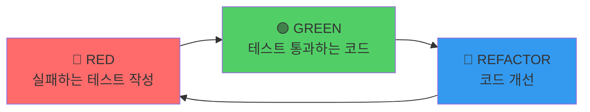
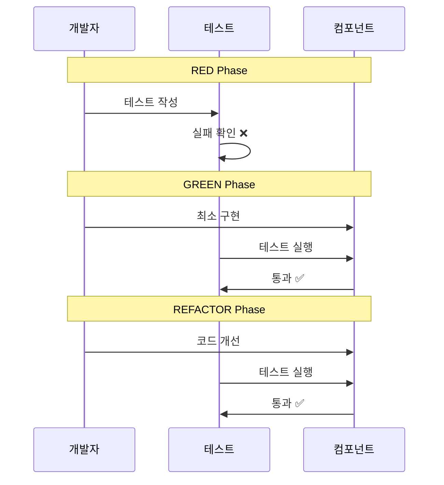

# TDD Guide (Test-Driven Development)

> 이 문서는 TalkStudio 프로젝트의 TDD 개발 방법론을 정의합니다.
> 모든 기능 개발은 TDD 사이클을 따릅니다.

---

## 변경 이력 (Changelog)

| 버전 | 날짜 | 작성자 | 변경 내용 |
|------|------|--------|----------|
| 1.0.0 | 2025-12-08 | @haseongpark | 최초 작성 |

---

## 관련 문서

- [plan.md](../../plan.md) - TDD 개발 계획
- [TEST_STRATEGY_GUIDE.md](./TEST_STRATEGY_GUIDE.md) - 테스트 전략
- [CLEAN_CODE_GUIDE.md](./CLEAN_CODE_GUIDE.md) - 클린 코드 가이드

---

## 1. TDD 개요

### 1.1 TDD란?

**Test-Driven Development(TDD)**는 테스트를 먼저 작성하고, 그 테스트를 통과하는 코드를 구현하는 개발 방법론입니다.

```
┌─────────────────────────────────────────────────────────────────┐
│                        TDD 핵심 원칙                             │
├─────────────────────────────────────────────────────────────────┤
│ 1. 실패하는 테스트 없이 프로덕션 코드를 작성하지 않는다          │
│ 2. 실패하는 테스트를 통과할 만큼만 코드를 작성한다               │
│ 3. 테스트가 통과하면 리팩토링한다                                │
└─────────────────────────────────────────────────────────────────┘
```

### 1.2 TDD 사이클



### 1.3 TDD의 이점

| 이점 | 설명 |
|------|------|
| **설계 개선** | 테스트 가능한 코드 = 좋은 설계 |
| **버그 감소** | 작성 즉시 검증 |
| **문서화** | 테스트가 명세 역할 |
| **리팩토링 안전망** | 변경 후 즉시 검증 가능 |
| **개발 속도** | 장기적으로 디버깅 시간 감소 |

---

## 2. TDD 사이클 상세

### 2.1 RED: 실패하는 테스트 작성

**목표**: 구현하려는 기능의 명세를 테스트로 작성

```javascript
// ❌ 아직 구현되지 않은 기능 테스트
describe('useChatStore', () => {
  describe('addMessage', () => {
    it('should add a new message to the messages array', () => {
      // Arrange
      const initialLength = useChatStore.getState().messages.length;
      const newMessage = {
        sender: 'me',
        type: 'text',
        text: 'Hello!',
        time: '12:30',
      };

      // Act
      useChatStore.getState().addMessage(newMessage);

      // Assert
      const messages = useChatStore.getState().messages;
      expect(messages.length).toBe(initialLength + 1);
      expect(messages[messages.length - 1].text).toBe('Hello!');
    });
  });
});
```

**RED 단계 체크리스트:**
- [ ] 테스트가 명확한 이름을 가지고 있는가?
- [ ] 테스트가 하나의 동작만 검증하는가?
- [ ] 테스트가 실패하는 것을 확인했는가?
- [ ] 실패 메시지가 명확한가?

### 2.2 GREEN: 테스트 통과하는 최소 코드

**목표**: 테스트를 통과하는 가장 간단한 코드 작성

```javascript
// ✅ 테스트를 통과하는 최소 구현
const useChatStore = create((set) => ({
  messages: [],

  addMessage: (message) => set((state) => ({
    messages: [
      ...state.messages,
      {
        id: Date.now().toString(),
        ...message,
      },
    ],
  })),
}));
```

**GREEN 단계 체크리스트:**
- [ ] 테스트가 통과하는가?
- [ ] 불필요한 코드를 추가하지 않았는가?
- [ ] "작동하는" 코드인가? (깔끔하지 않아도 됨)

### 2.3 REFACTOR: 코드 개선

**목표**: 동작을 유지하면서 코드 품질 개선

```javascript
// 🔄 리팩토링: ID 생성 로직 분리
function generateMessageId() {
  return `msg-${Date.now()}-${Math.random().toString(36).substr(2, 9)}`;
}

const useChatStore = create((set) => ({
  messages: [],

  addMessage: (message) => set((state) => ({
    messages: [
      ...state.messages,
      {
        id: generateMessageId(),
        createdAt: Date.now(),
        ...message,
      },
    ],
  })),
}));
```

**REFACTOR 단계 체크리스트:**
- [ ] 모든 테스트가 여전히 통과하는가?
- [ ] 중복이 제거되었는가?
- [ ] 코드가 더 읽기 쉬워졌는가?
- [ ] 함수/변수 이름이 명확한가?

---

## 3. 테스트 작성 가이드

### 3.1 테스트 네이밍 컨벤션

```javascript
// 패턴: should [예상 동작] when [조건]

// ✅ 좋은 예시
it('should add message to store when valid message is provided', () => {});
it('should throw error when message text is empty', () => {});
it('should update theme when setTheme is called', () => {});

// ❌ 나쁜 예시
it('test addMessage', () => {});
it('works', () => {});
it('message test', () => {});
```

### 3.2 AAA 패턴

모든 테스트는 **Arrange-Act-Assert** 패턴을 따릅니다:

```javascript
it('should remove message from store when removeMessage is called', () => {
  // Arrange (준비)
  const messageId = 'msg-123';
  useChatStore.setState({
    messages: [
      { id: messageId, sender: 'me', text: 'Hello', time: '12:30' },
      { id: 'msg-456', sender: 'other', text: 'Hi', time: '12:31' },
    ],
  });

  // Act (실행)
  useChatStore.getState().removeMessage(messageId);

  // Assert (검증)
  const messages = useChatStore.getState().messages;
  expect(messages.length).toBe(1);
  expect(messages.find(m => m.id === messageId)).toBeUndefined();
});
```

### 3.3 테스트 격리

```javascript
describe('useChatStore', () => {
  // 각 테스트 전에 스토어 초기화
  beforeEach(() => {
    useChatStore.setState({
      config: { theme: 'kakao', capturedImage: null },
      messages: [],
      profiles: {
        me: { name: '나', avatar: '' },
        other: { name: '상대방', avatar: '' },
      },
      statusBar: { time: '12:30', battery: 85, wifi: true },
    });
  });

  it('should start with empty messages', () => {
    expect(useChatStore.getState().messages).toHaveLength(0);
  });
});
```

---

## 4. 컴포넌트 TDD

### 4.1 컴포넌트 테스트 사이클



### 4.2 RED: 컴포넌트 테스트 작성

```jsx
// tests/components/MessageEditor.test.jsx
import { render, screen, fireEvent } from '@testing-library/react';
import userEvent from '@testing-library/user-event';
import { MessageEditor } from '../../src/components/editor/MessageEditor';
import { useChatStore } from '../../src/store/useChatStore';

describe('MessageEditor', () => {
  beforeEach(() => {
    useChatStore.setState({ messages: [] });
  });

  it('should render message input field', () => {
    render(<MessageEditor />);

    expect(screen.getByPlaceholderText('메시지를 입력하세요')).toBeInTheDocument();
  });

  it('should render sender toggle with "me" and "other" options', () => {
    render(<MessageEditor />);

    expect(screen.getByRole('button', { name: '나' })).toBeInTheDocument();
    expect(screen.getByRole('button', { name: '상대방' })).toBeInTheDocument();
  });

  it('should add message to store when form is submitted', async () => {
    render(<MessageEditor />);

    const input = screen.getByPlaceholderText('메시지를 입력하세요');
    const submitButton = screen.getByRole('button', { name: '메시지 추가' });

    await userEvent.type(input, 'Hello, World!');
    await userEvent.click(submitButton);

    const messages = useChatStore.getState().messages;
    expect(messages).toHaveLength(1);
    expect(messages[0].text).toBe('Hello, World!');
  });

  it('should clear input after successful submission', async () => {
    render(<MessageEditor />);

    const input = screen.getByPlaceholderText('메시지를 입력하세요');
    await userEvent.type(input, 'Test message');
    await userEvent.click(screen.getByRole('button', { name: '메시지 추가' }));

    expect(input).toHaveValue('');
  });

  it('should not add message when input is empty', async () => {
    render(<MessageEditor />);

    await userEvent.click(screen.getByRole('button', { name: '메시지 추가' }));

    expect(useChatStore.getState().messages).toHaveLength(0);
  });
});
```

### 4.3 GREEN: 컴포넌트 구현

```jsx
// src/components/editor/MessageEditor.jsx
import { useState } from 'react';
import { useChatStore } from '../../store/useChatStore';

export function MessageEditor() {
  const [sender, setSender] = useState('me');
  const [text, setText] = useState('');
  const addMessage = useChatStore((state) => state.addMessage);

  const handleSubmit = (e) => {
    e.preventDefault();
    if (!text.trim()) return;

    addMessage({
      sender,
      type: 'text',
      text: text.trim(),
      time: new Date().toLocaleTimeString('ko-KR', {
        hour: '2-digit',
        minute: '2-digit',
      }),
    });

    setText('');
  };

  return (
    <form onSubmit={handleSubmit}>
      <div>
        <button
          type="button"
          onClick={() => setSender('me')}
          aria-pressed={sender === 'me'}
        >
          나
        </button>
        <button
          type="button"
          onClick={() => setSender('other')}
          aria-pressed={sender === 'other'}
        >
          상대방
        </button>
      </div>
      <textarea
        value={text}
        onChange={(e) => setText(e.target.value)}
        placeholder="메시지를 입력하세요"
      />
      <button type="submit">메시지 추가</button>
    </form>
  );
}
```

### 4.4 REFACTOR: 컴포넌트 개선

```jsx
// 리팩토링된 버전
import { useState, useCallback } from 'react';
import { useChatStore } from '../../store/useChatStore';
import { SenderToggle } from './SenderToggle';
import { Button } from '../common/Button';

const getCurrentTime = () =>
  new Date().toLocaleTimeString('ko-KR', {
    hour: '2-digit',
    minute: '2-digit',
  });

export function MessageEditor() {
  const [sender, setSender] = useState('me');
  const [text, setText] = useState('');
  const addMessage = useChatStore((state) => state.addMessage);

  const handleSubmit = useCallback((e) => {
    e.preventDefault();
    const trimmedText = text.trim();
    if (!trimmedText) return;

    addMessage({
      sender,
      type: 'text',
      text: trimmedText,
      time: getCurrentTime(),
    });

    setText('');
  }, [text, sender, addMessage]);

  return (
    <form onSubmit={handleSubmit} className="space-y-4">
      <SenderToggle value={sender} onChange={setSender} />

      <textarea
        value={text}
        onChange={(e) => setText(e.target.value)}
        placeholder="메시지를 입력하세요"
        className="w-full p-3 border rounded-lg"
        rows={3}
      />

      <Button type="submit" disabled={!text.trim()}>
        메시지 추가
      </Button>
    </form>
  );
}
```

---

## 5. TDD 실전 워크플로우

### 5.1 기능 개발 프로세스

```
1. 요구사항 분석
   └── PRD.md에서 기능 확인 (예: F-002 메시지 편집)

2. 테스트 목록 작성
   └── 기능에 필요한 테스트 케이스 나열

3. TDD 사이클 반복
   └── 각 테스트에 대해 RED → GREEN → REFACTOR

4. 통합 테스트
   └── 컴포넌트 간 상호작용 테스트

5. 코드 리뷰
   └── PR 생성 및 리뷰 요청
```

### 5.2 테스트 목록 작성 예시

```markdown
## F-002: 메시지 편집 기능

### 단위 테스트 (Store)
- [ ] addMessage: 메시지 추가 시 ID 자동 생성
- [ ] addMessage: 메시지 추가 시 createdAt 타임스탬프 추가
- [ ] addMessage: 빈 텍스트는 추가 불가
- [ ] removeMessage: 지정 ID 메시지 삭제
- [ ] removeMessage: 존재하지 않는 ID는 무시
- [ ] updateMessage: 메시지 내용 수정

### 컴포넌트 테스트 (MessageEditor)
- [ ] 메시지 입력 필드 렌더링
- [ ] 발신자 토글 렌더링 및 동작
- [ ] 폼 제출 시 메시지 추가
- [ ] 제출 후 입력 필드 초기화
- [ ] 빈 입력 시 제출 방지

### 통합 테스트
- [ ] 메시지 추가 후 프리뷰에 표시
- [ ] 메시지 삭제 후 프리뷰에서 제거
```

### 5.3 TDD 세션 예시

```bash
# 1. 테스트 파일 생성
touch tests/unit/store/useChatStore.test.js

# 2. 테스트 실행 (watch 모드)
npm run test:watch

# 3. RED: 실패하는 테스트 확인
# 터미널에서 FAIL 메시지 확인

# 4. GREEN: 코드 구현
# src/store/useChatStore.js 수정

# 5. 테스트 통과 확인
# 터미널에서 PASS 메시지 확인

# 6. REFACTOR: 코드 개선
# 중복 제거, 이름 개선 등

# 7. 다음 테스트로 이동
```

---

## 6. 테스트 도구 설정

### 6.1 Vitest 설정

```javascript
// vitest.config.js
import { defineConfig } from 'vitest/config';
import react from '@vitejs/plugin-react';

export default defineConfig({
  plugins: [react()],
  test: {
    environment: 'jsdom',
    globals: true,
    setupFiles: ['./tests/setup.js'],
    include: ['tests/**/*.test.{js,jsx}'],
    coverage: {
      provider: 'v8',
      reporter: ['text', 'html', 'lcov'],
      exclude: ['node_modules/', 'tests/'],
    },
  },
});
```

### 6.2 테스트 셋업

```javascript
// tests/setup.js
import '@testing-library/jest-dom';
import { cleanup } from '@testing-library/react';
import { afterEach, beforeEach } from 'vitest';
import { useChatStore } from '../src/store/useChatStore';

// 각 테스트 후 cleanup
afterEach(() => {
  cleanup();
});

// 스토어 초기화 헬퍼
export const resetStore = () => {
  useChatStore.setState({
    config: { theme: 'kakao', capturedImage: null },
    messages: [],
    profiles: {
      me: { name: '나', avatar: '' },
      other: { name: '상대방', avatar: '' },
    },
    statusBar: { time: '12:30', battery: 85, wifi: true },
  });
};
```

### 6.3 npm 스크립트

```json
{
  "scripts": {
    "test": "vitest run",
    "test:watch": "vitest",
    "test:coverage": "vitest run --coverage",
    "test:ui": "vitest --ui"
  }
}
```

---

## 7. TDD 안티패턴

### 7.1 피해야 할 패턴

| 안티패턴 | 문제점 | 해결책 |
|----------|--------|--------|
| **테스트 건너뛰기** | TDD 원칙 위반 | RED부터 시작 |
| **과도한 구현** | 불필요한 코드 | 테스트만 통과하는 최소 코드 |
| **테스트 후 작성** | 누락 가능성 | 항상 테스트 먼저 |
| **구현 세부사항 테스트** | 리팩토링 어려움 | 동작/결과만 테스트 |
| **느린 테스트** | 피드백 지연 | 단위 테스트 우선 |

### 7.2 안티패턴 예시

```javascript
// ❌ 구현 세부사항 테스트 (나쁨)
it('should call useState with initial value', () => {
  const useStateSpy = vi.spyOn(React, 'useState');
  render(<MessageEditor />);
  expect(useStateSpy).toHaveBeenCalledWith('');
});

// ✅ 동작 테스트 (좋음)
it('should start with empty input', () => {
  render(<MessageEditor />);
  expect(screen.getByPlaceholderText('메시지를 입력하세요')).toHaveValue('');
});
```

```javascript
// ❌ 테스트가 서로 의존 (나쁨)
let savedMessage;

it('should add message', () => {
  addMessage({ text: 'Hello' });
  savedMessage = getMessages()[0];
  expect(savedMessage).toBeDefined();
});

it('should use saved message', () => {
  // savedMessage에 의존 - 테스트 순서에 따라 실패 가능
  expect(savedMessage.text).toBe('Hello');
});

// ✅ 독립적인 테스트 (좋음)
it('should add message', () => {
  addMessage({ text: 'Hello' });
  const messages = getMessages();
  expect(messages[0].text).toBe('Hello');
});
```

---

## 8. TDD 체크리스트

### 8.1 RED 단계 체크리스트

```markdown
- [ ] 테스트가 요구사항을 명확히 표현하는가?
- [ ] 테스트 이름이 의도를 설명하는가?
- [ ] 테스트가 독립적인가?
- [ ] 테스트가 실제로 실패하는가?
- [ ] 실패 메시지가 유용한가?
```

### 8.2 GREEN 단계 체크리스트

```markdown
- [ ] 테스트가 통과하는가?
- [ ] 가장 간단한 구현인가?
- [ ] 다른 테스트가 깨지지 않았는가?
- [ ] 하드코딩으로 통과시키지 않았는가?
```

### 8.3 REFACTOR 단계 체크리스트

```markdown
- [ ] 모든 테스트가 여전히 통과하는가?
- [ ] 코드 중복이 제거되었는가?
- [ ] 함수/변수 이름이 명확한가?
- [ ] 단일 책임 원칙을 따르는가?
- [ ] 코드가 더 읽기 쉬워졌는가?
```

---

## 9. 참고 자료

### 9.1 추천 도서

- "Test-Driven Development by Example" - Kent Beck
- "Clean Code" - Robert C. Martin
- "Working Effectively with Legacy Code" - Michael Feathers

### 9.2 유용한 링크

- [Vitest 공식 문서](https://vitest.dev/)
- [React Testing Library](https://testing-library.com/docs/react-testing-library/intro/)
- [Testing Library Cheatsheet](https://testing-library.com/docs/react-testing-library/cheatsheet/)

---

> **Remember**: TDD는 단순히 테스트를 먼저 작성하는 것이 아닙니다.
> 작은 단계로 나누어 점진적으로 기능을 완성하는 설계 방법론입니다.
