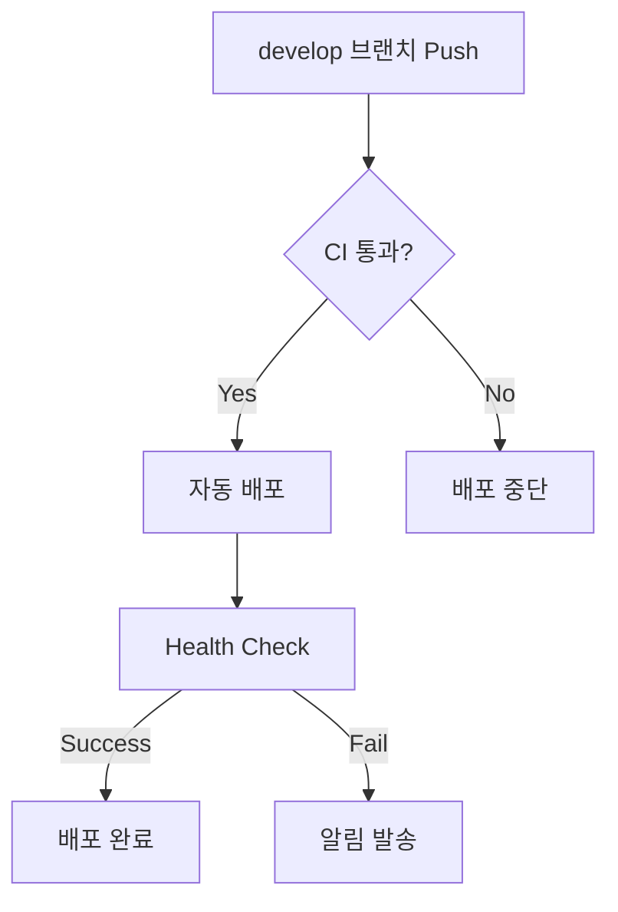
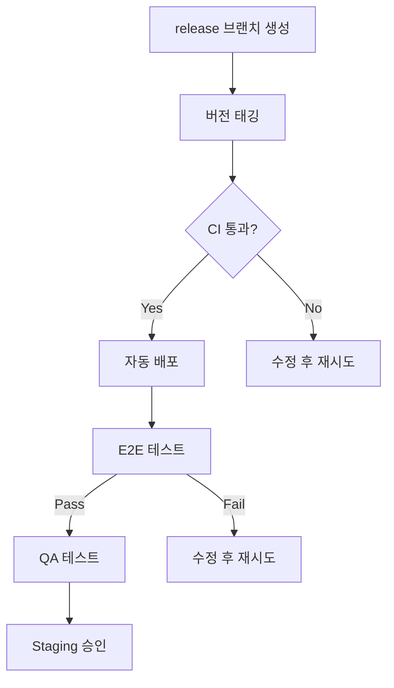
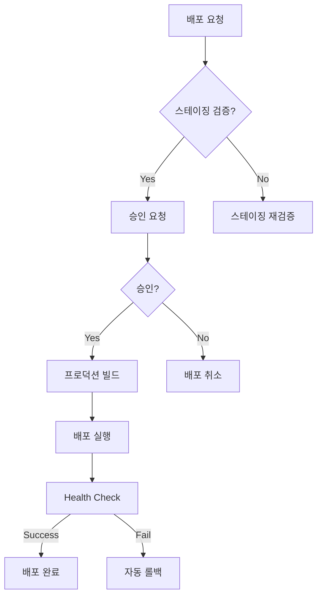

# Deployment Checklist

> TalkStudio 배포 시 확인해야 할 체크리스트입니다.

---

## 변경 이력 (Changelog)

| 버전 | 날짜 | 작성자 | 변경 내용 |
|------|------|--------|----------|
| 1.0.0 | 2025-12-08 | @haseongpark | 최초 작성 |

---

## 관련 문서

- [RELEASE_MANAGEMENT.md](./RELEASE_MANAGEMENT.md)
- [MONITORING_AND_ALERTING.md](./MONITORING_AND_ALERTING.md)
- [INCIDENT_RESPONSE.md](./INCIDENT_RESPONSE.md)
- [ci.yml](../../.github/workflows/ci.yml)
- [deploy-prod.yml](../../.github/workflows/deploy-prod.yml)

---

## 1. 배포 환경 개요

### 1.1 환경 구성

```
┌─────────────────────────────────────────────────────────────────┐
│                     Deployment Environments                      │
├─────────────────────────────────────────────────────────────────┤
│                                                                  │
│   ┌─────────────┐    ┌─────────────┐    ┌─────────────┐        │
│   │ Development │───▶│   Staging   │───▶│ Production  │        │
│   │             │    │             │    │             │        │
│   │ dev.talk    │    │ staging.    │    │ talkstudio  │        │
│   │ studio.app  │    │ talkstudio  │    │ .app        │        │
│   │             │    │ .app        │    │             │        │
│   └─────────────┘    └─────────────┘    └─────────────┘        │
│         │                  │                  │                 │
│         ▼                  ▼                  ▼                 │
│   ┌─────────────┐    ┌─────────────┐    ┌─────────────┐        │
│   │  Auto on    │    │  Auto on    │    │   Manual    │        │
│   │  develop    │    │  release/*  │    │  Approval   │        │
│   │  branch     │    │  branch     │    │  Required   │        │
│   └─────────────┘    └─────────────┘    └─────────────┘        │
│                                                                  │
└─────────────────────────────────────────────────────────────────┘
```

### 1.2 환경별 특성

| 환경 | URL | 배포 트리거 | 승인 | 목적 |
|------|-----|-------------|------|------|
| Development | dev.talkstudio.app | `develop` branch push | 불필요 | 개발/통합 테스트 |
| Staging | staging.talkstudio.app | `release/*` branch push | 불필요 | QA/UAT |
| Production | talkstudio.app | Manual dispatch | **필수** | 실 서비스 |

---

## 2. Pre-Deployment Checklist

### 2.1 코드 품질 확인

#### 필수 항목

- [ ] 모든 CI 파이프라인 통과
  - [ ] ESLint 검사 통과
  - [ ] TypeScript 타입 체크 통과
  - [ ] Unit 테스트 통과 (커버리지 80% 이상)
  - [ ] Build 성공

- [ ] 코드 리뷰 완료
  - [ ] 최소 1명 이상의 승인
  - [ ] 리뷰 코멘트 모두 해결
  - [ ] 머지 충돌 해결

- [ ] 변경 사항 문서화
  - [ ] PR 설명 작성
  - [ ] CHANGELOG 업데이트 (해당 시)
  - [ ] API 변경 시 문서 업데이트

#### 확인 스크립트

```bash
# 로컬에서 배포 전 확인
pnpm lint && pnpm tsc --noEmit && pnpm test && pnpm build

# 성공 시 출력 예시
# ✓ Lint passed
# ✓ Type check passed
# ✓ Tests passed (coverage: 85%)
# ✓ Build completed
```

### 2.2 스테이징 검증

#### 기능 테스트

- [ ] 핵심 기능 테스트
  - [ ] 메시지 추가/삭제/수정
  - [ ] 프로필 설정
  - [ ] 테마 변경 (Kakao, Telegram, Instagram, Discord)
  - [ ] 이미지 내보내기

- [ ] E2E 테스트 통과
  - [ ] Critical path 모두 통과
  - [ ] 크로스 브라우저 테스트 (Chrome, Firefox, Safari)

#### 성능 테스트

- [ ] Lighthouse 점수 확인
  - [ ] Performance: 90+
  - [ ] Accessibility: 90+
  - [ ] Best Practices: 90+
  - [ ] SEO: 90+

- [ ] 번들 사이즈 확인
  - [ ] Main JS: < 500KB
  - [ ] CSS: < 100KB
  - [ ] 총 초기 로드: < 1MB

### 2.3 의존성 확인

- [ ] 보안 취약점 스캔
  ```bash
  pnpm audit
  # 높은 심각도 취약점 없어야 함
  ```

- [ ] 라이선스 검토
  ```bash
  pnpm exec license-checker --summary
  # GPL 라이선스 포함 여부 확인
  ```

- [ ] 의존성 버전 확인
  - [ ] 메이저 버전 업데이트 검토
  - [ ] Deprecated 패키지 확인

---

## 3. Deployment Checklist

### 3.1 Development 환경



#### 체크리스트

- [ ] `develop` 브랜치에 머지 완료
- [ ] CI 파이프라인 자동 실행 확인
- [ ] 배포 완료 확인 (약 3-5분)
- [ ] Health check 통과 확인
- [ ] 기본 기능 스모크 테스트

### 3.2 Staging 환경



#### 체크리스트

- [ ] Release 브랜치 생성
  ```bash
  git checkout develop
  git pull origin develop
  git checkout -b release/v1.2.3
  git push -u origin release/v1.2.3
  ```

- [ ] 버전 업데이트
  ```bash
  npm version patch|minor|major
  ```

- [ ] CI/CD 파이프라인 확인
  - [ ] 빌드 성공
  - [ ] 자동 배포 완료
  - [ ] E2E 테스트 통과

- [ ] QA 테스트
  - [ ] 모든 기능 테스트 완료
  - [ ] 버그 수정 완료
  - [ ] UAT 승인

### 3.3 Production 환경



#### 체크리스트

**배포 전**

- [ ] 스테이징 환경 최종 확인
- [ ] 배포 승인권자 확인
- [ ] 배포 시간 결정 (트래픽 낮은 시간대 권장)
- [ ] 롤백 계획 수립
- [ ] 모니터링 대시보드 준비

**배포 실행**

1. GitHub Actions 수동 트리거
   ```
   Actions → Deploy to Production → Run workflow
   - version: v1.2.3
   - confirm_staging: true
   ```

2. 승인 대기
   - [ ] 지정된 승인권자가 승인

3. 배포 모니터링
   - [ ] 빌드 단계 확인
   - [ ] 배포 단계 확인
   - [ ] Health check 확인

**배포 후**

- [ ] 프로덕션 스모크 테스트
- [ ] 에러 로그 모니터링 (15분)
- [ ] 성능 메트릭 확인
- [ ] 사용자 피드백 모니터링

---

## 4. Post-Deployment Checklist

### 4.1 즉시 확인 (0-15분)

- [ ] 애플리케이션 접속 확인
  ```bash
  curl -I https://talkstudio.app
  # HTTP/2 200 확인
  ```

- [ ] 빌드 정보 확인
  ```bash
  curl https://talkstudio.app/build-info.json
  # 배포된 버전 확인
  ```

- [ ] Critical Path 테스트
  - [ ] 홈페이지 로드
  - [ ] 메시지 추가
  - [ ] 테마 변경
  - [ ] 이미지 내보내기

- [ ] 에러 모니터링
  - [ ] Sentry 대시보드 확인
  - [ ] 새로운 에러 없음 확인

### 4.2 단기 모니터링 (15분-1시간)

- [ ] 성능 메트릭
  - [ ] 평균 응답 시간 정상
  - [ ] Error rate < 0.1%
  - [ ] Core Web Vitals 정상

- [ ] 사용자 행동
  - [ ] 정상적인 트래픽 패턴
  - [ ] Bounce rate 급증 없음

### 4.3 장기 모니터링 (1시간-24시간)

- [ ] 일간 에러 리포트 확인
- [ ] 사용자 피드백/문의 확인
- [ ] 성능 트렌드 분석

---

## 5. Rollback Procedures

### 5.1 자동 롤백

Production 배포 시 health check 실패 시 자동으로 롤백됩니다.

```yaml
# deploy-prod.yml 중 롤백 로직
rollback:
  name: Rollback
  if: failure() && needs.deploy.result == 'success'
  steps:
    - name: Restore from backup
      run: |
        aws s3 sync s3://bucket-backup s3://bucket-prod --delete
```

### 5.2 수동 롤백

문제 발생 시 수동으로 이전 버전으로 롤백합니다.

#### 방법 1: 이전 버전 재배포

```bash
# 이전 버전 태그 확인
git tag --list 'v*-prod' | tail -5

# 이전 버전으로 배포
# GitHub Actions → Deploy to Production
# version: v1.2.2 (이전 버전)
```

#### 방법 2: AWS S3 백업 복원 (AWS 사용 시)

```bash
# 백업 확인
aws s3 ls s3://talkstudio-prod-backup-{run_number}/

# 복원
aws s3 sync s3://talkstudio-prod-backup-{run_number} s3://talkstudio-prod --delete

# CloudFront 캐시 무효화
aws cloudfront create-invalidation \
  --distribution-id XXXXX \
  --paths "/*"
```

### 5.3 롤백 체크리스트

- [ ] 문제 원인 파악
- [ ] 롤백 결정 및 승인
- [ ] 롤백 실행
- [ ] 서비스 정상화 확인
- [ ] 인시던트 리포트 작성
- [ ] 원인 분석 및 재발 방지 대책

---

## 6. Environment-Specific Configurations

### 6.1 환경 변수

| 변수 | Development | Staging | Production |
|------|-------------|---------|------------|
| `VITE_APP_ENV` | development | staging | production |
| `VITE_ENABLE_DEBUG` | true | false | false |
| `VITE_ENABLE_ANALYTICS` | false | true | true |
| `VITE_API_URL` | api-dev... | api-staging... | api... |
| `VITE_SENTRY_DSN` | - | (staging DSN) | (prod DSN) |

### 6.2 Feature Flags

```typescript
// 환경별 기능 제어
const features = {
  development: {
    debugMode: true,
    experimentalFeatures: true,
    mockData: true,
  },
  staging: {
    debugMode: false,
    experimentalFeatures: true,
    mockData: false,
  },
  production: {
    debugMode: false,
    experimentalFeatures: false,
    mockData: false,
  },
};
```

---

## 7. Emergency Contacts

### 7.1 Escalation Matrix

| 레벨 | 상황 | 담당자 | 연락처 |
|------|------|--------|--------|
| L1 | 일반 이슈 | On-call Engineer | Slack #ops-alerts |
| L2 | 서비스 장애 | Tech Lead | Phone/Slack |
| L3 | 심각한 장애 | Engineering Manager | Phone |
| L4 | 보안 인시던트 | Security Team | security@talkstudio.app |

### 7.2 Communication Channels

- **Slack**: #deployments, #ops-alerts
- **Email**: ops@talkstudio.app
- **PagerDuty**: Critical alerts

---

## 8. Quick Reference

### 배포 명령어

```bash
# Development 배포 (자동)
git checkout develop
git pull && git merge feature/xxx
git push origin develop

# Staging 배포
git checkout -b release/v1.2.3
npm version 1.2.3
git push -u origin release/v1.2.3

# Production 배포
# GitHub Actions → Deploy to Production → Run workflow
```

### 확인 URL

| 환경 | URL | Health Check |
|------|-----|--------------|
| Dev | https://dev.talkstudio.app | /build-info.json |
| Staging | https://staging.talkstudio.app | /build-info.json |
| Production | https://talkstudio.app | /build-info.json |

---

## Validation Checklist

- [x] 모든 환경에 대한 체크리스트 포함
- [x] Pre/Post deployment 절차 명시
- [x] 롤백 절차 문서화
- [x] 환경별 설정 정리
- [x] 비상 연락처 포함
- [x] 실행 가능한 명령어 제공
