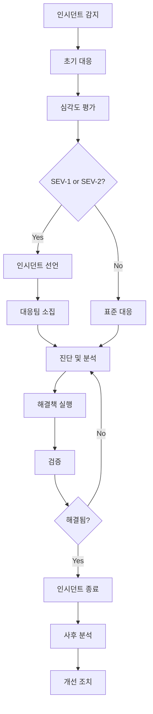

# Incident Response

> TalkStudio 인시던트 대응 프로세스 및 절차입니다.

---

## 변경 이력 (Changelog)

| 버전 | 날짜 | 작성자 | 변경 내용 |
|------|------|--------|----------|
| 1.0.0 | 2025-12-08 | @haseongpark | 최초 작성 |

---

## 관련 문서

- [MONITORING_AND_ALERTING.md](./MONITORING_AND_ALERTING.md)
- [DEPLOYMENT_CHECKLIST.md](./DEPLOYMENT_CHECKLIST.md)
- [RELEASE_MANAGEMENT.md](./RELEASE_MANAGEMENT.md)
- [ERROR_HANDLING_GUIDE.md](../guides/ERROR_HANDLING_GUIDE.md)

---

## 1. Incident Overview

### 1.1 Incident Definition

**인시던트(Incident)**란 서비스의 정상적인 운영을 방해하거나 사용자 경험을 저해하는 모든 이벤트를 의미합니다.

```
┌─────────────────────────────────────────────────────────────────┐
│                    Incident Classification                       │
├─────────────────────────────────────────────────────────────────┤
│                                                                  │
│   ┌───────────────────────────────────────────────────────────┐ │
│   │ SEV-1 (Critical)                                          │ │
│   │ • 서비스 완전 다운                                        │ │
│   │ • 데이터 손실/유출                                        │ │
│   │ • 모든 사용자 영향                                        │ │
│   └───────────────────────────────────────────────────────────┘ │
│                           ▼                                      │
│   ┌───────────────────────────────────────────────────────────┐ │
│   │ SEV-2 (High)                                              │ │
│   │ • 주요 기능 장애                                          │ │
│   │ • 상당수 사용자 영향                                      │ │
│   │ • 우회 방법 없음                                          │ │
│   └───────────────────────────────────────────────────────────┘ │
│                           ▼                                      │
│   ┌───────────────────────────────────────────────────────────┐ │
│   │ SEV-3 (Medium)                                            │ │
│   │ • 부분적 기능 장애                                        │ │
│   │ • 일부 사용자 영향                                        │ │
│   │ • 우회 방법 존재                                          │ │
│   └───────────────────────────────────────────────────────────┘ │
│                           ▼                                      │
│   ┌───────────────────────────────────────────────────────────┐ │
│   │ SEV-4 (Low)                                               │ │
│   │ • 경미한 이슈                                             │ │
│   │ • 최소 사용자 영향                                        │ │
│   │ • 비즈니스 영향 없음                                      │ │
│   └───────────────────────────────────────────────────────────┘ │
│                                                                  │
└─────────────────────────────────────────────────────────────────┘
```

### 1.2 Severity Matrix

| 심각도 | 영향 범위 | 비즈니스 영향 | 응답 시간 | 해결 목표 |
|--------|----------|--------------|----------|----------|
| **SEV-1** | 전체 서비스 | 치명적 | 즉시 | 1시간 |
| **SEV-2** | 주요 기능 | 심각 | 15분 | 4시간 |
| **SEV-3** | 부분 기능 | 중간 | 1시간 | 24시간 |
| **SEV-4** | 경미 | 낮음 | 24시간 | 1주일 |

### 1.3 Incident Examples

| 심각도 | 예시 |
|--------|------|
| SEV-1 | 웹사이트 접속 불가, 데이터베이스 장애 |
| SEV-2 | 이미지 내보내기 실패, 테마 변경 불가 |
| SEV-3 | 특정 브라우저에서 스타일 깨짐, 느린 로딩 |
| SEV-4 | 오타, 마이너 UI 버그 |

---

## 2. Incident Response Process

### 2.1 Incident Lifecycle



### 2.2 Response Timeline

```
┌─────────────────────────────────────────────────────────────────┐
│                     Incident Response Timeline                   │
├─────────────────────────────────────────────────────────────────┤
│                                                                  │
│  T+0      T+5min    T+15min   T+30min   T+1hr    T+4hr   T+24hr │
│   │         │          │         │        │        │        │   │
│   ▼         ▼          ▼         ▼        ▼        ▼        ▼   │
│ ┌───┐    ┌───┐      ┌───┐    ┌────┐   ┌────┐   ┌────┐  ┌────┐  │
│ │감지│───▶│확인│─────▶│선언│───▶│소집│──▶│진단│──▶│해결│─▶│종료│  │
│ └───┘    └───┘      └───┘    └────┘   └────┘   └────┘  └────┘  │
│                                                                  │
│ SEV-1:   즉시      5분       15분      30분      1시간           │
│ SEV-2:   5분       15분      30분      1시간     4시간           │
│                                                                  │
└─────────────────────────────────────────────────────────────────┘
```

---

## 3. Incident Roles

### 3.1 Role Definitions

| 역할 | 책임 | 담당자 |
|------|------|--------|
| **Incident Commander (IC)** | 전체 대응 조율, 의사결정 | Tech Lead / Engineering Manager |
| **Technical Lead** | 기술적 진단 및 해결 | Senior Engineer |
| **Communications Lead** | 내외부 커뮤니케이션 | PM / Tech Lead |
| **Scribe** | 인시던트 기록 | 지정된 엔지니어 |
| **Subject Matter Expert (SME)** | 특정 영역 전문가 | 해당 영역 담당자 |

### 3.2 Role Responsibilities

#### Incident Commander (IC)

```markdown
## IC Responsibilities

### 인시던트 선언 시
1. 인시던트 심각도 결정
2. 대응팀 소집
3. 커뮤니케이션 채널 개설 (#incident-YYYYMMDD)

### 대응 중
1. 전체 상황 파악 및 조율
2. 의사결정 (롤백, 에스컬레이션 등)
3. 리소스 할당
4. 정기 상태 업데이트 (15분 간격)

### 인시던트 종료 시
1. 종료 선언
2. 사후 분석 일정 수립
3. 초기 인시던트 리포트 작성
```

#### Technical Lead

```markdown
## Technical Lead Responsibilities

1. 기술적 근본 원인 분석
2. 해결 방안 제시
3. 수정 사항 구현/검토
4. 복구 절차 실행
5. 기술적 상태 IC에게 보고
```

### 3.3 Escalation Matrix

```
┌─────────────────────────────────────────────────────────────────┐
│                      Escalation Matrix                           │
├─────────────────────────────────────────────────────────────────┤
│                                                                  │
│  Level 1: On-Call Engineer                                       │
│     └──▶ 15분 내 응답 없음                                       │
│           │                                                      │
│  Level 2: Tech Lead                                              │
│     └──▶ 30분 내 해결 안됨 또는 SEV-1                           │
│           │                                                      │
│  Level 3: Engineering Manager                                    │
│     └──▶ 1시간 내 해결 안됨 또는 비즈니스 영향 심각             │
│           │                                                      │
│  Level 4: CTO / Executive                                        │
│     └──▶ 보안 인시던트 또는 PR 이슈                             │
│                                                                  │
└─────────────────────────────────────────────────────────────────┘
```

---

## 4. Incident Communication

### 4.1 Communication Channels

| 채널 | 용도 | 대상 |
|------|------|------|
| **Slack #incident-{date}** | 실시간 대응 | 대응팀 |
| **Slack #ops-alerts** | 알림/모니터링 | 운영팀 |
| **Slack #general** | 전사 공지 | 전체 (SEV-1/2만) |
| **Email** | 공식 커뮤니케이션 | 이해관계자 |
| **Status Page** | 외부 공지 | 사용자 |

### 4.2 Communication Templates

#### 인시던트 선언

```markdown
🚨 **INCIDENT DECLARED**

**Severity**: SEV-{X}
**Title**: {간단한 설명}
**Impact**: {영향 범위}
**Status**: Investigating

**Incident Commander**: @{name}
**Technical Lead**: @{name}

**War Room**: #incident-{YYYYMMDD}

Updates every 15 minutes.
```

#### 상태 업데이트

```markdown
📊 **STATUS UPDATE** (T+{XX}min)

**Current Status**: {Investigating | Identified | Mitigating | Resolved}

**Summary**:
{현재 상황 요약}

**Actions Taken**:
- {조치 1}
- {조치 2}

**Next Steps**:
- {다음 계획}

**ETA**: {예상 해결 시간 또는 "Investigating"}
```

#### 인시던트 해결

```markdown
✅ **INCIDENT RESOLVED**

**Duration**: {시작 시간} - {종료 시간} ({총 시간})
**Root Cause**: {간단한 원인}
**Resolution**: {해결 방법}

**Impact Summary**:
- Affected users: ~{수}
- Duration: {시간}

**Follow-up**:
- Post-mortem scheduled: {날짜}
- Action items: {수}개

Thank you to everyone involved in the response.
```

### 4.3 Status Page Updates

```yaml
# Status Page 업데이트 가이드
states:
  investigating:
    title: "Investigating Issues"
    message: "We are currently investigating reports of {issue}."
    status: yellow

  identified:
    title: "Issue Identified"
    message: "We have identified the cause and are working on a fix."
    status: orange

  mitigating:
    title: "Fix in Progress"
    message: "A fix is being implemented and will be deployed shortly."
    status: orange

  resolved:
    title: "Issue Resolved"
    message: "The issue has been resolved. All systems are operational."
    status: green
```

---

## 5. Incident Response Procedures

### 5.1 SEV-1 Procedure

```markdown
## SEV-1 Response Procedure

### 즉시 조치 (0-5분)
1. [ ] 알림 확인 및 문제 검증
2. [ ] Slack #incident-{date} 채널 생성
3. [ ] IC 역할 선언
4. [ ] PagerDuty를 통해 대응팀 호출

### 초기 대응 (5-15분)
1. [ ] 영향 범위 파악
2. [ ] 첫 번째 상태 업데이트 게시
3. [ ] Status Page 업데이트 (Investigating)
4. [ ] 롤백 필요 여부 판단

### 진단 (15-30분)
1. [ ] 로그 분석 시작
2. [ ] 최근 변경사항 검토
3. [ ] 근본 원인 추정
4. [ ] 해결 방안 수립

### 해결 (30분-1시간)
1. [ ] 해결책 구현
2. [ ] 변경사항 배포
3. [ ] 검증 테스트
4. [ ] 사용자 영향 확인

### 종료
1. [ ] 인시던트 해결 선언
2. [ ] Status Page 업데이트 (Resolved)
3. [ ] 전사 공지
4. [ ] 사후 분석 일정 수립
```

### 5.2 롤백 절차

```bash
# 롤백 결정 기준
# - 서비스 완전 다운 (SEV-1)
# - 원인 파악에 30분 이상 소요 예상
# - 데이터 손상 가능성

# 롤백 실행
# 1. 이전 안정 버전 확인
git tag --list 'v*-prod' | tail -5

# 2. GitHub Actions에서 이전 버전 배포
# Actions → Deploy to Production
#   version: v{이전버전}
#   confirm_staging: true

# 3. 롤백 완료 후 검증
curl https://talkstudio.app/build-info.json | jq .version

# 4. 롤백 완료 공지
```

### 5.3 데이터 인시던트 절차

```markdown
## 데이터 관련 인시던트 추가 절차

### 데이터 유출 의심 시
1. [ ] 즉시 보안팀 통보
2. [ ] 영향 받은 데이터 범위 파악
3. [ ] 접근 로그 보존
4. [ ] 법무팀 통보 (필요시)
5. [ ] 규제 기관 보고 검토 (GDPR 등)

### 데이터 손실 시
1. [ ] 마지막 정상 백업 확인
2. [ ] 복구 가능 범위 파악
3. [ ] 복구 절차 실행
4. [ ] 데이터 정합성 검증
```

---

## 6. Post-Incident Process

### 6.1 Post-Mortem Meeting

```markdown
## Post-Mortem 회의 가이드

### 참석자
- Incident Commander
- Technical Lead
- 대응에 참여한 모든 엔지니어
- 영향 받은 팀 대표

### 회의 시간
- SEV-1/2: 인시던트 종료 후 1-2일 내
- SEV-3/4: 다음 스프린트 시작 시

### 회의 원칙
- Blameless: 개인을 비난하지 않음
- 시스템 개선에 집중
- 모든 의견 존중
- 구체적인 Action Items 도출
```

### 6.2 Post-Mortem Template

```markdown
# Post-Mortem: {인시던트 제목}

## Summary
| 항목 | 내용 |
|------|------|
| Date | {YYYY-MM-DD} |
| Duration | {시작} - {종료} ({총 시간}) |
| Severity | SEV-{X} |
| Incident Commander | @{name} |
| Author | @{name} |

## Impact
- **Users Affected**: ~{수}명
- **Revenue Impact**: ${금액} (해당 시)
- **SLA Breach**: Yes/No

## Timeline (KST)
| 시간 | 이벤트 |
|------|--------|
| HH:MM | 인시던트 감지 |
| HH:MM | 첫 번째 알림 |
| HH:MM | IC 선언 |
| HH:MM | 원인 파악 |
| HH:MM | 수정 배포 |
| HH:MM | 인시던트 종료 |

## Root Cause
{근본 원인 상세 설명}

## Contributing Factors
- Factor 1: {설명}
- Factor 2: {설명}

## What Went Well
- {잘된 점 1}
- {잘된 점 2}

## What Went Wrong
- {개선 필요 점 1}
- {개선 필요 점 2}

## Action Items
| ID | Action | Owner | Due Date | Status |
|----|--------|-------|----------|--------|
| 1 | {액션} | @{name} | {날짜} | Open |
| 2 | {액션} | @{name} | {날짜} | Open |

## Lessons Learned
{교훈 및 인사이트}

## Supporting Documents
- [Sentry Issue](#)
- [Slack Thread](#)
- [PR/Commit](#)
```

### 6.3 Action Item Tracking

```typescript
// Action Item 상태 관리
interface ActionItem {
  id: string;
  description: string;
  owner: string;
  dueDate: Date;
  status: 'open' | 'in-progress' | 'completed';
  priority: 'high' | 'medium' | 'low';
  incidentId: string;
}

// Action Item 분류
const actionCategories = {
  prevention: '재발 방지',
  detection: '감지 개선',
  response: '대응 개선',
  documentation: '문서화',
  training: '교육/훈련',
};
```

---

## 7. Incident Metrics

### 7.1 Key Metrics

| 메트릭 | 설명 | 목표 |
|--------|------|------|
| **MTTR** | Mean Time To Recovery | < 1시간 (SEV-1) |
| **MTTA** | Mean Time To Acknowledge | < 5분 |
| **MTTD** | Mean Time To Detect | < 5분 |
| **Incident Rate** | 월간 인시던트 수 | 감소 추세 |
| **Action Item Completion** | 액션 아이템 완료율 | > 90% |

### 7.2 Incident Dashboard

```
┌────────────────────────────────────────────────────────────────────┐
│                    Incident Metrics Dashboard                       │
├────────────────────────────────────────────────────────────────────┤
│                                                                     │
│  ┌─────────────┐  ┌─────────────┐  ┌─────────────┐  ┌───────────┐ │
│  │    MTTR     │  │    MTTA     │  │  Incidents  │  │  Actions  │ │
│  │   45 min    │  │   3 min     │  │   2/month   │  │   85%     │ │
│  │     ✅      │  │     ✅      │  │     ✅      │  │    ⚠️     │ │
│  └─────────────┘  └─────────────┘  └─────────────┘  └───────────┘ │
│                                                                     │
│  ┌──────────────────────────────────────────────────────────────┐  │
│  │                 Incidents by Severity (6 months)             │  │
│  │                                                              │  │
│  │  SEV-1: ■                     (1)                           │  │
│  │  SEV-2: ■■■                   (3)                           │  │
│  │  SEV-3: ■■■■■■■               (7)                           │  │
│  │  SEV-4: ■■■■■■■■■■■■          (12)                          │  │
│  │                                                              │  │
│  └──────────────────────────────────────────────────────────────┘  │
│                                                                     │
│  ┌──────────────────────────────────────────────────────────────┐  │
│  │                  Recent Incidents                            │  │
│  │                                                              │  │
│  │  2025-01-15  SEV-2  Image Export Failure      RESOLVED      │  │
│  │  2025-01-08  SEV-3  Slow Loading              RESOLVED      │  │
│  │  2025-01-02  SEV-4  Minor UI Bug              RESOLVED      │  │
│  │                                                              │  │
│  └──────────────────────────────────────────────────────────────┘  │
│                                                                     │
└────────────────────────────────────────────────────────────────────┘
```

---

## 8. Training & Drills

### 8.1 Incident Response Training

```markdown
## 필수 교육

### 신규 입사자
- [ ] 인시던트 대응 프로세스 이해
- [ ] 모니터링 도구 사용법
- [ ] 커뮤니케이션 채널 숙지
- [ ] On-call 도구 접근 권한 설정

### 정기 교육 (분기별)
- [ ] 인시던트 시뮬레이션 (Tabletop Exercise)
- [ ] 롤백 절차 실습
- [ ] Post-mortem 리뷰
```

### 8.2 Game Day (Chaos Engineering)

```markdown
## Game Day 계획

### 목적
- 실제 장애 상황 대응 능력 검증
- 모니터링/알림 시스템 검증
- 대응 프로세스 개선점 발견

### 시나리오 예시
1. API 응답 지연 (500ms → 5s)
2. 외부 서비스(DiceBear) 장애
3. CDN 캐시 무효화
4. 대량 트래픽 유입

### 실행 원칙
- 프로덕션 영향 최소화
- 항상 롤백 계획 준비
- 모든 참여자 인지
- 결과 문서화
```

---

## 9. Quick Reference

### 9.1 인시던트 발생 시 체크리스트

```markdown
□ 문제 확인 및 영향 범위 파악
□ 심각도 결정 (SEV-1/2/3/4)
□ Slack 채널 생성 (#incident-YYYYMMDD)
□ IC 역할 선언
□ 첫 상태 업데이트 게시
□ 필요시 팀원 호출
□ Status Page 업데이트
□ 15분 간격 상태 업데이트
□ 해결 후 종료 선언
□ Post-mortem 일정 수립
```

### 9.2 유용한 명령어

```bash
# 서비스 상태 확인
curl -I https://talkstudio.app

# 버전 확인
curl https://talkstudio.app/build-info.json | jq .

# 롤백 (GitHub CLI)
gh workflow run deploy-prod.yml -f version=v1.2.2

# 로그 확인 (AWS 사용 시)
aws logs filter-log-events --log-group-name /talkstudio/prod
```

### 9.3 비상 연락처

| 역할 | 담당자 | 연락처 |
|------|--------|--------|
| Primary On-Call | 로테이션 | PagerDuty |
| Tech Lead | @techlead | Slack/Phone |
| Engineering Manager | @em | Slack/Phone |
| Security | Security Team | security@talkstudio.app |

---

## Validation Checklist

- [x] 인시던트 심각도 정의
- [x] 대응 프로세스 흐름도
- [x] 역할 및 책임 정의
- [x] 에스컬레이션 매트릭스
- [x] 커뮤니케이션 템플릿
- [x] Post-mortem 프로세스
- [x] 인시던트 메트릭 정의
- [x] 교육/훈련 계획
