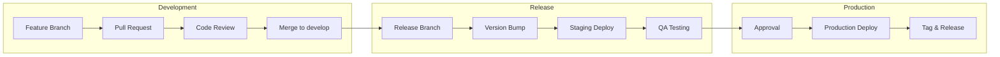
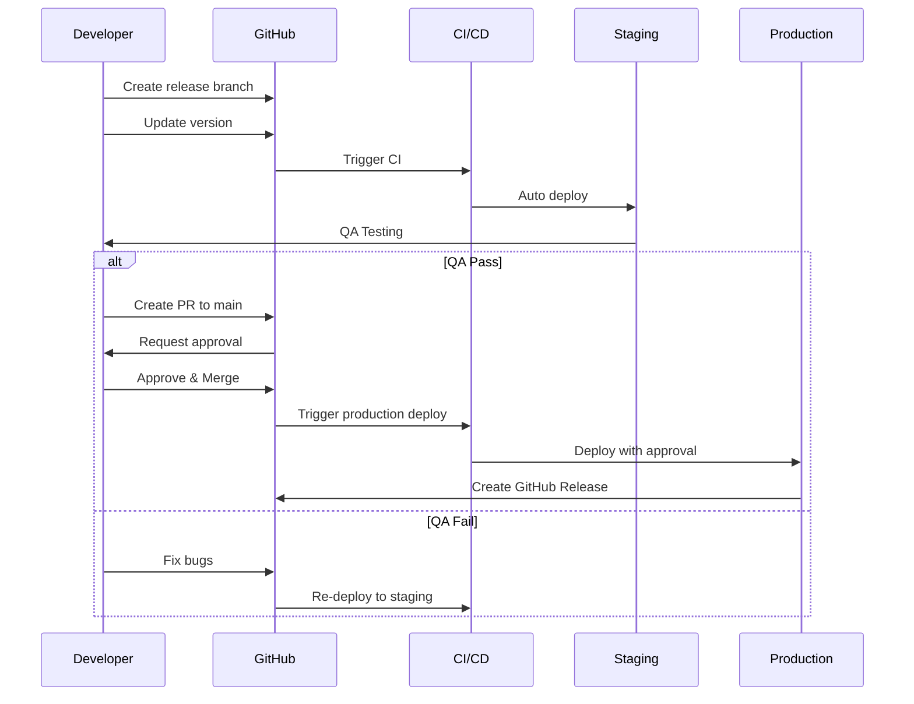
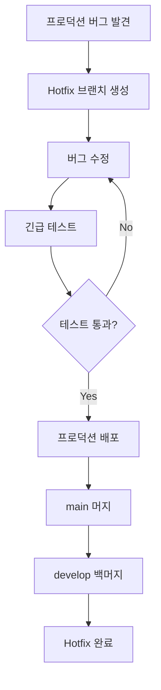

# Release Management

> TalkStudio 릴리즈 관리 프로세스 및 절차입니다.

---

## 변경 이력 (Changelog)

| 버전 | 날짜 | 작성자 | 변경 내용 |
|------|------|--------|----------|
| 1.0.0 | 2025-12-08 | @haseongpark | 최초 작성 |

---

## 관련 문서

- [VERSIONING_GUIDE.md](../../VERSIONING_GUIDE.md)
- [DEPLOYMENT_CHECKLIST.md](./DEPLOYMENT_CHECKLIST.md)
- [CONTRIBUTING.md](../../CONTRIBUTING.md)
- [deploy-prod.yml](../../.github/workflows/deploy-prod.yml)

---

## 1. Release Overview

### 1.1 Release Strategy

TalkStudio는 **Continuous Delivery** 방식을 채택하며, 안정적인 릴리즈를 위해 다음 전략을 따릅니다.



### 1.2 Release Types

| 타입 | 버전 변경 | 주기 | 설명 |
|------|----------|------|------|
| **Major** | X.0.0 | 분기별 | Breaking changes, 대규모 기능 |
| **Minor** | x.X.0 | 격주 | 새로운 기능, 개선사항 |
| **Patch** | x.x.X | 필요 시 | 버그 수정, 보안 패치 |
| **Hotfix** | x.x.X | 긴급 시 | 프로덕션 긴급 수정 |

### 1.3 Release Schedule

```
Week 1: Feature Development
Week 2: Feature Development + Code Freeze (금요일)
Week 3: QA Testing + Bug Fixes
Week 4: Release (화요일) + Monitoring

※ Hotfix는 즉시 릴리즈
```

---

## 2. Version Management

### 2.1 Semantic Versioning

TalkStudio는 [Semantic Versioning 2.0.0](https://semver.org/)을 따릅니다.

```
MAJOR.MINOR.PATCH[-PRERELEASE][+BUILD]

예시:
- 1.0.0          : 첫 정식 릴리즈
- 1.1.0          : 새 기능 추가
- 1.1.1          : 버그 수정
- 2.0.0-alpha.1  : 메이저 버전 알파
- 2.0.0-beta.1   : 메이저 버전 베타
- 2.0.0-rc.1     : Release Candidate
```

### 2.2 Version Bump Guidelines

| 변경 사항 | 버전 변경 | 예시 |
|----------|----------|------|
| Breaking API 변경 | Major | 컴포넌트 Props 삭제 |
| 하위 호환 기능 추가 | Minor | 새 테마 추가 |
| 버그 수정 | Patch | 스타일 버그 수정 |
| 문서 변경 | - | README 업데이트 |
| 개발 의존성 변경 | - | devDependencies 업데이트 |

### 2.3 Version Update Commands

```bash
# Patch 버전 (1.0.0 → 1.0.1)
npm version patch

# Minor 버전 (1.0.0 → 1.1.0)
npm version minor

# Major 버전 (1.0.0 → 2.0.0)
npm version major

# 특정 버전 지정
npm version 1.2.3

# Pre-release 버전
npm version 1.2.0-alpha.1
npm version prerelease --preid=beta
```

---

## 3. Release Process

### 3.1 Standard Release Flow



### 3.2 Step-by-Step Guide

#### Step 1: Release Branch 생성

```bash
# develop 브랜치에서 시작
git checkout develop
git pull origin develop

# release 브랜치 생성
git checkout -b release/v1.2.0

# 원격에 푸시
git push -u origin release/v1.2.0
```

#### Step 2: Version Bump

```bash
# package.json 버전 업데이트
npm version 1.2.0 --no-git-tag-version

# 변경사항 커밋
git add package.json
git commit -m "chore: bump version to 1.2.0"
```

#### Step 3: Changelog 업데이트

```markdown
# CHANGELOG.md

## [1.2.0] - 2025-01-15

### Added
- Discord 테마 지원 (#123)
- 메시지 검색 기능 (#124)

### Changed
- 이미지 내보내기 품질 개선 (#125)

### Fixed
- Kakao 테마 폰트 버그 수정 (#126)

### Security
- 의존성 보안 업데이트 (#127)
```

#### Step 4: Staging 배포 및 QA

```bash
# release 브랜치 푸시 시 자동 배포
git push origin release/v1.2.0

# Staging URL에서 QA 테스트
# https://staging.talkstudio.app
```

#### Step 5: Production 배포

```bash
# GitHub Actions에서 수동 트리거
# Actions → Deploy to Production → Run workflow
#   version: v1.2.0
#   confirm_staging: true
```

#### Step 6: Release 완료

```bash
# main 브랜치에 머지
git checkout main
git merge release/v1.2.0
git push origin main

# 태그 생성 (자동으로 생성됨)
# develop 브랜치에 백머지
git checkout develop
git merge main
git push origin develop

# release 브랜치 삭제
git branch -d release/v1.2.0
git push origin --delete release/v1.2.0
```

---

## 4. Hotfix Process

### 4.1 Hotfix Flow



### 4.2 Hotfix Steps

```bash
# 1. main에서 hotfix 브랜치 생성
git checkout main
git pull origin main
git checkout -b hotfix/v1.2.1

# 2. 버그 수정 및 버전 업데이트
# ... 수정 작업 ...
npm version patch

# 3. 커밋 및 푸시
git add .
git commit -m "fix: critical bug in message rendering"
git push -u origin hotfix/v1.2.1

# 4. 긴급 테스트 후 프로덕션 배포
# GitHub Actions → Deploy to Production
#   version: v1.2.1
#   skip_approval: true (긴급 시에만)

# 5. main 및 develop에 머지
git checkout main
git merge hotfix/v1.2.1
git push origin main

git checkout develop
git merge hotfix/v1.2.1
git push origin develop

# 6. hotfix 브랜치 삭제
git branch -d hotfix/v1.2.1
git push origin --delete hotfix/v1.2.1
```

---

## 5. Release Artifacts

### 5.1 GitHub Release

각 프로덕션 릴리즈 시 GitHub Release가 자동으로 생성됩니다.

```markdown
## Release v1.2.0

### What's Changed
- Discord 테마 지원
- 메시지 검색 기능
- 이미지 내보내기 품질 개선

### Bug Fixes
- Kakao 테마 폰트 버그 수정

### Contributors
@contributor1, @contributor2

### Full Changelog
https://github.com/org/talkstudio/compare/v1.1.0...v1.2.0
```

### 5.2 Build Artifacts

프로덕션 빌드 아티팩트는 90일간 보관됩니다.

| 아티팩트 | 내용 | 보관 기간 |
|----------|------|----------|
| `build-prod-{version}` | Production 빌드 파일 | 90일 |
| `build-staging-{version}` | Staging 빌드 파일 | 30일 |
| `build-dev-{run}` | Development 빌드 파일 | 7일 |

### 5.3 Release Notes Template

```markdown
# TalkStudio v{VERSION} Release Notes

## Overview
{릴리즈 개요 및 주요 변경사항 요약}

## New Features
- Feature 1: {설명} (#PR)
- Feature 2: {설명} (#PR)

## Improvements
- Improvement 1: {설명} (#PR)

## Bug Fixes
- Fix 1: {설명} (#PR)

## Breaking Changes
- Change 1: {마이그레이션 가이드}

## Dependencies
- Updated: dependency@version
- Added: new-dependency@version
- Removed: old-dependency

## Known Issues
- Issue 1: {설명} (workaround: {임시 해결책})

## Upgrade Guide
{업그레이드 절차 설명}

---
Release Date: {YYYY-MM-DD}
```

---

## 6. Release Checklist

### 6.1 Pre-Release

- [ ] Feature freeze 완료
- [ ] 모든 planned issues 완료 또는 다음 릴리즈로 이동
- [ ] Release branch 생성
- [ ] Version bump 완료
- [ ] CHANGELOG.md 업데이트
- [ ] Staging 배포 성공
- [ ] QA 테스트 완료
- [ ] 성능 테스트 완료
- [ ] 보안 스캔 통과

### 6.2 Release

- [ ] Release PR 생성 및 리뷰
- [ ] 승인권자 승인
- [ ] Production 배포 실행
- [ ] Health check 통과
- [ ] Smoke test 통과
- [ ] GitHub Release 생성

### 6.3 Post-Release

- [ ] 모니터링 (1시간)
- [ ] main → develop 백머지
- [ ] Release branch 삭제
- [ ] Release notes 공유
- [ ] 문서 업데이트
- [ ] 회고 진행 (필요 시)

---

## 7. Rollback Strategy

### 7.1 Rollback Decision Matrix

| 상황 | 롤백 여부 | 대응 |
|------|----------|------|
| 서비스 완전 다운 | **즉시 롤백** | 자동 롤백 트리거 |
| 주요 기능 장애 | **즉시 롤백** | 수동 롤백 실행 |
| 마이너 버그 발견 | Hotfix | 긴급 패치 배포 |
| 성능 저하 (심각) | 롤백 고려 | 상황 판단 후 결정 |
| 성능 저하 (경미) | 유지 | 모니터링 + 최적화 |

### 7.2 Rollback Execution

```bash
# 이전 버전으로 롤백
# GitHub Actions → Deploy to Production
#   version: v1.1.0 (이전 안정 버전)
#   confirm_staging: true
```

### 7.3 Post-Rollback Actions

1. 인시던트 채널 알림
2. 롤백 원인 분석
3. 인시던트 리포트 작성
4. 수정 후 재배포 계획

---

## 8. Release Metrics

### 8.1 Key Metrics

| 메트릭 | 목표 | 현재 |
|--------|------|------|
| Release Frequency | 격주 | - |
| Lead Time | < 2주 | - |
| Deployment Frequency | 주 2회 | - |
| Change Failure Rate | < 5% | - |
| MTTR (Mean Time to Recovery) | < 1시간 | - |

### 8.2 Release History

| 버전 | 날짜 | 타입 | 주요 변경 | 롤백 |
|------|------|------|----------|------|
| v1.0.0 | 2025-01-01 | Major | 초기 릴리즈 | No |
| v1.0.1 | 2025-01-03 | Patch | 버그 수정 | No |
| v1.1.0 | 2025-01-15 | Minor | 테마 추가 | No |

---

## 9. Communication

### 9.1 Internal Communication

| 단계 | 채널 | 대상 | 내용 |
|------|------|------|------|
| Release 시작 | Slack #releases | 개발팀 | 릴리즈 시작 알림 |
| QA 시작 | Slack #qa | QA팀 | 테스트 요청 |
| 배포 승인 요청 | GitHub | 승인권자 | PR 리뷰 요청 |
| 배포 완료 | Slack #deployments | 전체 | 배포 완료 알림 |
| Rollback | Slack #ops-alerts | 운영팀 | 롤백 알림 |

### 9.2 External Communication

- **Release Notes**: GitHub Releases
- **Changelog**: CHANGELOG.md
- **Status Page**: status.talkstudio.app (향후)

---

## Validation Checklist

- [x] Semantic Versioning 가이드라인 포함
- [x] Standard/Hotfix 릴리즈 프로세스 정의
- [x] 단계별 체크리스트 제공
- [x] Rollback 전략 문서화
- [x] Release metrics 정의
- [x] Communication 채널 정의
