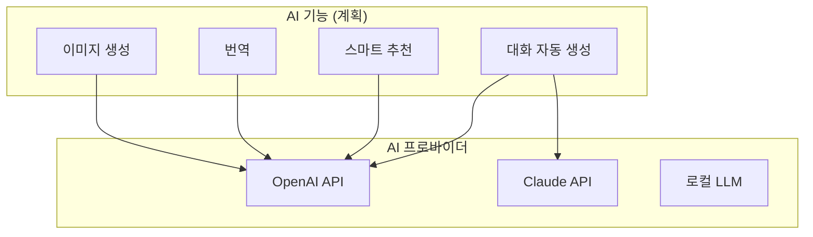
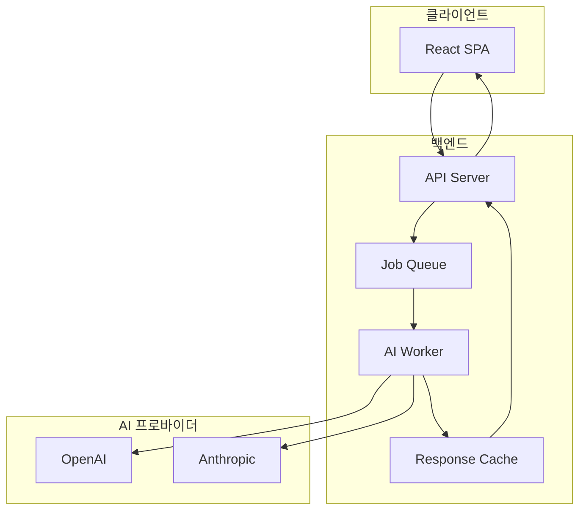
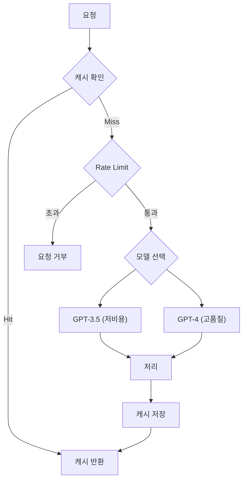
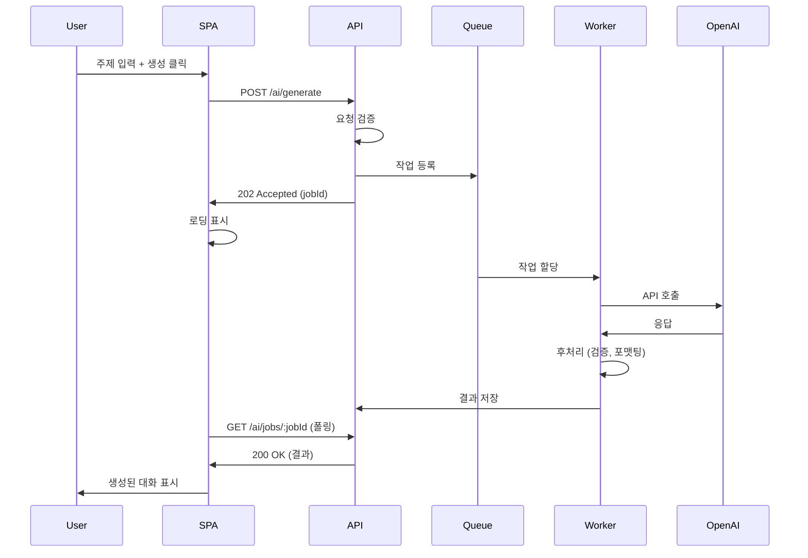
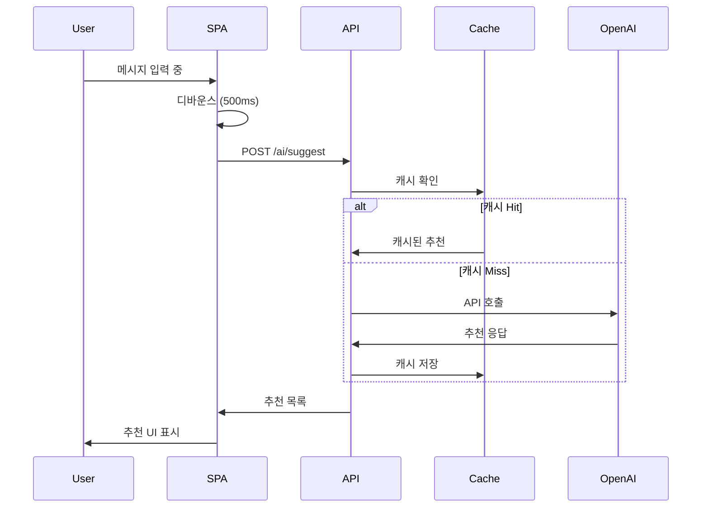

# AI Pipeline Design

> 이 문서는 TalkStudio의 AI 파이프라인 설계를 정의합니다.
> **현재 상태**: TalkStudio v1.0은 AI 기능이 포함되지 않습니다. 이 문서는 향후 AI 기능 확장을 위한 계획입니다.

---

## 변경 이력 (Changelog)

| 버전 | 날짜 | 작성자 | 변경 내용 |
|------|------|--------|----------|
| 1.0.0 | 2025-12-08 | @haseongpark | 최초 작성 (계획 문서) |

---

## 관련 문서

- [ARCHITECTURE.md](./ARCHITECTURE.md) - 시스템 아키텍처
- [BACKEND_DESIGN.md](./BACKEND_DESIGN.md) - 백엔드 설계
- [PRD.md](./PRD.md) - 제품 요구사항

---

## 1. 현재 상태

### 1.1 v1.0 - AI 미적용

TalkStudio v1.0은 AI 기능 없이 출시됩니다:

- 모든 대화 내용은 사용자가 직접 입력
- 자동 생성, 추천 기능 없음
- 외부 AI API 연동 없음

### 1.2 AI 도입 시점

| 기능 | 필요성 | 우선순위 | 예상 시점 |
|------|--------|----------|----------|
| 대화 자동 생성 | 중간 | P3 | v2.0 |
| 스마트 추천 | 낮음 | P4 | v2.x |
| 이미지 생성 | 낮음 | P4 | v3.0 |

---

## 2. AI 기능 계획

### 2.1 계획된 AI 기능



### 2.2 기능별 상세

#### 대화 자동 생성 (P3)

| 항목 | 내용 |
|------|------|
| **설명** | 주제/상황을 입력하면 자연스러운 대화 생성 |
| **입력** | 주제, 톤, 메시지 수, 언어 |
| **출력** | 생성된 메시지 배열 |
| **사용 모델** | GPT-4 / Claude |

**예시:**
```
입력:
- 주제: "친구와 점심 약속"
- 톤: 캐주얼
- 메시지 수: 6개

출력:
[
  { sender: "other", text: "오늘 점심 뭐 먹을까?" },
  { sender: "me", text: "음... 파스타 어때?" },
  ...
]
```

#### 스마트 추천 (P4)

| 항목 | 내용 |
|------|------|
| **설명** | 현재 대화 맥락에 맞는 다음 메시지 추천 |
| **입력** | 현재 대화 내용 |
| **출력** | 추천 메시지 3-5개 |
| **사용 모델** | GPT-3.5 (비용 효율) |

#### 번역 (P4)

| 항목 | 내용 |
|------|------|
| **설명** | 대화 내용 다국어 번역 |
| **입력** | 원본 대화, 대상 언어 |
| **출력** | 번역된 대화 |
| **사용 모델** | GPT-4 / DeepL API |

#### 이미지 생성 (P4)

| 항목 | 내용 |
|------|------|
| **설명** | 텍스트로 대화용 이미지 생성 |
| **입력** | 이미지 설명 텍스트 |
| **출력** | 생성된 이미지 URL |
| **사용 모델** | DALL-E 3 / Stable Diffusion |

---

## 3. 아키텍처 설계 (계획)

### 3.1 AI 파이프라인 아키텍처



### 3.2 컴포넌트 역할

| 컴포넌트 | 역할 |
|----------|------|
| API Server | 요청 검증, 라우팅 |
| Job Queue | 비동기 작업 관리 |
| AI Worker | AI API 호출, 후처리 |
| Cache | 응답 캐싱, 비용 절감 |

---

## 4. API 설계 (계획)

### 4.1 대화 생성 API

```typescript
// POST /api/v1/ai/generate-conversation
interface GenerateConversationRequest {
  topic: string;           // 대화 주제
  tone: 'casual' | 'formal' | 'friendly';
  messageCount: number;    // 2-20
  language: 'ko' | 'en' | 'ja';
  context?: string;        // 추가 컨텍스트
}

interface GenerateConversationResponse {
  success: true;
  data: {
    messages: Message[];
    tokensUsed: number;
    model: string;
  };
}
```

### 4.2 추천 API

```typescript
// POST /api/v1/ai/suggest
interface SuggestRequest {
  messages: Message[];     // 현재 대화 (최근 10개)
  sender: 'me' | 'other';  // 추천 대상
  count?: number;          // 추천 개수 (기본 3)
}

interface SuggestResponse {
  success: true;
  data: {
    suggestions: string[];
  };
}
```

### 4.3 번역 API

```typescript
// POST /api/v1/ai/translate
interface TranslateRequest {
  messages: Message[];
  targetLanguage: 'ko' | 'en' | 'ja' | 'zh';
}

interface TranslateResponse {
  success: true;
  data: {
    messages: Message[];
  };
}
```

---

## 5. 프롬프트 설계 (계획)

### 5.1 대화 생성 프롬프트

```markdown
# System Prompt

You are a conversation generator for a chat simulator app.
Generate natural, realistic conversations in the specified language and tone.

## Rules:
1. Messages should be short (under 100 characters)
2. Maintain consistent character personalities
3. Include natural conversation flow (greetings, topic, farewell)
4. Use appropriate emojis sparingly
5. Respect cultural norms for the target language

## Output Format:
Return a JSON array of messages:
[
  { "sender": "me" | "other", "text": "message content" }
]
```

### 5.2 추천 프롬프트

```markdown
# System Prompt

Based on the conversation context, suggest natural follow-up messages.
Match the tone and style of previous messages.

## Rules:
1. Suggestions should be contextually relevant
2. Vary the response types (question, statement, reaction)
3. Keep suggestions concise
4. Match the language of the conversation
```

---

## 6. 비용 관리

### 6.1 토큰 사용량 추정

| 기능 | 입력 토큰 | 출력 토큰 | 예상 비용/요청 |
|------|----------|----------|---------------|
| 대화 생성 (10개) | ~200 | ~500 | $0.01-0.02 |
| 추천 (3개) | ~300 | ~100 | $0.005 |
| 번역 | ~500 | ~500 | $0.02 |

### 6.2 비용 절감 전략



| 전략 | 설명 | 절감율 |
|------|------|--------|
| 응답 캐싱 | 동일 요청 캐시 | 30-50% |
| 모델 티어링 | 작업별 적합 모델 | 40-60% |
| Rate Limiting | 과도한 사용 제한 | - |
| 배치 처리 | 여러 요청 통합 | 10-20% |

### 6.3 사용자별 제한

| 티어 | 일일 생성 | 월간 생성 |
|------|----------|----------|
| 무료 | 5회 | 50회 |
| 프로 | 50회 | 500회 |
| 엔터프라이즈 | 무제한 | 무제한 |

---

## 7. 데이터 흐름

### 7.1 대화 생성 흐름



### 7.2 실시간 추천 흐름



---

## 8. 품질 관리

### 8.1 출력 검증

```javascript
// AI 응답 검증
function validateGeneratedConversation(messages) {
  const errors = [];

  // 메시지 수 확인
  if (messages.length < 2 || messages.length > 20) {
    errors.push('Invalid message count');
  }

  // 각 메시지 검증
  messages.forEach((msg, i) => {
    if (!['me', 'other'].includes(msg.sender)) {
      errors.push(`Invalid sender at index ${i}`);
    }
    if (!msg.text || msg.text.length > 500) {
      errors.push(`Invalid text at index ${i}`);
    }
  });

  // 발신자 균형 확인
  const meCount = messages.filter(m => m.sender === 'me').length;
  const otherCount = messages.filter(m => m.sender === 'other').length;
  if (Math.abs(meCount - otherCount) > messages.length * 0.3) {
    errors.push('Unbalanced conversation');
  }

  return {
    isValid: errors.length === 0,
    errors,
  };
}
```

### 8.2 콘텐츠 필터링

```javascript
// 부적절한 콘텐츠 필터링
async function filterContent(text) {
  // OpenAI Moderation API 사용
  const response = await openai.moderations.create({
    input: text,
  });

  const result = response.results[0];

  if (result.flagged) {
    throw new ContentPolicyError('Content violates policy');
  }

  return text;
}
```

### 8.3 A/B 테스트

| 테스트 | 변수 | 측정 지표 |
|--------|------|----------|
| 프롬프트 버전 | v1 vs v2 | 사용자 만족도 |
| 모델 선택 | GPT-3.5 vs GPT-4 | 품질/비용 비율 |
| 온도 설정 | 0.7 vs 0.9 | 창의성/일관성 |

---

## 9. 보안 고려사항

### 9.1 데이터 보호

| 항목 | 조치 |
|------|------|
| PII 필터링 | 개인정보 입력 경고 |
| 로깅 | 민감 데이터 마스킹 |
| 저장 | AI 응답 일시적 저장만 |

### 9.2 API 키 관리

```yaml
# 환경 변수 구조
AI_OPENAI_API_KEY: sk-***
AI_ANTHROPIC_API_KEY: sk-ant-***
AI_RATE_LIMIT_PER_USER: 100
AI_RATE_LIMIT_WINDOW: 3600
```

---

## 10. 모니터링

### 10.1 메트릭

| 메트릭 | 설명 | 알람 기준 |
|--------|------|----------|
| 응답 시간 | AI API 응답 시간 | > 10초 |
| 에러율 | API 실패율 | > 5% |
| 토큰 사용량 | 일일 토큰 소비 | 예산 80% |
| 캐시 히트율 | 캐시 효율성 | < 30% |

### 10.2 대시보드 (계획)

```
┌─────────────────────────────────────────────────┐
│             AI Pipeline Dashboard               │
├─────────────────────────────────────────────────┤
│                                                 │
│  Daily Requests: 1,234    Success Rate: 98.5%  │
│                                                 │
│  Token Usage:     Model Distribution:          │
│  ████████░░ 80%   GPT-3.5: 70%                │
│                   GPT-4: 30%                   │
│                                                 │
│  Response Time:   Cache Hit Rate:              │
│  Avg: 2.3s        ███████░░░ 65%              │
│  P99: 8.1s                                     │
│                                                 │
└─────────────────────────────────────────────────┘
```

---

## 11. 구현 로드맵

### 11.1 단계별 구현

```
Phase 1: 인프라 구축
├── AI Worker 서비스 구축
├── Queue 시스템 설정
├── API 엔드포인트 구현
└── 예상 기간: 2주

Phase 2: 대화 생성 기능
├── 프롬프트 개발 및 튜닝
├── 응답 검증 로직
├── 프론트엔드 UI
└── 예상 기간: 2주

Phase 3: 추천 기능
├── 실시간 추천 API
├── 캐싱 최적화
├── UI 통합
└── 예상 기간: 1주

Phase 4: 고급 기능
├── 번역 기능
├── 이미지 생성
├── A/B 테스트 시스템
└── 예상 기간: 3주
```

### 11.2 MVP 범위

**포함:**
- 대화 자동 생성 (기본)
- 일일 사용 제한
- 에러 처리

**제외:**
- 실시간 추천
- 번역
- 이미지 생성
- 고급 커스터마이징

---

## 12. 결론

### 12.1 권장사항

1. **v1.0**: AI 기능 없이 출시 (현재)
2. **v1.x**: 사용자 피드백 수집
3. **v2.0**: 대화 생성 기능 추가
4. **v2.x+**: 추가 AI 기능 점진적 도입

### 12.2 의사결정 기준

| 지표 | 임계값 | 액션 |
|------|--------|------|
| 사용자 요청 | 높음 | AI 기능 개발 착수 |
| 경쟁사 기능 | 필수화 | 우선순위 상향 |
| 비용 효율 | 긍정적 | 확장 검토 |

---

> **Note**: 이 문서는 계획 단계 문서입니다.
> AI 기능 구현 결정 시 상세 설계를 진행합니다.
