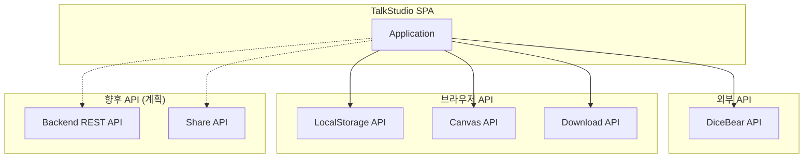

# API Specification

> 이 문서는 TalkStudio에서 사용하는 외부 API 및 내부 인터페이스 명세입니다.
> 현재 TalkStudio는 프론트엔드 전용 SPA로, 백엔드 API는 향후 확장 시 추가됩니다.

---

## 변경 이력 (Changelog)

| 버전 | 날짜 | 작성자 | 변경 내용 |
|------|------|--------|----------|
| 1.0.0 | 2025-12-08 | @haseongpark | 최초 작성 |

---

## 관련 문서

- [ARCHITECTURE.md](./ARCHITECTURE.md) - 시스템 아키텍처
- [DATA_MODEL.md](./DATA_MODEL.md) - 데이터 모델
- [FRONTEND_SPEC.md](./FRONTEND_SPEC.md) - 프론트엔드 스펙

---

## 1. API 개요

### 1.1 현재 상태

TalkStudio v1.0은 **서버리스 SPA**로 설계되어 있습니다:

| 구분 | 상태 | 설명 |
|------|------|------|
| 백엔드 API | 없음 | 모든 데이터 클라이언트 처리 |
| 외부 API | 사용 | DiceBear (아바타 생성) |
| 브라우저 API | 사용 | LocalStorage, Canvas, Download |

### 1.2 API 유형



---

## 2. 외부 API: DiceBear

### 2.1 개요

| 항목 | 내용 |
|------|------|
| 서비스명 | DiceBear |
| 용도 | 랜덤 아바타 이미지 생성 |
| 베이스 URL | `https://api.dicebear.com` |
| 인증 | 불필요 (Public API) |
| 제한 | 없음 (Fair Use) |

### 2.2 아바타 생성 API

#### Endpoint

```
GET https://api.dicebear.com/{version}/{style}/{format}
```

#### Parameters

| 파라미터 | 타입 | 필수 | 설명 |
|----------|------|------|------|
| `version` | string | Yes | API 버전 (예: `7.x`) |
| `style` | string | Yes | 아바타 스타일 |
| `format` | string | Yes | 이미지 형식 (`svg`, `png`) |
| `seed` | string | No | 고유 식별자 (동일 시드 = 동일 아바타) |
| `size` | number | No | 이미지 크기 (픽셀) |
| `backgroundColor` | string | No | 배경색 (hex) |

#### 지원 스타일

| 스타일 | 설명 | 예시 |
|--------|------|------|
| `avataaars` | 카툰 스타일 | 인물 아바타 |
| `bottts` | 로봇 스타일 | 봇 아바타 |
| `initials` | 이니셜 | 텍스트 기반 |
| `identicon` | 패턴 | 기하학적 패턴 |
| `pixel-art` | 픽셀 아트 | 레트로 스타일 |

#### 사용 예시

```javascript
// services/avatarService.js

const DICEBEAR_BASE_URL = 'https://api.dicebear.com/7.x';

export const avatarService = {
  /**
   * 아바타 URL 생성
   * @param {string} seed - 고유 식별자
   * @param {Object} options - 옵션
   * @returns {string} 아바타 URL
   */
  generateAvatarUrl(seed, options = {}) {
    const {
      style = 'avataaars',
      size = 128,
      format = 'svg',
    } = options;

    const params = new URLSearchParams({
      seed,
      size: size.toString(),
    });

    return `${DICEBEAR_BASE_URL}/${style}/${format}?${params}`;
  },

  /**
   * 기본 프로필 아바타 생성
   * @param {string} type - 'me' | 'other'
   * @returns {string}
   */
  getDefaultAvatar(type) {
    const seed = type === 'me' ? 'user-me' : 'user-other';
    return this.generateAvatarUrl(seed);
  },
};
```

#### Response

```
HTTP/1.1 200 OK
Content-Type: image/svg+xml

<svg xmlns="http://www.w3.org/2000/svg" ...>
  <!-- SVG content -->
</svg>
```

#### 에러 응답

| 상태 코드 | 설명 |
|----------|------|
| 400 | 잘못된 파라미터 |
| 404 | 존재하지 않는 스타일 |
| 500 | 서버 오류 |

---

## 3. 브라우저 API

### 3.1 LocalStorage API

#### 용도

| 기능 | 저장 데이터 |
|------|-----------|
| 대화 저장 | 메시지, 프로필, 설정 |
| 설정 저장 | 테마 선호도 |

#### 스토리지 키

```javascript
const STORAGE_KEYS = {
  CONVERSATIONS: 'talkstudio_conversations',
  SETTINGS: 'talkstudio_settings',
  LAST_THEME: 'talkstudio_last_theme',
};
```

#### 인터페이스

```javascript
// 저장
localStorage.setItem(key, JSON.stringify(data));

// 조회
const data = JSON.parse(localStorage.getItem(key));

// 삭제
localStorage.removeItem(key);

// 전체 삭제
localStorage.clear();
```

#### 데이터 구조

```javascript
// CONVERSATIONS
{
  "conversation-name": {
    "messages": [...],
    "profiles": {...},
    "config": {...},
    "savedAt": "2025-12-08T12:00:00Z"
  }
}

// SETTINGS
{
  "defaultTheme": "kakao",
  "exportQuality": 2
}
```

### 3.2 Canvas API (html2canvas)

#### 용도

대화 프리뷰를 PNG 이미지로 캡처

#### 인터페이스

```javascript
import html2canvas from 'html2canvas';

/**
 * DOM 요소를 Canvas로 변환
 * @param {HTMLElement} element - 캡처할 요소
 * @param {Object} options - html2canvas 옵션
 * @returns {Promise<HTMLCanvasElement>}
 */
async function captureToCanvas(element, options = {}) {
  return html2canvas(element, {
    scale: 2,                    // 해상도 배율
    useCORS: true,               // 외부 이미지 허용
    allowTaint: false,           // 보안 제한
    backgroundColor: null,       // 투명 배경
    logging: false,              // 로그 비활성화
    ...options,
  });
}
```

#### 옵션

| 옵션 | 타입 | 기본값 | 설명 |
|------|------|--------|------|
| `scale` | number | 1 | 해상도 배율 |
| `useCORS` | boolean | false | CORS 이미지 허용 |
| `backgroundColor` | string | #fff | 배경색 |
| `width` | number | auto | 캡처 너비 |
| `height` | number | auto | 캡처 높이 |

### 3.3 Download API

#### 용도

생성된 이미지를 파일로 다운로드

#### 인터페이스

```javascript
/**
 * Blob을 파일로 다운로드
 * @param {Blob} blob - 다운로드할 데이터
 * @param {string} filename - 파일명
 */
function downloadBlob(blob, filename) {
  // Object URL 생성
  const url = URL.createObjectURL(blob);

  // 다운로드 링크 생성 및 클릭
  const link = document.createElement('a');
  link.href = url;
  link.download = filename;
  document.body.appendChild(link);
  link.click();

  // 정리
  document.body.removeChild(link);
  URL.revokeObjectURL(url);
}
```

---

## 4. 내부 인터페이스 (Zustand Store)

### 4.1 Store Actions API

#### setTheme

```typescript
/**
 * 테마 변경
 * @param theme - 테마 ID ('kakao' | 'telegram' | 'instagram' | 'discord')
 */
setTheme(theme: ThemeId): void
```

**사용 예시:**
```javascript
const setTheme = useChatStore(state => state.setTheme);
setTheme('telegram');
```

#### addMessage

```typescript
/**
 * 메시지 추가
 * @param message - 메시지 객체
 */
addMessage(message: Omit<Message, 'id'>): void
```

**파라미터:**
```javascript
{
  sender: 'me' | 'other',
  type: 'text' | 'image',
  text: string,
  time: string
}
```

**사용 예시:**
```javascript
const addMessage = useChatStore(state => state.addMessage);
addMessage({
  sender: 'me',
  type: 'text',
  text: '안녕하세요!',
  time: '12:30'
});
```

#### removeMessage

```typescript
/**
 * 메시지 삭제
 * @param id - 메시지 ID
 */
removeMessage(id: string): void
```

#### updateProfile

```typescript
/**
 * 프로필 업데이트
 * @param type - 프로필 타입 ('me' | 'other')
 * @param profile - 업데이트할 프로필 데이터
 */
updateProfile(type: 'me' | 'other', profile: Partial<Profile>): void
```

**파라미터:**
```javascript
{
  name?: string,
  avatar?: string
}
```

#### updateStatusBar

```typescript
/**
 * 상태바 업데이트
 * @param updates - 업데이트할 상태바 데이터
 */
updateStatusBar(updates: Partial<StatusBar>): void
```

**파라미터:**
```javascript
{
  time?: string,
  battery?: number,
  wifi?: boolean
}
```

### 4.2 Store Selectors

```javascript
// 단일 값 선택
const theme = useChatStore(state => state.config.theme);
const messages = useChatStore(state => state.messages);

// 복수 값 선택 (shallow 비교)
import { shallow } from 'zustand/shallow';

const { name, avatar } = useChatStore(
  state => ({
    name: state.profiles.me.name,
    avatar: state.profiles.me.avatar
  }),
  shallow
);
```

---

## 5. 향후 API 계획 (v2.0)

### 5.1 Backend REST API (계획)

> **상태**: 계획 단계 - 향후 공유 기능 추가 시 구현 예정

#### Base URL

```
https://api.talkstudio.app/v1
```

#### 인증

```
Authorization: Bearer <access_token>
```

#### Endpoints (계획)

##### 대화 저장

```
POST /conversations
Content-Type: application/json

{
  "name": "my-conversation",
  "messages": [...],
  "profiles": {...},
  "theme": "kakao"
}

Response: 201 Created
{
  "id": "conv_abc123",
  "shareUrl": "https://talkstudio.app/s/abc123",
  "createdAt": "2025-12-08T12:00:00Z"
}
```

##### 대화 조회

```
GET /conversations/{id}

Response: 200 OK
{
  "id": "conv_abc123",
  "name": "my-conversation",
  "messages": [...],
  "profiles": {...},
  "theme": "kakao",
  "createdAt": "2025-12-08T12:00:00Z"
}
```

##### 공유 URL 조회

```
GET /share/{shareCode}

Response: 200 OK
{
  "conversation": {...},
  "expiresAt": "2025-12-15T12:00:00Z"
}
```

### 5.2 예상 에러 코드

| 코드 | 설명 |
|------|------|
| 400 | Bad Request - 잘못된 요청 |
| 401 | Unauthorized - 인증 필요 |
| 403 | Forbidden - 권한 없음 |
| 404 | Not Found - 리소스 없음 |
| 429 | Too Many Requests - 요청 제한 초과 |
| 500 | Internal Server Error - 서버 오류 |

### 5.3 Rate Limiting (계획)

| 엔드포인트 | 제한 |
|-----------|------|
| POST /conversations | 10/분 |
| GET /conversations | 60/분 |
| GET /share | 100/분 |

---

## 6. API 사용 가이드라인

### 6.1 에러 처리

```javascript
// services/apiService.js
export async function fetchWithErrorHandling(url, options = {}) {
  try {
    const response = await fetch(url, options);

    if (!response.ok) {
      throw new ApiError(response.status, await response.text());
    }

    return response.json();
  } catch (error) {
    if (error instanceof ApiError) {
      throw error;
    }
    throw new NetworkError('Network request failed', error);
  }
}

class ApiError extends Error {
  constructor(status, message) {
    super(message);
    this.status = status;
    this.name = 'ApiError';
  }
}

class NetworkError extends Error {
  constructor(message, cause) {
    super(message);
    this.cause = cause;
    this.name = 'NetworkError';
  }
}
```

### 6.2 캐싱 전략

```javascript
// 아바타 URL 캐싱
const avatarCache = new Map();

function getCachedAvatarUrl(seed) {
  if (avatarCache.has(seed)) {
    return avatarCache.get(seed);
  }

  const url = avatarService.generateAvatarUrl(seed);
  avatarCache.set(seed, url);
  return url;
}
```

### 6.3 재시도 로직

```javascript
async function fetchWithRetry(url, options = {}, retries = 3) {
  for (let i = 0; i < retries; i++) {
    try {
      return await fetch(url, options);
    } catch (error) {
      if (i === retries - 1) throw error;
      await delay(Math.pow(2, i) * 1000); // 지수 백오프
    }
  }
}

function delay(ms) {
  return new Promise(resolve => setTimeout(resolve, ms));
}
```

---

## 7. 보안 고려사항

### 7.1 현재 보안 조치

| 항목 | 조치 |
|------|------|
| XSS | React 자동 이스케이프 |
| CORS | 외부 이미지 useCORS 설정 |
| 데이터 저장 | 클라이언트만 (서버 전송 없음) |
| 민감 정보 | 저장하지 않음 |

### 7.2 향후 보안 계획

| 항목 | 계획 |
|------|------|
| 인증 | OAuth 2.0 (Google, Kakao) |
| HTTPS | 필수 적용 |
| Rate Limiting | API 요청 제한 |
| 입력 검증 | 서버 측 검증 |

---

## 8. 테스트

### 8.1 API 테스트 예시

```javascript
// tests/services/avatarService.test.js
describe('avatarService', () => {
  describe('generateAvatarUrl', () => {
    it('should generate valid DiceBear URL', () => {
      const url = avatarService.generateAvatarUrl('test-seed');

      expect(url).toContain('https://api.dicebear.com');
      expect(url).toContain('seed=test-seed');
    });

    it('should include custom options in URL', () => {
      const url = avatarService.generateAvatarUrl('test', {
        style: 'bottts',
        size: 256,
      });

      expect(url).toContain('/bottts/');
      expect(url).toContain('size=256');
    });
  });
});
```

---

> **Note**: 이 문서는 현재 클라이언트 사이드 API만 포함합니다.
> 백엔드 API 추가 시 이 문서를 업데이트하세요.
