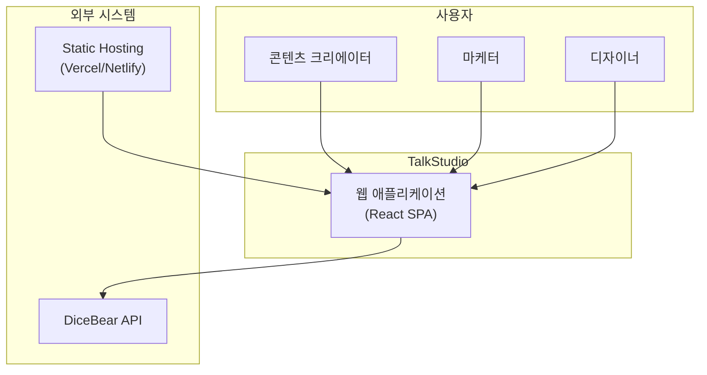
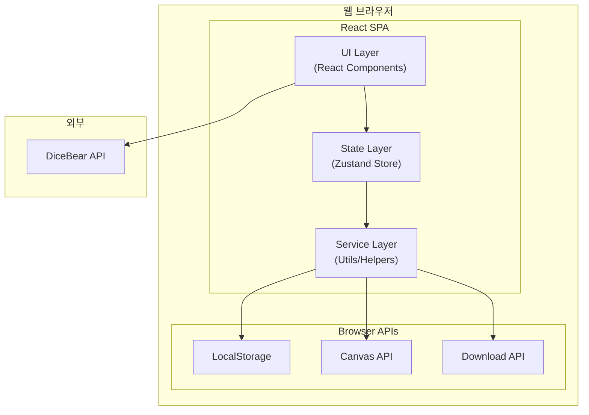
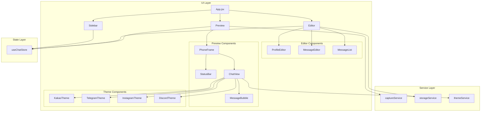
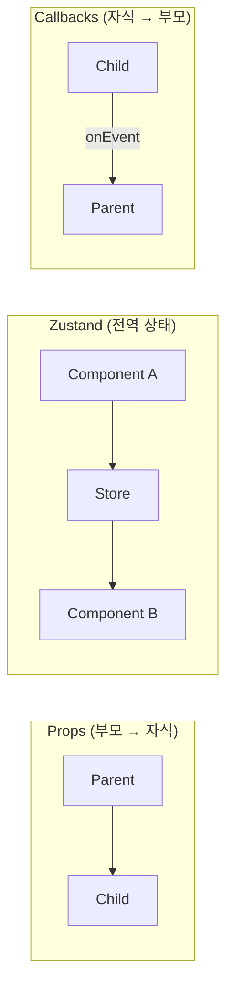
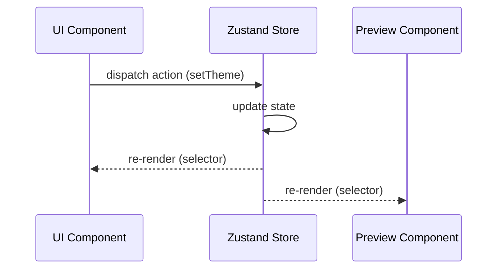
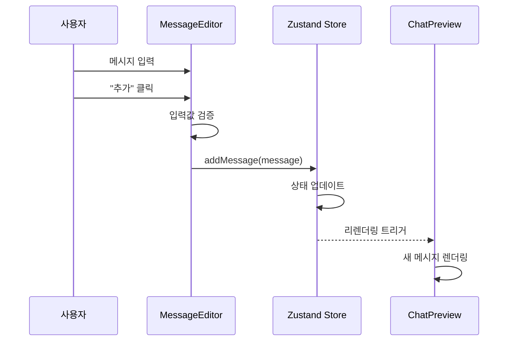
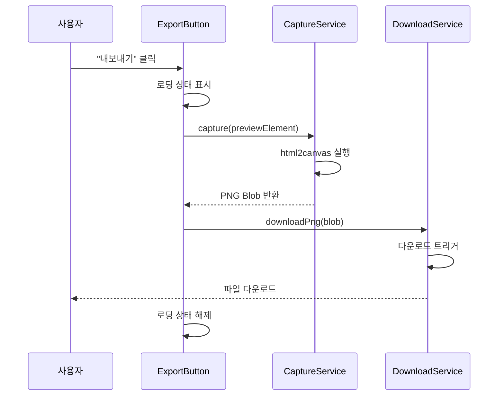
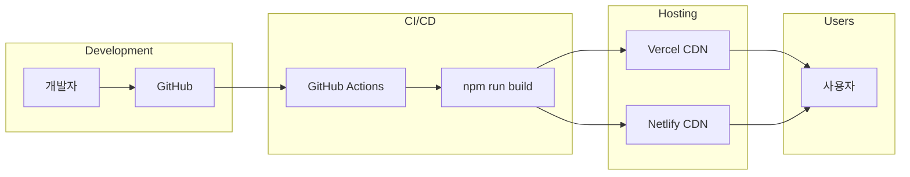
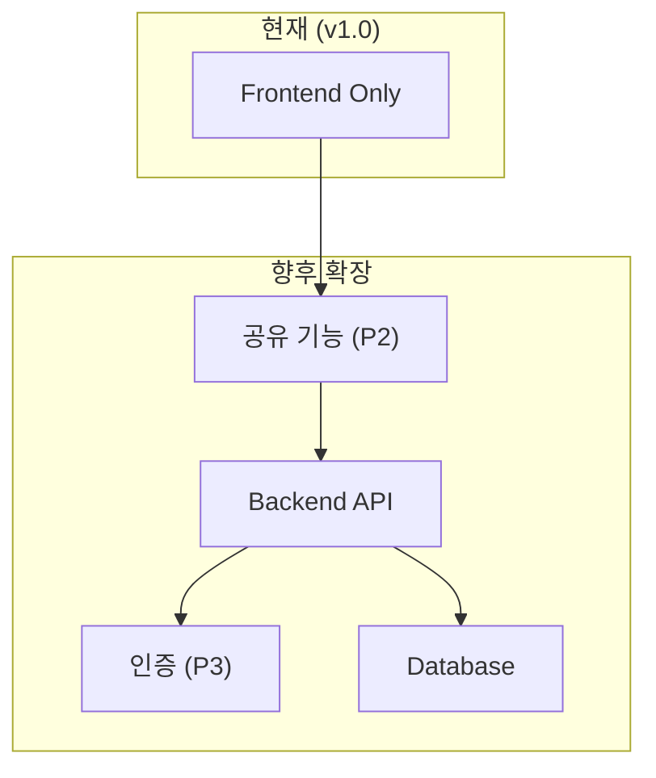

# System Architecture

> 이 문서는 TalkStudio의 시스템 아키텍처를 정의합니다.
> 프론트엔드 SPA(Single Page Application) 아키텍처를 기반으로 합니다.

---

## 변경 이력 (Changelog)

| 버전 | 날짜 | 작성자 | 변경 내용 |
|------|------|--------|----------|
| 1.0.0 | 2025-12-08 | @haseongpark | 최초 작성 |

---

## 관련 문서

- [CONTEXT.md](../../CONTEXT.md) - 프로젝트 전체 맥락
- [PRD.md](./PRD.md) - 제품 요구사항
- [FRONTEND_SPEC.md](./FRONTEND_SPEC.md) - 프론트엔드 상세 스펙
- [DATA_MODEL.md](./DATA_MODEL.md) - 데이터 모델

---

## 1. 아키텍처 개요

### 1.1 시스템 유형

TalkStudio는 **클라이언트 사이드 렌더링(CSR)** 기반의 **Single Page Application(SPA)**입니다.

```
┌─────────────────────────────────────────────────────────────────┐
│                        TalkStudio                                │
│                                                                  │
│   ┌──────────────────────────────────────────────────────────┐  │
│   │                    React SPA                              │  │
│   │                                                          │  │
│   │  ┌─────────┐  ┌─────────┐  ┌─────────┐  ┌─────────┐    │  │
│   │  │   UI    │  │  State  │  │  Utils  │  │ Themes  │    │  │
│   │  │Components│  │ (Zustand)│  │         │  │         │    │  │
│   │  └─────────┘  └─────────┘  └─────────┘  └─────────┘    │  │
│   │                                                          │  │
│   └──────────────────────────────────────────────────────────┘  │
│                              │                                   │
│                              ▼                                   │
│   ┌──────────────────────────────────────────────────────────┐  │
│   │                 Browser APIs                              │  │
│   │  ┌─────────┐  ┌─────────┐  ┌─────────┐                  │  │
│   │  │ Local   │  │ Canvas  │  │ Download │                  │  │
│   │  │ Storage │  │   API   │  │   API    │                  │  │
│   │  └─────────┘  └─────────┘  └─────────┘                  │  │
│   └──────────────────────────────────────────────────────────┘  │
│                                                                  │
└─────────────────────────────────────────────────────────────────┘
                              │
                              ▼
              ┌───────────────────────────────┐
              │      External Services        │
              │  ┌─────────────────────────┐  │
              │  │   DiceBear API          │  │
              │  │   (Avatar Generation)   │  │
              │  └─────────────────────────┘  │
              └───────────────────────────────┘
```

### 1.2 설계 원칙

| 원칙 | 설명 | 적용 |
|------|------|------|
| **단순성** | 불필요한 복잡성 배제 | 서버리스 아키텍처 |
| **컴포넌트 기반** | 재사용 가능한 UI 단위 | React 컴포넌트 |
| **단방향 데이터 흐름** | 예측 가능한 상태 관리 | Zustand |
| **관심사 분리** | 역할별 모듈 분리 | 컴포넌트/스토어/유틸 |
| **성능 우선** | 빠른 사용자 경험 | Vite, 최적화 |

---

## 2. C4 다이어그램

### 2.1 Level 1: System Context



### 2.2 Level 2: Container



### 2.3 Level 3: Component



---

## 3. 레이어 아키텍처

### 3.1 레이어 구조

```
┌─────────────────────────────────────────────────────────────────┐
│                        UI Layer                                  │
│  (React Components - 사용자 인터페이스)                          │
├─────────────────────────────────────────────────────────────────┤
│                       State Layer                                │
│  (Zustand Store - 애플리케이션 상태 관리)                        │
├─────────────────────────────────────────────────────────────────┤
│                      Service Layer                               │
│  (Utils/Helpers - 비즈니스 로직 및 유틸리티)                     │
├─────────────────────────────────────────────────────────────────┤
│                    Infrastructure Layer                          │
│  (Browser APIs - LocalStorage, Canvas, Download)                 │
└─────────────────────────────────────────────────────────────────┘
```

### 3.2 레이어별 책임

| 레이어 | 책임 | 포함 요소 |
|--------|------|----------|
| **UI Layer** | 사용자 인터페이스 렌더링 | React Components, Tailwind Styles |
| **State Layer** | 애플리케이션 상태 관리 | Zustand Store, Actions |
| **Service Layer** | 비즈니스 로직, 유틸리티 | Capture, Storage, Theme Utils |
| **Infrastructure** | 외부 API 및 브라우저 기능 | LocalStorage, Canvas, fetch |

### 3.3 레이어 간 통신 규칙

```javascript
// ✅ 올바른 레이어 통신
// UI → State
const theme = useChatStore(state => state.config.theme);
const setTheme = useChatStore(state => state.setTheme);

// State → Service (Action 내부)
const addMessage = (msg) => set((state) => ({
  messages: [...state.messages, validateMessage(msg)]
}));

// UI → Service (직접 호출 가능)
const handleExport = async () => {
  const image = await captureService.capture(previewRef.current);
  downloadService.downloadPng(image);
};

// ❌ 잘못된 레이어 통신
// Infrastructure를 UI에서 직접 접근
localStorage.setItem('messages', JSON.stringify(messages)); // Bad
storageService.saveMessages(messages); // Good
```

---

## 4. 컴포넌트 아키텍처

### 4.1 컴포넌트 트리

```
App
├── Sidebar
│   └── ThemeButton (x4)
│
├── Editor
│   ├── ProfileEditor
│   │   ├── ProfileCard (me)
│   │   └── ProfileCard (other)
│   │
│   ├── MessageEditor
│   │   ├── SenderToggle
│   │   ├── MessageInput
│   │   ├── TimeInput
│   │   └── AddButton
│   │
│   └── MessageList
│       └── MessageItem (xN)
│           ├── MessageContent
│           └── DeleteButton
│
└── Preview
    └── PhoneFrame
        ├── StatusBar
        │   ├── TimeDisplay
        │   ├── BatteryIcon
        │   └── WifiIcon
        │
        ├── ChatHeader
        │   └── ProfileAvatar
        │
        └── ChatView
            └── MessageBubble (xN)
                ├── Avatar
                ├── BubbleContent
                └── TimeStamp
```

### 4.2 컴포넌트 분류

| 유형 | 특징 | 예시 |
|------|------|------|
| **Container** | 상태 연결, 로직 포함 | App, Editor, Preview |
| **Presentational** | UI만 담당, props 의존 | MessageBubble, StatusBar |
| **Layout** | 레이아웃 구조 | Sidebar, PhoneFrame |
| **Common** | 재사용 가능 UI | Button, Input, Avatar |

### 4.3 컴포넌트 통신



---

## 5. 상태 관리 아키텍처

### 5.1 Zustand Store 구조

```javascript
// store/useChatStore.js
import { create } from 'zustand';

const useChatStore = create((set, get) => ({
  // ==================== State ====================

  // 설정 상태
  config: {
    theme: 'kakao',
    capturedImage: null,
  },

  // 상태바 상태
  statusBar: {
    time: '12:30',
    battery: 85,
    wifi: true,
  },

  // 프로필 상태
  profiles: {
    me: { name: '나', avatar: '...' },
    other: { name: '상대방', avatar: '...' },
  },

  // 메시지 상태
  messages: [],

  // ==================== Actions ====================

  // 테마 변경
  setTheme: (theme) => set((state) => ({
    config: { ...state.config, theme }
  })),

  // 메시지 추가
  addMessage: (message) => set((state) => ({
    messages: [...state.messages, {
      id: Date.now().toString(),
      ...message,
    }]
  })),

  // 메시지 삭제
  removeMessage: (id) => set((state) => ({
    messages: state.messages.filter(m => m.id !== id)
  })),

  // 프로필 업데이트
  updateProfile: (type, profile) => set((state) => ({
    profiles: {
      ...state.profiles,
      [type]: { ...state.profiles[type], ...profile }
    }
  })),

  // 상태바 업데이트
  updateStatusBar: (updates) => set((state) => ({
    statusBar: { ...state.statusBar, ...updates }
  })),

  // ==================== Selectors ====================

  // 현재 테마 가져오기
  getTheme: () => get().config.theme,

  // 메시지 개수
  getMessageCount: () => get().messages.length,
}));
```

### 5.2 상태 흐름



### 5.3 상태 최적화 규칙

```javascript
// ✅ 선택적 구독 (Good)
const theme = useChatStore(state => state.config.theme);
const messages = useChatStore(state => state.messages);

// ❌ 전체 구독 (Bad - 모든 상태 변경 시 리렌더링)
const store = useChatStore();

// ✅ 얕은 비교로 객체 구독 최적화
import { shallow } from 'zustand/shallow';

const { name, avatar } = useChatStore(
  state => ({ name: state.profiles.me.name, avatar: state.profiles.me.avatar }),
  shallow
);
```

---

## 6. 테마 아키텍처

### 6.1 테마 시스템 구조

```
themes/
├── index.js              # 테마 export
├── themeConfig.js        # 테마 설정 정의
├── kakao/
│   ├── KakaoTheme.jsx    # 카카오 테마 컴포넌트
│   └── kakaoStyles.js    # 카카오 스타일 정의
├── telegram/
│   ├── TelegramTheme.jsx
│   └── telegramStyles.js
├── instagram/
│   ├── InstagramTheme.jsx
│   └── instagramStyles.js
└── discord/
    ├── DiscordTheme.jsx
    └── discordStyles.js
```

### 6.2 테마 설정 구조

```javascript
// themes/themeConfig.js
export const THEMES = {
  kakao: {
    id: 'kakao',
    name: '카카오톡',
    colors: {
      primary: '#FEE500',
      background: '#B2C7D9',
      myBubble: '#FFEB33',
      otherBubble: '#FFFFFF',
      text: '#000000',
    },
    bubble: {
      borderRadius: '16px',
      padding: '10px 14px',
      maxWidth: '70%',
    },
    layout: {
      avatarPosition: 'left',
      timePosition: 'right',
      showTail: false,
    },
  },
  telegram: {
    id: 'telegram',
    name: '텔레그램',
    colors: {
      primary: '#2AABEE',
      background: '#0E1621',
      myBubble: '#2B5278',
      otherBubble: '#182533',
      text: '#FFFFFF',
    },
    // ...
  },
  // instagram, discord...
};
```

### 6.3 테마 적용 패턴

```jsx
// ChatView.jsx
import { THEMES } from '../themes/themeConfig';
import { useChatStore } from '../store/useChatStore';

function ChatView() {
  const theme = useChatStore(state => state.config.theme);
  const themeConfig = THEMES[theme];

  return (
    <div style={{ background: themeConfig.colors.background }}>
      {messages.map(msg => (
        <MessageBubble
          key={msg.id}
          message={msg}
          theme={themeConfig}
        />
      ))}
    </div>
  );
}

// MessageBubble.jsx
function MessageBubble({ message, theme }) {
  const isMe = message.sender === 'me';
  const bubbleColor = isMe ? theme.colors.myBubble : theme.colors.otherBubble;

  return (
    <div
      style={{
        backgroundColor: bubbleColor,
        borderRadius: theme.bubble.borderRadius,
        padding: theme.bubble.padding,
        maxWidth: theme.bubble.maxWidth,
      }}
    >
      {message.text}
    </div>
  );
}
```

---

## 7. 서비스 레이어

### 7.1 서비스 구조

```
services/
├── captureService.js    # 이미지 캡처
├── storageService.js    # 로컬 스토리지
├── downloadService.js   # 파일 다운로드
└── avatarService.js     # 아바타 생성
```

### 7.2 캡처 서비스

```javascript
// services/captureService.js
import html2canvas from 'html2canvas';

export const captureService = {
  /**
   * DOM 요소를 PNG 이미지로 캡처
   * @param {HTMLElement} element - 캡처할 DOM 요소
   * @param {Object} options - 캡처 옵션
   * @returns {Promise<Blob>} PNG Blob
   */
  async capture(element, options = {}) {
    const { scale = 2 } = options;

    const canvas = await html2canvas(element, {
      scale,
      useCORS: true,
      allowTaint: false,
      backgroundColor: null,
    });

    return new Promise((resolve) => {
      canvas.toBlob(resolve, 'image/png');
    });
  },

  /**
   * Blob을 Data URL로 변환
   * @param {Blob} blob
   * @returns {Promise<string>}
   */
  async blobToDataUrl(blob) {
    return new Promise((resolve) => {
      const reader = new FileReader();
      reader.onloadend = () => resolve(reader.result);
      reader.readAsDataURL(blob);
    });
  },
};
```

### 7.3 다운로드 서비스

```javascript
// services/downloadService.js
export const downloadService = {
  /**
   * Blob을 파일로 다운로드
   * @param {Blob} blob - 다운로드할 Blob
   * @param {string} filename - 파일명
   */
  download(blob, filename) {
    const url = URL.createObjectURL(blob);
    const link = document.createElement('a');
    link.href = url;
    link.download = filename;
    document.body.appendChild(link);
    link.click();
    document.body.removeChild(link);
    URL.revokeObjectURL(url);
  },

  /**
   * PNG 이미지 다운로드
   * @param {Blob} blob - PNG Blob
   * @param {string} [name] - 파일명 (확장자 제외)
   */
  downloadPng(blob, name = 'talkstudio-chat') {
    const timestamp = new Date().toISOString().slice(0, 10);
    this.download(blob, `${name}-${timestamp}.png`);
  },
};
```

### 7.4 스토리지 서비스

```javascript
// services/storageService.js
const STORAGE_KEYS = {
  CONVERSATIONS: 'talkstudio_conversations',
  SETTINGS: 'talkstudio_settings',
};

export const storageService = {
  /**
   * 대화 저장
   * @param {string} name - 대화 이름
   * @param {Object} conversation - 대화 데이터
   */
  saveConversation(name, conversation) {
    const conversations = this.getConversations();
    conversations[name] = {
      ...conversation,
      savedAt: new Date().toISOString(),
    };
    localStorage.setItem(
      STORAGE_KEYS.CONVERSATIONS,
      JSON.stringify(conversations)
    );
  },

  /**
   * 모든 대화 목록 가져오기
   * @returns {Object}
   */
  getConversations() {
    const data = localStorage.getItem(STORAGE_KEYS.CONVERSATIONS);
    return data ? JSON.parse(data) : {};
  },

  /**
   * 특정 대화 가져오기
   * @param {string} name
   * @returns {Object|null}
   */
  getConversation(name) {
    const conversations = this.getConversations();
    return conversations[name] || null;
  },

  /**
   * 대화 삭제
   * @param {string} name
   */
  deleteConversation(name) {
    const conversations = this.getConversations();
    delete conversations[name];
    localStorage.setItem(
      STORAGE_KEYS.CONVERSATIONS,
      JSON.stringify(conversations)
    );
  },
};
```

---

## 8. 데이터 흐름

### 8.1 메시지 추가 흐름



### 8.2 이미지 내보내기 흐름



---

## 9. 빌드 및 번들링

### 9.1 Vite 빌드 설정

```javascript
// vite.config.js
import { defineConfig } from 'vite';
import react from '@vitejs/plugin-react';

export default defineConfig({
  plugins: [react()],
  build: {
    target: 'es2020',
    outDir: 'dist',
    rollupOptions: {
      output: {
        manualChunks: {
          vendor: ['react', 'react-dom'],
          ui: ['lucide-react'],
          capture: ['html2canvas'],
        },
      },
    },
  },
});
```

### 9.2 번들 구조

```
dist/
├── index.html
├── assets/
│   ├── index-[hash].js      # 메인 번들
│   ├── vendor-[hash].js     # React, ReactDOM
│   ├── ui-[hash].js         # Lucide 아이콘
│   ├── capture-[hash].js    # html2canvas
│   └── index-[hash].css     # 스타일시트
└── vite.svg
```

---

## 10. 배포 아키텍처

### 10.1 정적 호스팅



### 10.2 CDN 설정

| 설정 | 값 |
|------|-----|
| Build Command | `npm run build` |
| Output Directory | `dist` |
| Node Version | 20.x |
| Framework | Vite |

---

## 11. 확장성 고려

### 11.1 향후 확장 영역



### 11.2 확장 시 아키텍처 변경

| 기능 | 현재 | 확장 후 |
|------|------|---------|
| 저장 | LocalStorage | Backend API + DB |
| 인증 | 없음 | OAuth (Google, Kakao) |
| 공유 | 없음 | URL 기반 공유 |
| 분석 | 없음 | Analytics 연동 |

---

## 12. 아키텍처 결정 기록 (ADR)

| ADR | 제목 | 상태 |
|-----|------|------|
| ADR-001 | React SPA 선택 | Accepted |
| ADR-002 | Zustand 상태 관리 | Accepted |
| ADR-003 | html2canvas 캡처 | Accepted |
| ADR-004 | 서버리스 아키텍처 | Accepted |

상세 ADR은 `docs/specs/ADRs/` 디렉토리 참조.

---

> **Note for Developers**: 아키텍처 변경 시 이 문서를 반드시 업데이트하고,
> 필요시 ADR을 작성하여 의사결정 과정을 기록하세요.
