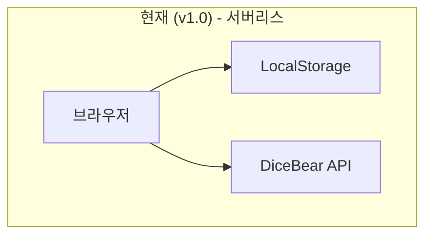
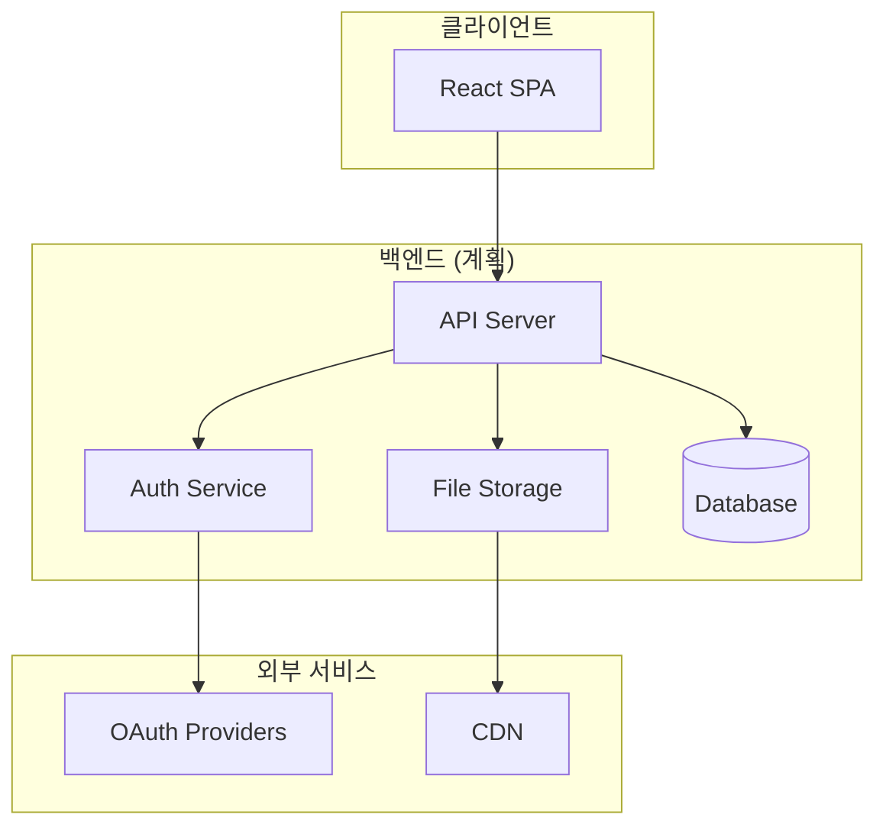
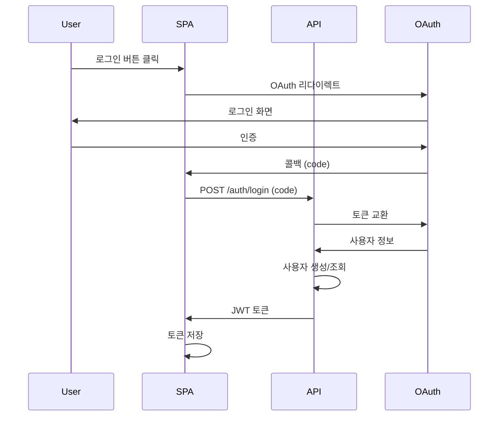
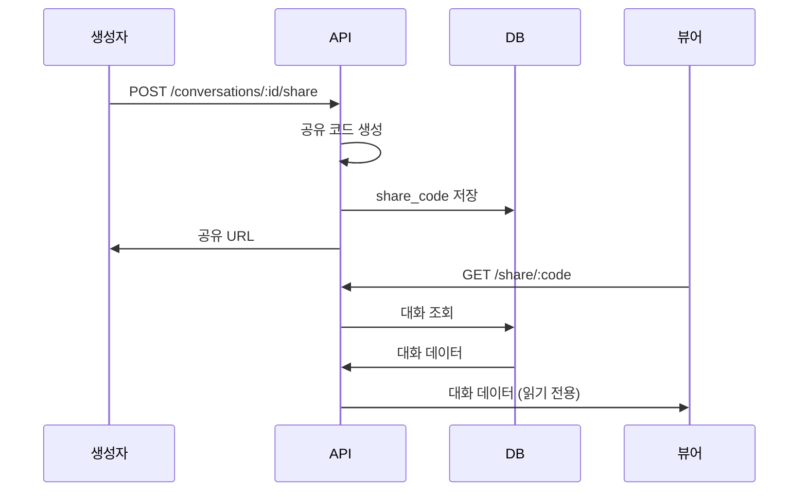
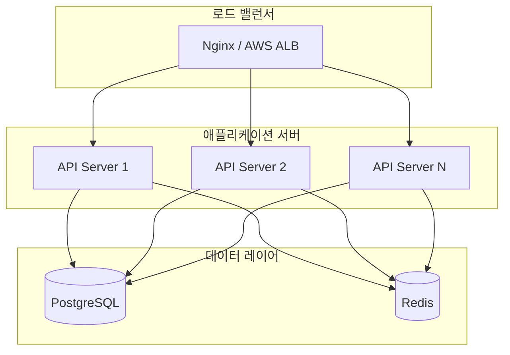

# Backend Design

> 이 문서는 TalkStudio 백엔드 설계를 정의합니다.
> **현재 상태**: TalkStudio v1.0은 프론트엔드 전용 SPA로, 백엔드는 향후 확장 시 구현 예정입니다.

---

## 변경 이력 (Changelog)

| 버전 | 날짜 | 작성자 | 변경 내용 |
|------|------|--------|----------|
| 1.0.0 | 2025-12-08 | @haseongpark | 최초 작성 (계획 문서) |

---

## 관련 문서

- [ARCHITECTURE.md](./ARCHITECTURE.md) - 시스템 아키텍처
- [API_SPEC.md](./API_SPEC.md) - API 명세
- [DATA_MODEL.md](./DATA_MODEL.md) - 데이터 모델

---

## 1. 현재 상태

### 1.1 v1.0 아키텍처



**현재 구현:**
- 모든 데이터는 클라이언트 측 LocalStorage에 저장
- 외부 API는 DiceBear(아바타)만 사용
- 서버 인프라 불필요

### 1.2 백엔드가 필요한 시점

| 기능 | 필요성 | 우선순위 |
|------|--------|----------|
| 대화 공유 (URL) | 높음 | P2 |
| 사용자 계정 | 중간 | P3 |
| 클라우드 저장 | 중간 | P3 |
| 협업 편집 | 낮음 | P4 |

---

## 2. 향후 백엔드 아키텍처 (계획)

### 2.1 목표 아키텍처



### 2.2 기술 스택 (권장)

| 레이어 | 기술 | 이유 |
|--------|------|------|
| Runtime | Node.js 20 LTS | 프론트엔드와 언어 통일 |
| Framework | Fastify / Express | 경량, 빠른 성능 |
| Database | PostgreSQL | 관계형 데이터, 안정성 |
| Cache | Redis | 세션, 캐싱 |
| Storage | S3 / Cloudflare R2 | 이미지 저장 |
| Auth | Passport.js | OAuth 지원 |

### 2.3 대안 (서버리스)

| 서비스 | 용도 |
|--------|------|
| Supabase | BaaS (DB + Auth + Storage) |
| Firebase | BaaS (간편한 시작) |
| Vercel Edge Functions | 서버리스 API |

---

## 3. API 설계 (계획)

### 3.1 RESTful API 구조

```
/api/v1
├── /auth
│   ├── POST   /login          # 로그인
│   ├── POST   /logout         # 로그아웃
│   ├── POST   /refresh        # 토큰 갱신
│   └── GET    /me             # 현재 사용자
│
├── /conversations
│   ├── GET    /               # 목록 조회
│   ├── POST   /               # 생성
│   ├── GET    /:id            # 상세 조회
│   ├── PUT    /:id            # 수정
│   ├── DELETE /:id            # 삭제
│   └── POST   /:id/share      # 공유 링크 생성
│
├── /share
│   └── GET    /:code          # 공유 대화 조회
│
└── /users
    ├── GET    /:id            # 사용자 조회
    └── PUT    /:id            # 사용자 수정
```

### 3.2 데이터베이스 스키마 (계획)

```sql
-- 사용자 테이블
CREATE TABLE users (
    id UUID PRIMARY KEY DEFAULT gen_random_uuid(),
    email VARCHAR(255) UNIQUE NOT NULL,
    name VARCHAR(100),
    avatar_url TEXT,
    provider VARCHAR(50) NOT NULL,  -- 'google', 'kakao'
    provider_id VARCHAR(255) NOT NULL,
    created_at TIMESTAMP DEFAULT CURRENT_TIMESTAMP,
    updated_at TIMESTAMP DEFAULT CURRENT_TIMESTAMP
);

-- 대화 테이블
CREATE TABLE conversations (
    id UUID PRIMARY KEY DEFAULT gen_random_uuid(),
    user_id UUID REFERENCES users(id) ON DELETE CASCADE,
    name VARCHAR(100) NOT NULL,
    theme VARCHAR(20) NOT NULL,
    data JSONB NOT NULL,  -- messages, profiles, statusBar
    is_public BOOLEAN DEFAULT FALSE,
    share_code VARCHAR(20) UNIQUE,
    created_at TIMESTAMP DEFAULT CURRENT_TIMESTAMP,
    updated_at TIMESTAMP DEFAULT CURRENT_TIMESTAMP
);

-- 인덱스
CREATE INDEX idx_conversations_user_id ON conversations(user_id);
CREATE INDEX idx_conversations_share_code ON conversations(share_code);
```

### 3.3 API 응답 형식

```typescript
// 성공 응답
interface SuccessResponse<T> {
  success: true;
  data: T;
  meta?: {
    page?: number;
    limit?: number;
    total?: number;
  };
}

// 에러 응답
interface ErrorResponse {
  success: false;
  error: {
    code: string;
    message: string;
    details?: Record<string, any>;
  };
}
```

---

## 4. 인증 설계 (계획)

### 4.1 인증 흐름



### 4.2 JWT 구조

```typescript
interface JWTPayload {
  sub: string;      // 사용자 ID
  email: string;
  name: string;
  iat: number;      // 발급 시간
  exp: number;      // 만료 시간
}

// Access Token: 15분
// Refresh Token: 7일
```

### 4.3 지원 OAuth 프로바이더

| 프로바이더 | 우선순위 | 이유 |
|-----------|----------|------|
| Google | P1 | 범용성 |
| Kakao | P1 | 한국 사용자 |
| GitHub | P2 | 개발자 대상 |

---

## 5. 공유 기능 설계 (계획)

### 5.1 공유 흐름



### 5.2 공유 URL 형식

```
https://talkstudio.app/s/{shareCode}

예시:
https://talkstudio.app/s/abc123xyz
```

### 5.3 공유 설정

| 설정 | 설명 | 기본값 |
|------|------|--------|
| 만료 기간 | 링크 유효 기간 | 7일 |
| 비밀번호 | 접근 비밀번호 | 없음 |
| 다운로드 허용 | 이미지 다운로드 | 허용 |

---

## 6. 스토리지 설계 (계획)

### 6.1 저장 데이터

| 데이터 | 저장소 | 형식 |
|--------|--------|------|
| 사용자 정보 | PostgreSQL | 정형 |
| 대화 데이터 | PostgreSQL (JSONB) | JSON |
| 아바타 이미지 | S3/R2 | PNG/WebP |
| 내보낸 이미지 | S3/R2 (임시) | PNG |

### 6.2 파일 저장 구조

```
storage/
├── avatars/
│   └── {user_id}/
│       └── {filename}.webp
└── exports/
    └── {date}/
        └── {conversation_id}/
            └── {timestamp}.png
```

---

## 7. 보안 고려사항

### 7.1 보안 체크리스트

| 항목 | 조치 |
|------|------|
| 인증 | JWT + Refresh Token |
| 인가 | 리소스 소유권 검증 |
| 입력 검증 | Zod/Joi 스키마 검증 |
| Rate Limiting | IP/사용자 기반 제한 |
| CORS | 허용 도메인 제한 |
| HTTPS | TLS 필수 |
| SQL Injection | ORM/Prepared Statement |
| XSS | 입력 이스케이프 |

### 7.2 Rate Limits (계획)

| 엔드포인트 | 제한 | 기준 |
|-----------|------|------|
| POST /auth | 10/분 | IP |
| POST /conversations | 30/분 | 사용자 |
| GET /share | 100/분 | IP |
| 전체 | 1000/시간 | 사용자 |

---

## 8. 확장성 고려

### 8.1 스케일링 전략



### 8.2 캐싱 전략

| 데이터 | 캐시 | TTL |
|--------|------|-----|
| 공유 대화 | Redis | 1시간 |
| 사용자 세션 | Redis | 7일 |
| 정적 설정 | Memory | 영구 |

---

## 9. 모니터링 (계획)

### 9.1 메트릭

| 메트릭 | 도구 |
|--------|------|
| APM | Datadog / New Relic |
| 로그 | Loki / CloudWatch |
| 에러 | Sentry |
| 업타임 | Uptime Robot |

### 9.2 알람 기준

| 상황 | 알람 |
|------|------|
| API 응답 > 1초 | Warning |
| 에러율 > 1% | Critical |
| CPU > 80% | Warning |
| DB 연결 실패 | Critical |

---

## 10. 마이그레이션 계획

### 10.1 v1.0 → v2.0 마이그레이션

```
Phase 1: 백엔드 인프라 구축
├── API 서버 배포
├── 데이터베이스 설정
└── 인증 시스템 구축

Phase 2: 공유 기능 추가
├── 공유 API 구현
├── 프론트엔드 연동
└── 테스트 및 배포

Phase 3: 계정 시스템
├── OAuth 연동
├── 사용자 대시보드
└── 클라우드 저장
```

### 10.2 데이터 마이그레이션

```javascript
// LocalStorage → Backend 마이그레이션
async function migrateToBackend(userId) {
  const localConversations = storageService.getConversations();

  for (const [name, data] of Object.entries(localConversations)) {
    await api.post('/conversations', {
      name,
      ...data,
    });
  }

  // 마이그레이션 완료 후 로컬 데이터 정리 (선택)
  // storageService.clear();
}
```

---

## 11. 비용 추정 (월간)

### 11.1 MVP 단계

| 서비스 | 예상 비용 | 비고 |
|--------|----------|------|
| Vercel (호스팅) | $0-20 | 프리 티어 가능 |
| Supabase (BaaS) | $0-25 | 프리 티어 가능 |
| 도메인 | $12/년 | - |
| **총계** | ~$20-45/월 | |

### 11.2 성장 단계

| 서비스 | 예상 비용 | 비고 |
|--------|----------|------|
| AWS / GCP | $50-200 | 트래픽 기준 |
| Database | $20-50 | 관리형 |
| Storage | $10-30 | 사용량 기준 |
| **총계** | ~$100-300/월 | |

---

## 12. 결론

### 12.1 권장 접근 방식

1. **v1.0**: 서버리스 유지 (현재)
2. **v1.x**: 공유 기능 필요 시 Supabase 도입
3. **v2.0**: 사용자 증가 시 커스텀 백엔드 구축

### 12.2 의사결정 기준

| 지표 | 임계값 | 액션 |
|------|--------|------|
| MAU | 1,000+ | Supabase 도입 검토 |
| MAU | 10,000+ | 커스텀 백엔드 검토 |
| 공유 요청 | 높음 | 백엔드 우선 구현 |

---

> **Note**: 이 문서는 계획 단계 문서입니다.
> 실제 구현 시 요구사항에 따라 조정될 수 있습니다.
