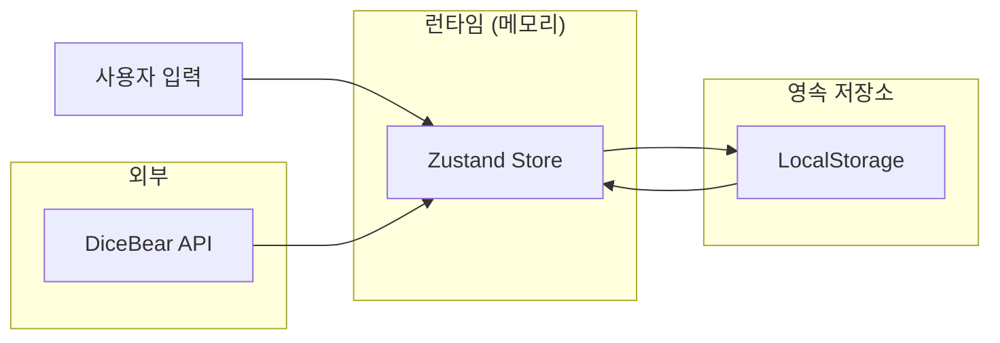
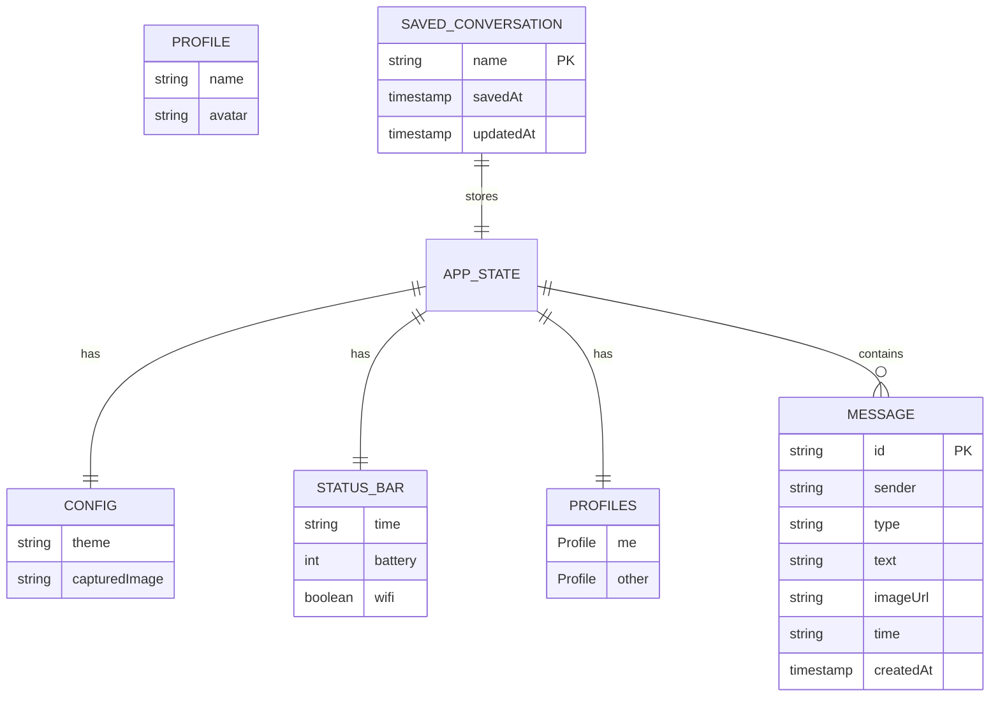

# Data Model

> 이 문서는 TalkStudio의 데이터 모델을 정의합니다.
> Zustand 스토어 스키마, LocalStorage 구조, TypeScript 인터페이스를 포함합니다.

---

## 변경 이력 (Changelog)

| 버전 | 날짜 | 작성자 | 변경 내용 |
|------|------|--------|----------|
| 1.0.0 | 2025-12-08 | @haseongpark | 최초 작성 |

---

## 관련 문서

- [ARCHITECTURE.md](./ARCHITECTURE.md) - 시스템 아키텍처
- [API_SPEC.md](./API_SPEC.md) - API 명세
- [FRONTEND_SPEC.md](./FRONTEND_SPEC.md) - 프론트엔드 스펙

---

## 1. 데이터 모델 개요

### 1.1 데이터 저장 위치

| 데이터 | 저장 위치 | 영속성 |
|--------|----------|--------|
| 현재 세션 상태 | Zustand (Memory) | 휘발성 |
| 저장된 대화 | LocalStorage | 영속성 |
| 설정 | LocalStorage | 영속성 |

### 1.2 데이터 흐름



---

## 2. TypeScript 인터페이스

### 2.1 Core Types

```typescript
// types/index.ts

/**
 * 테마 ID
 */
export type ThemeId = 'kakao' | 'telegram' | 'instagram' | 'discord';

/**
 * 발신자 타입
 */
export type Sender = 'me' | 'other';

/**
 * 메시지 타입
 */
export type MessageType = 'text' | 'image' | 'emoji';

/**
 * 메시지
 */
export interface Message {
  /** 고유 식별자 */
  id: string;
  /** 발신자 */
  sender: Sender;
  /** 메시지 타입 */
  type: MessageType;
  /** 메시지 내용 */
  text: string;
  /** 이미지 URL (type이 'image'일 때) */
  imageUrl?: string;
  /** 표시 시간 */
  time: string;
  /** 생성 타임스탬프 */
  createdAt?: number;
}

/**
 * 프로필
 */
export interface Profile {
  /** 이름 */
  name: string;
  /** 아바타 URL */
  avatar: string;
}

/**
 * 프로필 컬렉션
 */
export interface Profiles {
  me: Profile;
  other: Profile;
}

/**
 * 상태바
 */
export interface StatusBar {
  /** 시간 (예: "12:30") */
  time: string;
  /** 배터리 레벨 (0-100) */
  battery: number;
  /** WiFi 연결 상태 */
  wifi: boolean;
  /** 셀룰러 연결 상태 */
  cellular?: boolean;
}

/**
 * 설정
 */
export interface Config {
  /** 현재 테마 */
  theme: ThemeId;
  /** 캡처된 이미지 (Base64) */
  capturedImage: string | null;
}

/**
 * 전체 애플리케이션 상태
 */
export interface AppState {
  config: Config;
  statusBar: StatusBar;
  profiles: Profiles;
  messages: Message[];
}
```

### 2.2 Zustand Store Types

```typescript
// types/store.ts

import { AppState, ThemeId, Message, Profile, StatusBar } from './index';

/**
 * Zustand 스토어 액션
 */
export interface StoreActions {
  // 테마
  setTheme: (theme: ThemeId) => void;

  // 메시지
  addMessage: (message: Omit<Message, 'id' | 'createdAt'>) => void;
  removeMessage: (id: string) => void;
  updateMessage: (id: string, updates: Partial<Message>) => void;
  reorderMessages: (fromIndex: number, toIndex: number) => void;
  clearMessages: () => void;

  // 프로필
  updateProfile: (type: 'me' | 'other', profile: Partial<Profile>) => void;

  // 상태바
  updateStatusBar: (updates: Partial<StatusBar>) => void;

  // 설정
  updateConfig: (key: keyof Config, value: any) => void;

  // 유틸리티
  reset: () => void;
  loadConversation: (conversation: Partial<AppState>) => void;
}

/**
 * Zustand 스토어 전체 타입
 */
export type ChatStore = AppState & StoreActions;
```

### 2.3 Theme Types

```typescript
// types/theme.ts

import { ThemeId } from './index';

/**
 * 테마 색상
 */
export interface ThemeColors {
  primary: string;
  background: string;
  myBubble: string;
  otherBubble: string;
  myText: string;
  otherText: string;
  time: string;
  border?: string;
}

/**
 * 말풍선 스타일
 */
export interface BubbleStyle {
  borderRadius: string;
  padding: string;
  maxWidth: string;
  tail?: boolean;
  shadow?: string;
}

/**
 * 레이아웃 설정
 */
export interface ThemeLayout {
  avatarPosition: 'left' | 'right' | 'none';
  avatarSize: number;
  timePosition: 'inside' | 'outside';
  messageGap: string;
  showReadStatus?: boolean;
}

/**
 * 테마 설정
 */
export interface ThemeConfig {
  id: ThemeId;
  name: string;
  colors: ThemeColors;
  bubble: BubbleStyle;
  layout: ThemeLayout;
  statusBar: {
    style: 'light' | 'dark';
    background: string;
  };
}

/**
 * 테마 맵
 */
export type ThemeMap = Record<ThemeId, ThemeConfig>;
```

### 2.4 Storage Types

```typescript
// types/storage.ts

import { AppState } from './index';

/**
 * 저장된 대화
 */
export interface SavedConversation {
  /** 대화 데이터 */
  data: Omit<AppState, 'config'> & { theme: ThemeId };
  /** 저장 시간 */
  savedAt: string;
  /** 업데이트 시간 */
  updatedAt: string;
}

/**
 * 저장된 대화 컬렉션
 */
export interface ConversationStorage {
  [name: string]: SavedConversation;
}

/**
 * 앱 설정 저장
 */
export interface SettingsStorage {
  defaultTheme: ThemeId;
  exportQuality: 1 | 2 | 3;
  lastUsedTheme?: ThemeId;
}
```

---

## 3. Zustand Store 스키마

### 3.1 초기 상태

```javascript
// store/initialState.js

export const initialState = {
  config: {
    theme: 'kakao',
    capturedImage: null,
  },

  statusBar: {
    time: '12:30',
    battery: 85,
    wifi: true,
  },

  profiles: {
    me: {
      name: '나',
      avatar: 'https://api.dicebear.com/7.x/avataaars/svg?seed=user-me',
    },
    other: {
      name: '상대방',
      avatar: 'https://api.dicebear.com/7.x/avataaars/svg?seed=user-other',
    },
  },

  messages: [],
};
```

### 3.2 Store 구현

```javascript
// store/useChatStore.js

import { create } from 'zustand';
import { initialState } from './initialState';

export const useChatStore = create((set, get) => ({
  // 초기 상태
  ...initialState,

  // ==================== Actions ====================

  /**
   * 테마 변경
   */
  setTheme: (theme) => set((state) => ({
    config: { ...state.config, theme }
  })),

  /**
   * 메시지 추가
   */
  addMessage: (message) => set((state) => ({
    messages: [
      ...state.messages,
      {
        id: `msg-${Date.now()}-${Math.random().toString(36).substr(2, 9)}`,
        createdAt: Date.now(),
        ...message,
      }
    ]
  })),

  /**
   * 메시지 삭제
   */
  removeMessage: (id) => set((state) => ({
    messages: state.messages.filter((m) => m.id !== id)
  })),

  /**
   * 메시지 수정
   */
  updateMessage: (id, updates) => set((state) => ({
    messages: state.messages.map((m) =>
      m.id === id ? { ...m, ...updates } : m
    )
  })),

  /**
   * 메시지 순서 변경
   */
  reorderMessages: (fromIndex, toIndex) => set((state) => {
    const messages = [...state.messages];
    const [removed] = messages.splice(fromIndex, 1);
    messages.splice(toIndex, 0, removed);
    return { messages };
  }),

  /**
   * 모든 메시지 삭제
   */
  clearMessages: () => set({ messages: [] }),

  /**
   * 프로필 업데이트
   */
  updateProfile: (type, profile) => set((state) => ({
    profiles: {
      ...state.profiles,
      [type]: { ...state.profiles[type], ...profile }
    }
  })),

  /**
   * 상태바 업데이트
   */
  updateStatusBar: (updates) => set((state) => ({
    statusBar: { ...state.statusBar, ...updates }
  })),

  /**
   * 설정 업데이트
   */
  updateConfig: (key, value) => set((state) => ({
    config: { ...state.config, [key]: value }
  })),

  /**
   * 상태 초기화
   */
  reset: () => set(initialState),

  /**
   * 대화 불러오기
   */
  loadConversation: (conversation) => set((state) => ({
    ...state,
    ...conversation,
  })),
}));
```

---

## 4. 데이터 스키마 다이어그램

### 4.1 ERD (Entity Relationship Diagram)



### 4.2 상태 구조도

```
AppState
├── config
│   ├── theme: ThemeId
│   └── capturedImage: string | null
│
├── statusBar
│   ├── time: string
│   ├── battery: number
│   └── wifi: boolean
│
├── profiles
│   ├── me
│   │   ├── name: string
│   │   └── avatar: string
│   └── other
│       ├── name: string
│       └── avatar: string
│
└── messages[]
    ├── id: string
    ├── sender: 'me' | 'other'
    ├── type: 'text' | 'image' | 'emoji'
    ├── text: string
    ├── imageUrl?: string
    ├── time: string
    └── createdAt: number
```

---

## 5. LocalStorage 스키마

### 5.1 스토리지 키

| 키 | 용도 | 데이터 타입 |
|----|------|-----------|
| `talkstudio_conversations` | 저장된 대화 | ConversationStorage |
| `talkstudio_settings` | 앱 설정 | SettingsStorage |

### 5.2 대화 저장 스키마

```javascript
// LocalStorage: talkstudio_conversations
{
  "my-first-chat": {
    "data": {
      "theme": "kakao",
      "statusBar": {
        "time": "12:30",
        "battery": 85,
        "wifi": true
      },
      "profiles": {
        "me": { "name": "홍길동", "avatar": "..." },
        "other": { "name": "친구", "avatar": "..." }
      },
      "messages": [
        {
          "id": "msg-123",
          "sender": "me",
          "type": "text",
          "text": "안녕!",
          "time": "12:30",
          "createdAt": 1702000000000
        }
      ]
    },
    "savedAt": "2025-12-08T12:00:00.000Z",
    "updatedAt": "2025-12-08T12:30:00.000Z"
  },
  "work-chat": {
    // ...
  }
}
```

### 5.3 설정 저장 스키마

```javascript
// LocalStorage: talkstudio_settings
{
  "defaultTheme": "kakao",
  "exportQuality": 2,
  "lastUsedTheme": "telegram"
}
```

---

## 6. 테마 데이터

### 6.1 테마 설정 스키마

```javascript
// themes/themeConfig.js

export const THEMES = {
  kakao: {
    id: 'kakao',
    name: '카카오톡',
    colors: {
      primary: '#FEE500',
      background: '#B2C7D9',
      myBubble: '#FFEB33',
      otherBubble: '#FFFFFF',
      myText: '#000000',
      otherText: '#000000',
      time: '#999999',
    },
    bubble: {
      borderRadius: '16px',
      padding: '10px 14px',
      maxWidth: '70%',
      tail: false,
    },
    layout: {
      avatarPosition: 'left',
      avatarSize: 36,
      timePosition: 'outside',
      messageGap: '8px',
    },
    statusBar: {
      style: 'dark',
      background: '#FEE500',
    },
  },

  telegram: {
    id: 'telegram',
    name: '텔레그램',
    colors: {
      primary: '#2AABEE',
      background: '#0E1621',
      myBubble: '#2B5278',
      otherBubble: '#182533',
      myText: '#FFFFFF',
      otherText: '#FFFFFF',
      time: '#6D7883',
    },
    bubble: {
      borderRadius: '18px',
      padding: '8px 12px',
      maxWidth: '75%',
      tail: true,
    },
    layout: {
      avatarPosition: 'left',
      avatarSize: 32,
      timePosition: 'inside',
      messageGap: '4px',
      showReadStatus: true,
    },
    statusBar: {
      style: 'light',
      background: '#17212B',
    },
  },

  instagram: {
    id: 'instagram',
    name: '인스타그램',
    colors: {
      primary: 'linear-gradient(45deg, #f09433, #e6683c, #dc2743, #cc2366, #bc1888)',
      background: '#000000',
      myBubble: '#3797F0',
      otherBubble: '#262626',
      myText: '#FFFFFF',
      otherText: '#FFFFFF',
      time: '#8E8E8E',
    },
    bubble: {
      borderRadius: '22px',
      padding: '12px 16px',
      maxWidth: '65%',
      tail: false,
    },
    layout: {
      avatarPosition: 'left',
      avatarSize: 28,
      timePosition: 'outside',
      messageGap: '2px',
    },
    statusBar: {
      style: 'light',
      background: '#000000',
    },
  },

  discord: {
    id: 'discord',
    name: '디스코드',
    colors: {
      primary: '#5865F2',
      background: '#36393F',
      myBubble: 'transparent',
      otherBubble: 'transparent',
      myText: '#DCDDDE',
      otherText: '#DCDDDE',
      time: '#72767D',
    },
    bubble: {
      borderRadius: '0',
      padding: '2px 0',
      maxWidth: '100%',
      tail: false,
    },
    layout: {
      avatarPosition: 'left',
      avatarSize: 40,
      timePosition: 'inline',
      messageGap: '0px',
    },
    statusBar: {
      style: 'light',
      background: '#202225',
    },
  },
};
```

---

## 7. 데이터 유효성 검사

### 7.1 메시지 검증

```javascript
// utils/validators.js

/**
 * 메시지 유효성 검사
 * @param {Object} message - 검증할 메시지
 * @returns {Object} { isValid: boolean, errors: string[] }
 */
export function validateMessage(message) {
  const errors = [];

  // 필수 필드 검사
  if (!message.sender) {
    errors.push('sender is required');
  } else if (!['me', 'other'].includes(message.sender)) {
    errors.push('sender must be "me" or "other"');
  }

  if (!message.type) {
    errors.push('type is required');
  } else if (!['text', 'image', 'emoji'].includes(message.type)) {
    errors.push('type must be "text", "image", or "emoji"');
  }

  if (message.type === 'text' && !message.text?.trim()) {
    errors.push('text is required for text messages');
  }

  if (message.type === 'image' && !message.imageUrl) {
    errors.push('imageUrl is required for image messages');
  }

  if (!message.time) {
    errors.push('time is required');
  }

  return {
    isValid: errors.length === 0,
    errors,
  };
}

/**
 * 프로필 유효성 검사
 */
export function validateProfile(profile) {
  const errors = [];

  if (!profile.name?.trim()) {
    errors.push('name is required');
  } else if (profile.name.length > 20) {
    errors.push('name must be 20 characters or less');
  }

  if (profile.avatar && !isValidUrl(profile.avatar)) {
    errors.push('avatar must be a valid URL');
  }

  return {
    isValid: errors.length === 0,
    errors,
  };
}

/**
 * URL 유효성 검사
 */
function isValidUrl(string) {
  try {
    new URL(string);
    return true;
  } catch {
    return false;
  }
}
```

### 7.2 스키마 제약 조건

| 필드 | 제약 조건 |
|------|----------|
| `message.text` | 최대 1000자 |
| `profile.name` | 최대 20자, 필수 |
| `statusBar.battery` | 0-100 정수 |
| `statusBar.time` | HH:MM 형식 |
| `message.id` | 고유값, 자동 생성 |

---

## 8. 데이터 마이그레이션

### 8.1 버전 관리

```javascript
// utils/migration.js

const CURRENT_VERSION = 1;

export function migrateData(data, fromVersion) {
  let result = data;

  // v0 → v1: 메시지에 createdAt 추가
  if (fromVersion < 1) {
    result = migrateV0toV1(result);
  }

  // 향후 마이그레이션 추가

  return result;
}

function migrateV0toV1(data) {
  return {
    ...data,
    messages: data.messages.map((msg, index) => ({
      ...msg,
      createdAt: msg.createdAt || Date.now() - (data.messages.length - index) * 1000,
    })),
  };
}
```

---

## 9. 샘플 데이터

### 9.1 개발용 샘플 데이터

```javascript
// data/sampleData.js

export const sampleConversation = {
  config: {
    theme: 'kakao',
    capturedImage: null,
  },
  statusBar: {
    time: '오후 2:30',
    battery: 85,
    wifi: true,
  },
  profiles: {
    me: {
      name: '나',
      avatar: 'https://api.dicebear.com/7.x/avataaars/svg?seed=me',
    },
    other: {
      name: '친구',
      avatar: 'https://api.dicebear.com/7.x/avataaars/svg?seed=friend',
    },
  },
  messages: [
    {
      id: 'msg-1',
      sender: 'other',
      type: 'text',
      text: '안녕! 오늘 뭐해?',
      time: '오후 2:28',
      createdAt: 1702000000000,
    },
    {
      id: 'msg-2',
      sender: 'me',
      type: 'text',
      text: '안녕~ 별일 없어 ㅎㅎ',
      time: '오후 2:29',
      createdAt: 1702000060000,
    },
    {
      id: 'msg-3',
      sender: 'other',
      type: 'text',
      text: '그럼 나중에 같이 밥 먹을래?',
      time: '오후 2:30',
      createdAt: 1702000120000,
    },
    {
      id: 'msg-4',
      sender: 'me',
      type: 'text',
      text: '좋아! 몇 시에 만날까?',
      time: '오후 2:30',
      createdAt: 1702000140000,
    },
  ],
};
```

---

## 10. 성능 고려사항

### 10.1 데이터 크기 제한

| 항목 | 제한 | 이유 |
|------|------|------|
| 메시지 수 | 100개 권장 | 렌더링 성능 |
| LocalStorage | 5MB (브라우저 제한) | 브라우저 제약 |
| 대화 저장 수 | 50개 권장 | 스토리지 용량 |

### 10.2 최적화 전략

```javascript
// 메시지 배열 최적화
const messages = useChatStore(
  state => state.messages,
  (a, b) => a.length === b.length && a[a.length - 1]?.id === b[b.length - 1]?.id
);

// 개별 메시지 구독 최적화
const getMessage = (id) => useChatStore(
  state => state.messages.find(m => m.id === id)
);
```

---

> **Note**: 데이터 모델 변경 시 마이그레이션 스크립트를 반드시 작성하세요.
