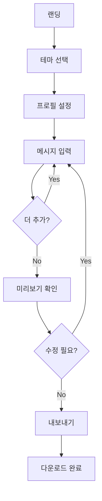

# Product Requirements Document (PRD)

> 이 문서는 TalkStudio 제품의 요구사항을 정의합니다.
> 모든 기능 개발의 기준 문서로 활용됩니다.

---

## 변경 이력 (Changelog)

| 버전 | 날짜 | 작성자 | 변경 내용 |
|------|------|--------|----------|
| 1.0.0 | 2025-12-08 | @haseongpark | 최초 작성 |

---

## 관련 문서

- [CONTEXT.md](../../CONTEXT.md) - 프로젝트 전체 맥락
- [ARCHITECTURE.md](./ARCHITECTURE.md) - 시스템 아키텍처
- [FRONTEND_SPEC.md](./FRONTEND_SPEC.md) - 프론트엔드 상세 스펙

---

## 1. 제품 개요

### 1.1 제품명
**TalkStudio** (톡스튜디오)

### 1.2 제품 비전
> "누구나 쉽게 자연스러운 대화 스크린샷을 만들 수 있는 도구"

### 1.3 문제 정의 (Problem Statement)

```
┌─────────────────────────────────────────────────────────────────┐
│                        현재 문제점                               │
├─────────────────────────────────────────────────────────────────┤
│ 1. 실제 앱에서 대화 후 스크린샷 → 번거로움, 시간 소모            │
│ 2. 개인정보 노출 위험 → 프라이버시 문제                          │
│ 3. 플랫폼별 별도 작업 → 비효율적                                 │
│ 4. 편집 불가능 → 수정 시 처음부터 다시 작업                      │
│ 5. 가상 대화 생성 도구 부족 → 마케팅/콘텐츠 제작 어려움          │
└─────────────────────────────────────────────────────────────────┘
```

### 1.4 솔루션 (Solution)

```
┌─────────────────────────────────────────────────────────────────┐
│                      TalkStudio 솔루션                           │
├─────────────────────────────────────────────────────────────────┤
│ 1. 웹 기반 대화 시뮬레이터 → 설치 없이 즉시 사용                 │
│ 2. 완전한 가상 데이터 → 프라이버시 보장                          │
│ 3. 멀티 플랫폼 테마 → 단일 도구로 4개 플랫폼 지원               │
│ 4. 실시간 편집 → 언제든 수정 가능                               │
│ 5. 고품질 이미지 내보내기 → 마케팅/콘텐츠 즉시 활용             │
└─────────────────────────────────────────────────────────────────┘
```

### 1.5 타겟 사용자

| 페르소나 | 특징 | 주요 니즈 |
|----------|------|----------|
| **콘텐츠 크리에이터** | 유튜버, 블로거, SNS 인플루언서 | 콘텐츠용 대화 이미지 |
| **마케터** | 광고, 프로모션 담당자 | 프로모션 자료 제작 |
| **디자이너** | UI/UX, 그래픽 디자이너 | 목업, 프레젠테이션 |
| **개발자** | 앱 개발자, QA 엔지니어 | 앱 스토어 스크린샷, 테스트 데이터 |
| **일반 사용자** | 개인 SNS 사용자 | 재미있는 대화 이미지 |

---

## 2. 핵심 지표 (Key Metrics)

### 2.1 북극성 지표 (North Star Metric)

```
┌─────────────────────────────────────────────────────────────────┐
│  📊 월간 이미지 내보내기 횟수 (Monthly Exports)                  │
│                                                                 │
│  - 사용자가 실제로 가치를 느끼는 핵심 행동                       │
│  - 제품의 핵심 기능 사용을 직접 측정                             │
└─────────────────────────────────────────────────────────────────┘
```

### 2.2 핵심 성과 지표 (KPIs)

| 지표 | 설명 | 목표 (MVP) |
|------|------|-----------|
| DAU | 일간 활성 사용자 | 100명 |
| 세션 길이 | 평균 사용 시간 | 5분 |
| 내보내기 전환율 | 방문 → 내보내기 | 30% |
| 재방문율 | 7일 내 재방문 | 20% |

### 2.3 품질 지표

| 지표 | 목표 |
|------|------|
| 페이지 로드 시간 | < 2초 |
| 이미지 생성 시간 | < 3초 |
| 에러율 | < 1% |

---

## 3. 기능 요구사항

### 3.1 기능 우선순위 매트릭스

```
                    높은 가치
                        │
         P1 (Must)      │      P0 (Critical)
         ───────────────┼───────────────
                        │
         P3 (Nice)      │      P2 (Should)
                        │
    낮은 영향 ──────────┼────────── 높은 영향
                        │
                    낮은 가치
```

### 3.2 P0 - Critical (MVP 필수)

#### F-001: 테마 전환
| 항목 | 내용 |
|------|------|
| **ID** | F-001 |
| **우선순위** | P0 |
| **설명** | 4개 메시징 플랫폼 테마 간 전환 기능 |
| **사용자 스토리** | 사용자로서, 카카오톡/텔레그램/인스타그램/디스코드 테마를 선택하여 해당 플랫폼 스타일의 대화를 만들고 싶다 |
| **인수 조건** | - 4개 테마 버튼이 사이드바에 표시됨<br/>- 클릭 시 즉시 테마 변경<br/>- 현재 테마가 시각적으로 표시됨 |
| **테스트 케이스** | TC-001-01: 카카오 테마 선택 시 카카오 스타일 적용<br/>TC-001-02: 테마 변경 시 기존 메시지 유지 |

#### F-002: 메시지 편집
| 항목 | 내용 |
|------|------|
| **ID** | F-002 |
| **우선순위** | P0 |
| **설명** | 메시지 추가, 수정, 삭제 기능 |
| **사용자 스토리** | 사용자로서, 대화 메시지를 자유롭게 추가하고 편집하여 원하는 대화를 구성하고 싶다 |
| **인수 조건** | - 발신자(나/상대방) 선택 가능<br/>- 메시지 텍스트 입력 가능<br/>- 시간 설정 가능<br/>- 메시지 삭제 가능 |
| **테스트 케이스** | TC-002-01: 메시지 추가 후 프리뷰에 표시<br/>TC-002-02: 빈 메시지 추가 불가<br/>TC-002-03: 메시지 삭제 시 프리뷰에서 제거 |

#### F-003: 프로필 설정
| 항목 | 내용 |
|------|------|
| **ID** | F-003 |
| **우선순위** | P0 |
| **설명** | 대화 참여자 프로필 커스터마이징 |
| **사용자 스토리** | 사용자로서, 대화 참여자의 이름과 프로필 이미지를 설정하여 실제 대화처럼 보이게 하고 싶다 |
| **인수 조건** | - 내 프로필 이름/이미지 설정<br/>- 상대방 프로필 이름/이미지 설정<br/>- 기본 아바타 제공 |
| **테스트 케이스** | TC-003-01: 프로필 이름 변경 시 프리뷰에 반영<br/>TC-003-02: 아바타 URL 입력 시 이미지 표시 |

#### F-004: 실시간 미리보기
| 항목 | 내용 |
|------|------|
| **ID** | F-004 |
| **우선순위** | P0 |
| **설명** | 폰 프레임 내 대화 실시간 렌더링 |
| **사용자 스토리** | 사용자로서, 편집한 대화가 실제 메신저 앱처럼 보이는 미리보기를 확인하고 싶다 |
| **인수 조건** | - 폰 프레임 UI (375x812px)<br/>- 상태바 표시 (시간, 배터리)<br/>- 테마별 말풍선 스타일<br/>- 실시간 업데이트 |
| **테스트 케이스** | TC-004-01: 메시지 추가 시 즉시 프리뷰에 표시<br/>TC-004-02: 테마 변경 시 말풍선 스타일 변경 |

#### F-005: 이미지 내보내기
| 항목 | 내용 |
|------|------|
| **ID** | F-005 |
| **우선순위** | P0 |
| **설명** | PNG 형식으로 대화 스크린샷 저장 |
| **사용자 스토리** | 사용자로서, 만든 대화를 이미지 파일로 저장하여 다른 곳에서 사용하고 싶다 |
| **인수 조건** | - PNG 형식 내보내기<br/>- 고해상도 옵션 (1x, 2x, 3x)<br/>- 다운로드 트리거 |
| **테스트 케이스** | TC-005-01: 내보내기 클릭 시 PNG 다운로드<br/>TC-005-02: 2x 해상도 선택 시 2배 크기 이미지 |

### 3.3 P1 - Must Have (MVP 후 1차)

#### F-006: 상태바 커스터마이징
| 항목 | 내용 |
|------|------|
| **ID** | F-006 |
| **우선순위** | P1 |
| **설명** | 시간, 배터리, WiFi 상태 조절 |
| **인수 조건** | - 시간 직접 입력<br/>- 배터리 레벨 조절 (0-100%)<br/>- WiFi/셀룰러 토글 |

#### F-007: 메시지 순서 변경
| 항목 | 내용 |
|------|------|
| **ID** | F-007 |
| **우선순위** | P1 |
| **설명** | 드래그 앤 드롭으로 메시지 순서 변경 |
| **인수 조건** | - 드래그 핸들 표시<br/>- 드롭 위치 표시<br/>- 순서 변경 후 프리뷰 업데이트 |

### 3.4 P2 - Should Have (향후 확장)

#### F-008: 이미지 메시지
| 항목 | 내용 |
|------|------|
| **ID** | F-008 |
| **우선순위** | P2 |
| **설명** | 이미지를 포함한 메시지 지원 |
| **인수 조건** | - 이미지 URL 입력<br/>- 이미지 미리보기<br/>- 테마별 이미지 메시지 스타일 |

#### F-009: 대화 저장/불러오기
| 항목 | 내용 |
|------|------|
| **ID** | F-009 |
| **우선순위** | P2 |
| **설명** | 로컬 스토리지 기반 대화 저장 |
| **인수 조건** | - 대화 저장 (이름 지정)<br/>- 저장 목록 표시<br/>- 불러오기<br/>- 삭제 |

#### F-010: 이모지/스티커
| 항목 | 내용 |
|------|------|
| **ID** | F-010 |
| **우선순위** | P2 |
| **설명** | 이모지 및 스티커 메시지 지원 |
| **인수 조건** | - 이모지 선택기<br/>- 이모지 전용 메시지<br/>- 반응 이모지 (인스타그램) |

### 3.5 P3 - Nice to Have (미래 고려)

| ID | 기능명 | 설명 |
|----|--------|------|
| F-011 | 대화 템플릿 | 미리 정의된 대화 템플릿 제공 |
| F-012 | 다국어 지원 | 영어, 일본어 UI 지원 |
| F-013 | 추가 테마 | 라인, WhatsApp 등 추가 플랫폼 |
| F-014 | 공유 기능 | URL로 대화 공유 |
| F-015 | 다크 모드 | 에디터 UI 다크 모드 |

---

## 4. 비기능 요구사항

### 4.1 성능 (Performance)

| 항목 | 요구사항 | 측정 방법 |
|------|----------|----------|
| 초기 로드 | < 2초 (3G 기준) | Lighthouse |
| 테마 전환 | < 100ms | Performance API |
| 메시지 추가 | < 50ms | React Profiler |
| 이미지 생성 | < 3초 | Console timing |
| 번들 사이즈 | < 500KB (gzip) | Build output |

### 4.2 접근성 (Accessibility)

| 항목 | 요구사항 |
|------|----------|
| WCAG 레벨 | AA 준수 |
| 키보드 내비게이션 | 전체 기능 접근 가능 |
| 스크린 리더 | 주요 기능 호환 |
| 색상 대비 | 4.5:1 이상 |

### 4.3 호환성 (Compatibility)

| 브라우저 | 최소 버전 |
|---------|----------|
| Chrome | 100+ |
| Firefox | 100+ |
| Safari | 15+ |
| Edge | 100+ |

| 디바이스 | 해상도 |
|---------|--------|
| Desktop | 1280px 이상 |
| Tablet | 768px 이상 |
| Mobile | 375px 이상 (뷰 전용) |

### 4.4 보안 (Security)

| 항목 | 요구사항 |
|------|----------|
| 데이터 저장 | 로컬 스토리지만 사용 (서버 전송 없음) |
| 외부 리소스 | HTTPS만 허용 |
| XSS 방지 | 사용자 입력 이스케이프 |
| CORS | 허용된 도메인만 접근 |

### 4.5 가용성 (Availability)

| 항목 | 요구사항 |
|------|----------|
| 오프라인 | PWA로 오프라인 사용 가능 (P2) |
| 업타임 | 99.9% (호스팅 SLA 기준) |

---

## 5. 사용자 플로우

### 5.1 기본 플로우



### 5.2 상세 시나리오

#### 시나리오 1: 카카오톡 대화 만들기

```
1. 사용자가 TalkStudio에 접속한다
2. 좌측 사이드바에서 카카오톡 테마(노란색)를 클릭한다
3. 우측 프리뷰가 카카오톡 스타일로 변경된다
4. 중앙 에디터에서:
   a. "나" 발신자를 선택한다
   b. "안녕하세요!" 메시지를 입력한다
   c. "추가" 버튼을 클릭한다
5. 우측 프리뷰에 내 말풍선이 표시된다
6. "상대방" 발신자를 선택한다
7. "네, 안녕하세요!" 메시지를 입력한다
8. "추가" 버튼을 클릭한다
9. 프리뷰를 확인하고 만족하면:
10. "내보내기" 버튼을 클릭한다
11. PNG 파일이 다운로드된다
```

---

## 6. 와이어프레임

### 6.1 메인 화면 레이아웃

```
┌──────────────────────────────────────────────────────────────────┐
│                         TalkStudio                                │
├────────┬─────────────────────────────────┬───────────────────────┤
│        │                                 │                       │
│  카카오 │     ┌─────────────────────┐    │   ┌─────────────────┐ │
│        │     │   프로필 설정        │    │   │  ┌───────────┐  │ │
│  텔레   │     │   [나] [상대방]     │    │   │  │  12:30    │  │ │
│  그램   │     └─────────────────────┘    │   │  ├───────────┤  │ │
│        │                                 │   │  │           │  │ │
│  인스타 │     ┌─────────────────────┐    │   │  │  프로필   │  │ │
│  그램   │     │   메시지 입력        │    │   │  │           │  │ │
│        │     │   ┌───────────────┐ │    │   │  │ ┌───────┐ │  │ │
│  디스   │     │   │              │ │    │   │  │ │ 안녕! │ │  │ │
│  코드   │     │   └───────────────┘ │    │   │  │ └───────┘ │  │ │
│        │     │   [나] [상대]  [추가]│    │   │  │    ┌────┐ │  │ │
│        │     └─────────────────────┘    │   │  │    │ 네 │ │  │ │
│        │                                 │   │  │    └────┘ │  │ │
│        │     ┌─────────────────────┐    │   │  │           │  │ │
│        │     │   메시지 목록        │    │   │  └───────────┘  │ │
│        │     │   1. 안녕! [삭제]   │    │   │  [  내보내기  ]  │ │
│        │     │   2. 네   [삭제]   │    │   └─────────────────┘ │
│        │     └─────────────────────┘    │                       │
│        │                                 │                       │
├────────┴─────────────────────────────────┴───────────────────────┤
│  w:80px          flex-1                        w:384px           │
└──────────────────────────────────────────────────────────────────┘
```

### 6.2 컴포넌트 명세

| 영역 | 컴포넌트 | 설명 |
|------|----------|------|
| 좌측 | Sidebar | 테마 선택 버튼 (4개) |
| 중앙 상단 | ProfileEditor | 프로필 이름/아바타 설정 |
| 중앙 중간 | MessageEditor | 메시지 입력 폼 |
| 중앙 하단 | MessageList | 입력된 메시지 목록 |
| 우측 | PhonePreview | 폰 프레임 + 채팅 미리보기 |

---

## 7. 릴리즈 계획

### 7.1 MVP (v1.0.0)

**목표**: 핵심 기능으로 제품 가치 검증

| 기능 | 상태 |
|------|------|
| F-001 테마 전환 | 포함 |
| F-002 메시지 편집 | 포함 |
| F-003 프로필 설정 | 포함 |
| F-004 실시간 미리보기 | 포함 |
| F-005 이미지 내보내기 | 포함 |

### 7.2 v1.1.0

**목표**: 사용성 개선

| 기능 | 상태 |
|------|------|
| F-006 상태바 커스터마이징 | 포함 |
| F-007 메시지 순서 변경 | 포함 |

### 7.3 v1.2.0

**목표**: 기능 확장

| 기능 | 상태 |
|------|------|
| F-008 이미지 메시지 | 포함 |
| F-009 대화 저장/불러오기 | 포함 |
| F-010 이모지/스티커 | 포함 |

---

## 8. 성공 기준

### 8.1 MVP 성공 기준

| 지표 | 목표 | 측정 시점 |
|------|------|----------|
| 월간 방문자 | 1,000명 | 출시 후 1개월 |
| 내보내기 횟수 | 500회/월 | 출시 후 1개월 |
| 사용자 피드백 | 긍정 70% 이상 | 출시 후 2주 |

### 8.2 장기 성공 기준

| 지표 | 목표 | 측정 시점 |
|------|------|----------|
| 월간 활성 사용자 | 10,000명 | 출시 후 6개월 |
| 재방문율 | 30% | 출시 후 3개월 |
| 유료 전환 (향후) | 5% | TBD |

---

## 9. 리스크 및 의존성

### 9.1 리스크

| 리스크 | 영향 | 확률 | 대응 방안 |
|--------|------|------|----------|
| 브라우저 호환성 이슈 | 중 | 중 | 크로스 브라우저 테스트 강화 |
| html2canvas 제한 | 중 | 낮음 | 대안 라이브러리 조사 |
| 저작권 문제 | 높음 | 낮음 | 플랫폼 로고 직접 사용 금지 |

### 9.2 의존성

| 의존성 | 유형 | 상태 |
|--------|------|------|
| DiceBear API | 외부 API | 안정적 |
| html2canvas | 라이브러리 | 안정적 |
| React 19 | 프레임워크 | 안정적 |

---

## 10. 용어 정의

| 용어 | 정의 |
|------|------|
| 테마 | 특정 메시징 플랫폼의 시각적 스타일 |
| 말풍선 | 메시지를 감싸는 UI 요소 |
| 내보내기 | 대화를 이미지 파일로 저장하는 기능 |
| 프리뷰 | 실시간으로 표시되는 대화 미리보기 |

---

## 11. 부록

### 11.1 경쟁 제품 분석

| 제품 | 장점 | 단점 |
|------|------|------|
| Fake Chat | 간단함 | 제한된 테마 |
| Chat Faker | 다양한 옵션 | 복잡한 UI |
| TextingStory | 동영상 지원 | 유료 |

### 11.2 참고 자료

- [카카오톡 디자인 가이드](https://developers.kakao.com/)
- [Telegram Design Guidelines](https://telegram.org/brand)
- [Instagram Brand Resources](https://about.instagram.com/brand)
- [Discord Brand Guidelines](https://discord.com/branding)

---

> **Note**: 이 PRD는 제품 개발의 기준 문서입니다.
> 변경 시 반드시 버전을 업데이트하고 변경 이력을 기록하세요.
